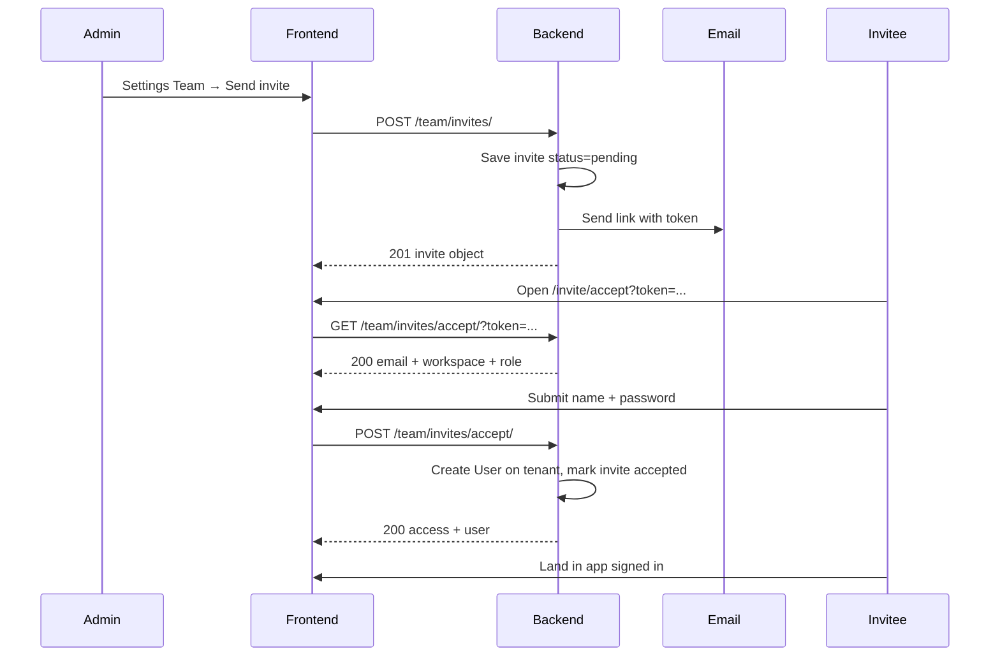
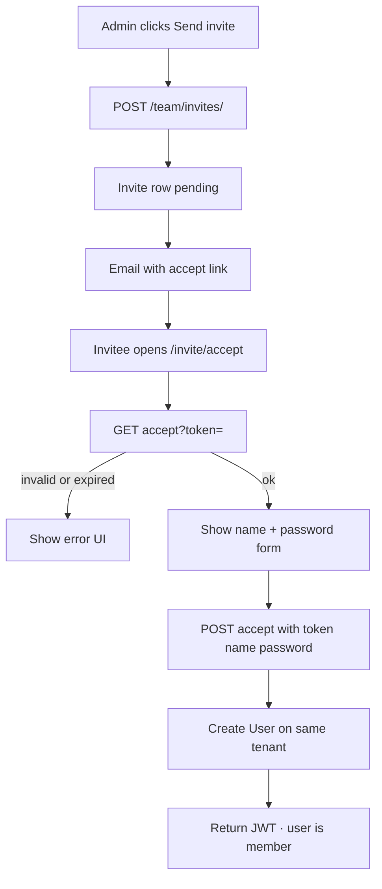

# Team invites — build guide

Junior-friendly spec. Implement in **`tenants/`** (backend) + Settings Team tab / accept page (frontend).  
Base URL: `/api/v1/`  
Auth header on protected routes: `Authorization: Bearer <access>`

**Goal:** Admin invites a new email → invitee opens link → sets name + password → joins the **same workspace** (no new tenant).

**Out of scope (v1):** existing Klints users joining another workspace, password reset, billing seats.

---

## 1. Flow (read this first)





---

## 2. What already exists (do not rebuild)

| Piece | Where |
|-------|--------|
| Tenant / Company / User | `tenants/models.py` |
| Roles on User | `admin` · `analyst` · `viewer` |
| Register (creates **new** tenant) | `POST /api/v1/auth/register/` |
| Login / me | `POST /auth/login/` · `GET /auth/me/` |
| Settings Team UI (mock) | `klints_frontend/src/routes/settings.tsx` |

**Important:** Invite accept must **attach** the new user to the inviter’s `tenant_id`.  
Do **not** call register logic that creates a new tenant.

---

## 3. New table: `invites`

Add model in `tenants/models.py` with `db_table = "invites"`, then migrate.

| Column | Type | Notes |
|--------|------|--------|
| `id` | UUID PK | default uuid4 |
| `tenant_id` | FK → `tenants` | CASCADE |
| `email` | EmailField | lowercase on save |
| `role` | CharField | `admin` \| `analyst` \| `viewer` |
| `invited_by_id` | FK → `users` | who sent it |
| `token` | CharField(64) unique | `secrets.token_urlsafe(32)` |
| `status` | CharField | `pending` \| `accepted` \| `revoked` \| `expired` |
| `expires_at` | DateTime | default now + 7 days |
| `accepted_at` | DateTime null | set on accept |
| `accepted_user_id` | FK → `users` null | set on accept |
| `created_at` | DateTime | auto |
| `updated_at` | DateTime | auto |

**Constraints / rules**
- At most **one** row with `status=pending` per `(tenant_id, email)`.
- Email must not already belong to a `User` on that tenant.
- Email must not already exist as a global `User` (email is unique) — return clear error (v1 = new emails only).

**Suggested status choices**

```python
class Status(models.TextChoices):
    PENDING = "pending", "Pending"
    ACCEPTED = "accepted", "Accepted"
    REVOKED = "revoked", "Revoked"
    EXPIRED = "expired", "Expired"
```

---

## 4. Settings (env)

Add to `core/settings/base.py` + `.env`:

```env
FRONTEND_INVITE_URL=http://localhost:8082/invite/accept
INVITE_TTL_DAYS=7
```

Invite email link shape:

```text
{FRONTEND_INVITE_URL}?token={token}
```

Example: `https://app.example/invite/accept?token=AbCd...`

---

## 5. Permissions

| Action | Who |
|--------|-----|
| List members / invites | Any authenticated member of the tenant |
| Create / resend / revoke invite | `role=admin` only |
| Change member role / deactivate | `role=admin` only |
| Accept invite | Public (`AllowAny`) with valid token |

**Guards**
- Cannot invite if email already on tenant or already a User in DB.
- Cannot demote or deactivate the **last** `admin` on the tenant.
- Cannot change your own role to non-admin if you are the last admin.
- Resend / revoke only when `status=pending` and not past `expires_at`.

---

## 6. API routes

Wire under `/api/v1/team/` (new `tenants/team_urls.py` included from `core/urls.py`).

| Method | Path | Auth | What it does |
|--------|------|------|--------------|
| `GET` | `/team/members/` | Bearer | List users on my tenant |
| `PATCH` | `/team/members/<uuid:id>/` | Bearer admin | Update `role` and/or `is_active` |
| `GET` | `/team/invites/` | Bearer | List invites for my tenant |
| `POST` | `/team/invites/` | Bearer admin | Create invite + send email |
| `POST` | `/team/invites/<uuid:id>/resend/` | Bearer admin | New token + email (pending only) |
| `POST` | `/team/invites/<uuid:id>/revoke/` | Bearer admin | Set `revoked` |
| `GET` | `/team/invites/accept/` | — | Preview invite by `?token=` |
| `POST` | `/team/invites/accept/` | — | Create user + return JWT |

---

## 7. Exact request / response shapes

### 7.1 `GET /api/v1/team/members/`

**Response `200`**

```json
{
  "members": [
    {
      "id": "uuid",
      "name": "George L.",
      "email": "george@lumera.skin",
      "role": "admin",
      "is_active": true,
      "email_verified": true,
      "is_workspace_creator": true,
      "created_at": "2026-07-18T10:00:00Z"
    }
  ]
}
```

`is_workspace_creator`: `true` for the earliest admin on the tenant (or first user). Frontend may show badge **Owner** — not a DB role.

---

### 7.2 `PATCH /api/v1/team/members/<id>/`

**Request**

```json
{
  "role": "analyst",
  "is_active": true
}
```

Either field optional. Both allowed together.

**Response `200`** — same object shape as one member in the list.

**Errors**

| Status | When | Body |
|--------|------|------|
| `403` | Not admin | `{"detail": "Admin only."}` |
| `404` | User not on your tenant | `{"detail": "Not found."}` |
| `400` | Would remove last admin | `{"detail": "Cannot remove the last admin."}` |

---

### 7.3 `GET /api/v1/team/invites/`

**Response `200`**

```json
{
  "invites": [
    {
      "id": "uuid",
      "email": "new@lumera.skin",
      "role": "analyst",
      "status": "pending",
      "invited_by": {
        "id": "uuid",
        "name": "George L.",
        "email": "george@lumera.skin"
      },
      "expires_at": "2026-07-25T10:00:00Z",
      "created_at": "2026-07-18T10:00:00Z",
      "accepted_at": null
    }
  ]
}
```

---

### 7.4 `POST /api/v1/team/invites/`

**Request**

```json
{
  "email": "new@lumera.skin",
  "role": "analyst"
}
```

**Response `201`** — same shape as one invite object above (`status: "pending"`).

**Side effect:** send email with accept link.

**Errors**

| Status | When | Body |
|--------|------|------|
| `403` | Not admin | `{"detail": "Admin only."}` |
| `400` | Bad role | `{"role": ["Invalid role."]}` |
| `400` | Email already a user | `{"email": ["A user with this email already exists."]}` |
| `400` | Pending invite exists | `{"email": ["An invite is already pending for this email."]}` |
| `400` | Already on this team | `{"email": ["This email is already on the team."]}` |

---

### 7.5 `POST /api/v1/team/invites/<id>/resend/`

**Request:** empty body `{}`

**Response `200`** — updated invite (new `token`, refreshed `expires_at`, still `pending`).

**Errors:** `403` not admin · `404` · `400` if not pending / already expired.

---

### 7.6 `POST /api/v1/team/invites/<id>/revoke/`

**Request:** empty body `{}`

**Response `200`**

```json
{
  "id": "uuid",
  "email": "new@lumera.skin",
  "role": "analyst",
  "status": "revoked",
  "invited_by": { "id": "uuid", "name": "George L.", "email": "george@lumera.skin" },
  "expires_at": "2026-07-25T10:00:00Z",
  "created_at": "2026-07-18T10:00:00Z",
  "accepted_at": null
}
```

---

### 7.7 `GET /api/v1/team/invites/accept/?token=...`

Public. Used to render the accept page before the form submit.

**Response `200`**

```json
{
  "email": "new@lumera.skin",
  "role": "analyst",
  "workspace_name": "Lumera Skin",
  "invited_by_name": "George L.",
  "expires_at": "2026-07-25T10:00:00Z"
}
```

**Errors**

| Status | When | Body |
|--------|------|------|
| `400` | Missing token | `{"detail": "token is required."}` |
| `404` | Unknown token | `{"detail": "Invite not found."}` |
| `410` | Revoked / accepted / expired | `{"detail": "Invite is no longer valid."}` |

On read: if `status=pending` and `expires_at < now`, set `status=expired` then return `410`.

---

### 7.8 `POST /api/v1/team/invites/accept/`

Public. Creates the user on the invite’s tenant and signs them in.

**Request**

```json
{
  "token": "AbCd...",
  "name": "Sam Rivera",
  "password": "secure-password-here"
}
```

**Response `200`** (same shape as login — reuse login serializer helpers if you can)

```json
{
  "access": "<jwt>",
  "user": {
    "id": "uuid",
    "email": "new@lumera.skin",
    "name": "Sam Rivera",
    "role": "analyst",
    "email_verified": true,
    "tenant": {
      "id": "uuid",
      "name": "Lumera Skin",
      "slug": "lumera-skin"
    }
  },
  "connectors": [],
  "needs_connector": true
}
```

**Server steps (exact order)**

1. Load invite by `token` where `status=pending`.
2. If missing → `404`. If expired → mark `expired`, `410`. If revoked/accepted → `410`.
3. If `User.objects.filter(email__iexact=invite.email).exists()` → `400`.
4. Create user:
   - `email=invite.email`
   - `name` from body
   - `tenant=invite.tenant`
   - `role=invite.role`
   - `email_verified=True`
   - `is_active=True`
   - `set_password(password)`
5. Set invite `status=accepted`, `accepted_at=now`, `accepted_user=user`.
6. Issue JWT access token (same as login).
7. Return `200` payload above.

**Errors**

| Status | Body example |
|--------|----------------|
| `400` | `{"password": ["This field is required."]}` |
| `400` | `{"name": ["This field is required."]}` |
| `404` | `{"detail": "Invite not found."}` |
| `410` | `{"detail": "Invite is no longer valid."}` |

Password rules: match register (min length already used in auth — keep consistent).

---

## 8. Email

Subject: `You're invited to {workspace_name} on Klints`

Body (plain text is fine for v1):

```text
{invited_by_name} invited you to join {workspace_name} as {role}.

Accept your invite:
{FRONTEND_INVITE_URL}?token={token}

This link expires in {INVITE_TTL_DAYS} days.
```

Mirror the style of `tenants/emails.py` verification mail.

---

## 9. Frontend

### 9.1 Settings → Team (`/settings?tab=team`)

Replace mock state in `settings.tsx` with API calls.

| UI action | API |
|-----------|-----|
| Load page | `GET /team/members/` + `GET /team/invites/` |
| Send invite | `POST /team/invites/` `{ email, role }` |
| Resend | `POST /team/invites/:id/resend/` |
| Revoke | `POST /team/invites/:id/revoke/` |
| Change role | `PATCH /team/members/:id/` `{ role }` |

**Role select values (send lowercase):** `admin` · `analyst` · `viewer`  
Display labels: Admin · Analyst · Viewer.  
Show **Owner** badge when `is_workspace_creator === true` (still role `admin`).

**UI states**
- Members list (active / inactive)
- Pending invites section (email, role, expires, Resend, Revoke)
- Errors from API shown in toast

### 9.2 New route: `/invite/accept`

Query: `?token=`

1. On load → `GET /team/invites/accept/?token=`
2. Show workspace name, inviter, email (read-only), role
3. Form: name, password, confirm password
4. Submit → `POST /team/invites/accept/`
5. Store JWT like login (`auth.ts`) → navigate to `/dashboard` or `/onboarding` using `needs_connector`

Error page copy for `410` / `404`: “This invite link is invalid or has expired. Ask your admin to send a new one.”

---

## 10. Build order (do in this order)

1. **Model + migration** — `Invite` in `tenants/models.py`
2. **Settings** — `FRONTEND_INVITE_URL`, `INVITE_TTL_DAYS`
3. **Email helper** — send invite mail
4. **Views + urls** — `team_urls.py` + include in `core/urls.py`
5. **Tests** — create invite, accept, last-admin guard, expired token
6. **Frontend accept page** — `/invite/accept`
7. **Frontend Settings Team** — wire list + invite + resend/revoke

---

## 11. File checklist

**Backend**
- [ ] `tenants/models.py` — `Invite`
- [ ] `tenants/migrations/000x_invite.py`
- [ ] `tenants/team_views.py` (or extend auth_views carefully)
- [ ] `tenants/team_urls.py`
- [ ] `tenants/emails.py` — invite email
- [ ] `core/urls.py` — `path("api/v1/team/", include(...))`
- [ ] `core/settings/base.py` — invite env vars
- [ ] `.env.example` — document vars
- [ ] tests for team invite flow

**Frontend**
- [ ] `src/routes/invite.accept.tsx` (or `invite/accept` route)
- [ ] `src/routes/settings.tsx` — real Team tab
- [ ] `src/lib/api.ts` — team endpoints
- [ ] store token on accept like login

---

## 12. Acceptance tests (manual)

1. Admin sends invite to a **new** email → row appears as pending → email arrives.
2. Open link → see workspace + form → set password → land signed in on that workspace.
3. Settings → Team shows the new member with correct role.
4. Resend works; old token returns `410` after resend (optional: invalidate old token on resend — **required:** on resend, rotate `token` so old link dies).
5. Revoke → accept with that token → `410`.
6. Expired invite → `410`.
7. Invite email that already registered → `400`.
8. Non-admin cannot `POST /team/invites/` → `403`.
9. Cannot deactivate last admin → `400`.

---

## 13. Quick error cheat sheet

| Code | Meaning |
|------|---------|
| `400` | Validation / business rule |
| `401` | Missing/invalid JWT |
| `403` | Authenticated but not admin |
| `404` | Wrong id/token |
| `410` | Invite used, revoked, or expired |

---

## 14. Do / don’t

**Do**
- Normalize email to lowercase
- Use one tenant from the invite row
- Set `email_verified=True` on accept (link proves inbox)
- Rotate token on resend

**Don’t**
- Create a new `Tenant` on accept
- Reuse `/auth/register/` for invitees
- Store plaintext passwords
- Allow `Owner` as a stored role value
