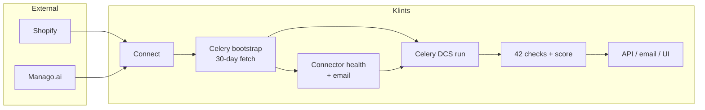
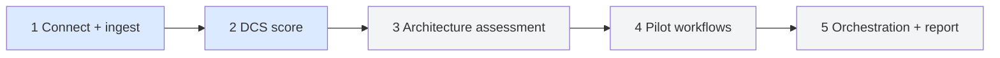

# PRD-00 — DCS series overview

**Status:** Ready for implementation sequencing  
**Spec version:** DataPack v1.2 / DCS workbook v1.4.1  
**Scoring model version:** `DCS-1.0.0`

## 1. What DCS is (plain language)

**DCS = Data Consistency Score.**

Klints connects a brand’s **commerce** (Shopify) and **marketing CDP** (Manago.ai), then asks one question:

> Is this customer/order/consent/product data consistent enough to safely run lifecycle automation?

DCS is **not** a generic analytics dashboard. It is a **deterministic 0–100 governance score** from a fixed catalogue of **42 MVP1 checks** across 7 dimensions (identity, events, products, segments, consent, measurement, business reality), plus foundation connectivity gates.

| Outcome | Meaning |
|---------|---------|
| Headline score (0–100) | Weighted health of the stack |
| `run_state` | READY / CONDITIONALLY_READY / REMEDIATE / BLOCKED / INCOMPLETE |
| Per-check results | PASS / WARN / FAIL / UNKNOWN / NOT_CONNECTED |
| Findings + root causes (RC-01…15) | Why it failed and what to fix first |

Later Klints products (architecture assessment, pilot workflows, assessment PDF report) **consume** DCS. This PRD series only builds: **connect → ingest → score → notify**.

## 2. What we are trying to do here

```text
Brand connects Shopify + Manago
        ↓
Celery pulls last 30 days of data (and flags connector problems)
        ↓
Klints freezes a scoring snapshot
        ↓
Runs 42 checks → assembles DCS score
        ↓
Saves results + emails the team
        ↓
UI / API can show the score (FE binds later)
```

**In scope for this series**

1. On-connect Celery bootstrap fetch (default **30 days**) + connector health email  
2. Check master + score assembly engine (golden-fixture correct)  
3. Celery DCS run: gates → snapshot → 42 checks → persist → email  
4. HTTP APIs for latest score / check results  

**Out of scope (later series)**

Architecture assessment, 16 pilot builds, MCP discovery, orchestration waves, free/paid assessment REPORT/EXPORT, the other ~60 catalogue checks, 12 pilot supplemental gates, ERP product connector.

## 3. Simple flow diagram



## 4. High-level architecture

```mermaid
flowchart TB
  subgraph Clients
    FE[Frontend<br/>onboarding / DCS views]
    Mail[Mailer API]
  end

  subgraph API["Django API /api/v1"]
    ConnAPI[Connect + bootstrap status]
    FetchAPI[Fetch enqueue 202]
    DcsAPI[DCS runs + master]
  end

  subgraph Workers["Celery workers"]
    T1[bootstrap_connector_fetch]
    T2[run_dcs_score]
  end

  subgraph Domain["dataruns domain"]
    Imp[import_data.run_import]
    Snap[Scoring snapshot]
    Master[Check master 42]
    Exec[Check executors]
    Asm[assemble_dcs_score]
  end

  subgraph Store[(Postgres)]
    Conn[(connectors + snapshots)]
    Data[(contacts / orders / DataRun / Run)]
    Dcs[(DCS run + check results<br/>+ ScoringModel)]
  end

  subgraph Ext[External systems]
    Shopify[Shopify Admin API]
    Manago[Manago API]
  end

  FE --> ConnAPI
  FE --> FetchAPI
  FE --> DcsAPI
  ConnAPI --> T1
  FetchAPI --> T1
  DcsAPI --> T2
  T1 --> Imp
  Imp --> Shopify
  Imp --> Manago
  Imp --> Conn
  Imp --> Data
  T1 --> Mail
  T2 --> Snap
  Snap --> Data
  T2 --> Master
  T2 --> Exec
  Exec --> Snap
  T2 --> Asm
  Asm --> Dcs
  T2 --> Mail
  DcsAPI --> Dcs
```

### 4.1 Layers (one line each)

| Layer | Job |
|-------|-----|
| Connect | Save Manago/Shopify credentials |
| Bootstrap worker | Prove the pipe works; load ~30 days into Klints tables |
| Scoring snapshot | Freeze canonical contacts/orders/events for one score run |
| Check executors | Evaluate each of 42 IDs → `check_result` |
| Score engine | Sheet **08** math → headline + dimensions + `run_state` |
| API + email | Expose results; notify admins when jobs finish |

### 4.2 Where this sits in full Klints (context only)



Blue = **this PRD series**. Grey = later client-vision work.

## 5. Goal (implementation checklist)

After Shopify and/or Manago.ai are connected:

1. Immediately bootstrap ingest (Celery, default **30 days**).
2. Report connector fetch health issues.
3. Score the company with the **exact 42 MVP1 checks**.
4. Persist results and email when bootstrap / DCS finishes.

## 6. Authoritative DataPack sources

### 6.1 Excel (local copy in this folder)

`docs/dcs_scoring/Klints_Spec_InitialDataConsistencyCheck_v1.4.1_20260718.xlsx`  
(identical to DataPack `01_Specifications/` copy; SHA-256 `2d33671e6b77d4982a12a911f4964d674c4178301e90fa0d72b6ec5a62ffd373`)

| Concern | Tab |
|---------|-----|
| Check IDs + class + weight + phase | **09 MVP1 Check Scope** |
| Detection logic, surfaces, severity, RC codes | **02 Check Catalogue** |
| Root cause codes RC-01…RC-15 | **03 Root Cause Taxonomy** |
| Connect sweep phases | **05 Initial Connect Runbook** |
| Canonical field mapping | **06 Field Mapping Reference** |
| Dimension weights + states | **07 Scoring Model** |
| Aggregation steps | **08 Score Assembly** |
| Worked numeric example | **10 Lumera Scoring Example** |

### 6.2 Fixtures + schemas (local copies)

Under `docs/dcs_scoring/reference/` (copied from DataPack):

| Concern | Local path |
|---------|------------|
| Machine shapes | `reference/schemas/check_definition.schema.json` |
| | `reference/schemas/check_result.schema.json` |
| | `reference/schemas/dcs_run.schema.json` |
| | `reference/schemas/finding.schema.json` |
| Golden check results (42) | `reference/fixtures/lumera_expected_results/check_results.json` |
| Golden score | `reference/fixtures/lumera_expected_results/dcs_score.json` |
| Engine regression cases | `reference/fixtures/scoring_golden_dataset.json` |
| Edge inputs | `reference/fixtures/edge_cases/*.json` |
| Connector count stub | `reference/fixtures/lumera_input/connector_snapshot.json` |

**ID authority:** sheet **09** + fixtures. Note: sheet 09 uses **SP-03** (not SP-01) for “Standard detail schema consistency”. Fixtures confirm `SP-03`.

## 7. End-to-end process (detail)

```text
CONNECT (Manago POST or Shopify OAuth callback)
  → enqueue Celery bootstrap (days=30)
  → health preflight
  → run_import (fetch → map → persist → snapshot)
  → connector health report + email
  → connector.status = connected | degraded | error

WHEN company has bootstrap data (and optionally both connectors green)
  → enqueue Celery DCS run
  → FD gates
  → build scoring snapshot from persisted data
  → evaluate 42 checks → check_result[]
  → assemble dcs_run (headline + dimensions + score_state)
  → persist + email
```

## 8. Current backend baseline (facts)

| Area | Path | State |
|------|------|--------|
| Sync fetch | `dataruns/connectors/import_data.py` → `run_import` | Live; default **days=10**; HTTP-blocking |
| Fetch views | `tenants/connector_views.py` | `POST .../shopify/fetch/`, `.../manago_ai/fetch/` |
| Connect Manago | `tenants/connector_views.py` | Saves connector; **no fetch enqueue** |
| Connect Shopify | OAuth callback same file | Saves connector; **no fetch enqueue** |
| Celery stub | `dataruns/tasks.py` → `process_data_run` | Status flip only |
| Mailer | `tenants/emails.py` → `send_email` | Verify/invite only |
| Score tables | `dataruns/models.py` → `ScoringModel`, `RunScore`, `RunIssue`, `QaCheck` | Schema only; unused |

## 9. Dimension weights (sheet 07)

| Dimension | Weight % | Required |
|-----------|---------:|----------|
| 01 Customer Identity | 18 | yes |
| 02 Lifecycle Event | 18 | yes |
| 03 Product & Transaction | 14 | yes |
| 04 Segment & Property | 12 | yes |
| 05 Channel & Consent | 18 | yes |
| 06 Measurement | 10 | yes |
| 07 Business Reality | 10 | no (optional if ERP out of scope) |

Foundation Gate (`00`) is **not** a weighted dimension. Gates use `numeric_weight = 0`.

## 10. MVP1 check counts (sheet 09)

| Class | Count | Build phase |
|-------|------:|-------------|
| RULE_BASED | 28 | MVP1-A (7 GATE + 21 SCORED) |
| DRIFT | 14 | MVP1-B |
| **Total** | **42** | |

## 11. ERP policy (locked for this series)

- No ERP connector product in this series.
- FD-03 → `NOT_CONNECTED` (or PASS only if an ERP feed is later wired).
- BR dimension checks → `NOT_CONNECTED` with reason when ERP absent.
- Headline excludes BR when ERP out of scope; `score_state` capped at `CONDITIONALLY_READY`; confidence capped at 0.85 (sheet 08 step 7).

## 12. Acceptance chain

| Gate | Evidence |
|------|----------|
| CONN-01 done | Connect → Celery → 30d data → email; bad creds → degraded/error report |
| DCS-00 done | Golden fixtures reproduce `headline_score = 84.267` |
| DCS-01+ done | Live run persists 42 results + email |
| DCS-04/05 done | Checks use scoring snapshot, not live re-fetch mid-run |

## 13. Stop rule

If code, tenant data, Manago/Shopify behavior, or Excel/fixtures disagree with these PRDs, stop and flag. Do not invent check IDs, weights, or formulas.
