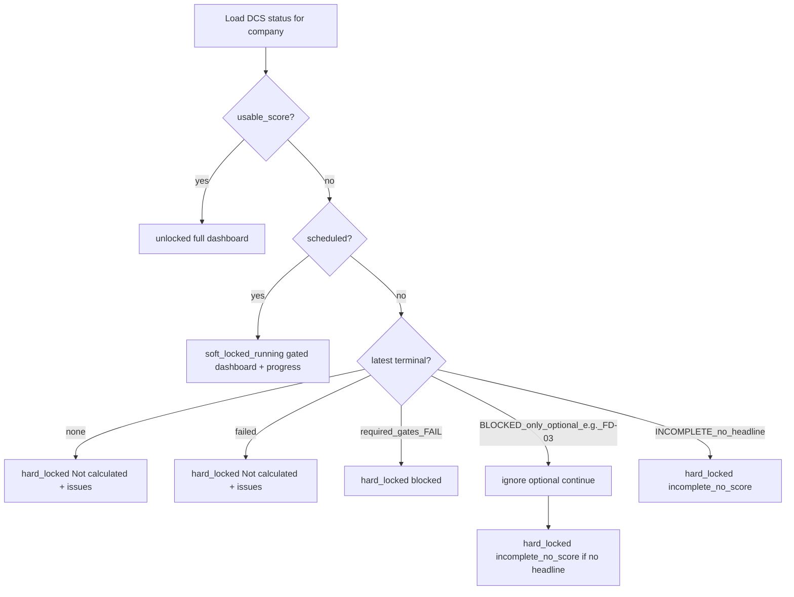

# PRD-FE-03 — DCS app lock / dashboard gate

**Status:** Ready for implementation  
**Depends on:**  
- DCS orchestration (`dataruns.run_dcs_score`, `dataruns/dcs/orchestrate.py`) — PR #15  
- Daily Beat / enqueue (PRD-DCS-07 / PR #16) for scheduled runs  
- [PRD_FE_01_SIGNIN_ROUTE_GUARD.md](./PRD_FE_01_SIGNIN_ROUTE_GUARD.md), [PRD_FE_02_ONBOARDING_ROUTE_GUARD.md](./PRD_FE_02_ONBOARDING_ROUTE_GUARD.md)  
- HTTP shape notes: `docs/dcs_scoring/PRD_DCS_06_API_RESPONSES.md`  
**Repos:** CheckMaster `isOptional` + backend status API + `klints_frontend` AppShell / gated dashboard  
**Scope:** until a publishable DCS `headline_score` exists, show a **score-gated dashboard** (Not calculated + issues only); keep Fix / Workflow / Reference menus unclickable except Account + Connectors. **Optional** check failures (e.g. FD-03) must **not** block the dashboard when other gate/score conditions are satisfied.

---

## 0. Prerequisite — CheckMaster `isOptional` (do first)

Add a boolean on the check registry so the app gate (and assemble blocking) can ignore non-critical checks.

### 0.1 Field

| Layer | Name | Type | Default |
|-------|------|------|---------|
| Django `CheckMaster` | `is_optional` | `BooleanField` | `False` |
| Seed / JSON master (`check_master_mvp1.json` / seed command) | `isOptional` | `true` \| `false` | `false` |
| Status API issue rows (optional) | `is_optional` | bool | from master |

Meaning:

- `isOptional=false` (default) — **required** for app-gate blocking. FAIL can contribute to `lock_reason=blocked` / suppress unlock when other conditions would otherwise unlock.  
- `isOptional=true` — **optional**. FAIL / WARN / problems are informational only for the dashboard gate: they **never alone** put the shell into `hard_locked`, and they **must not** keep the user blocked when required checks and score rules are otherwise OK.

### 0.2 Seed values (MVP1)

| `check_id` | `isOptional` |
|------------|--------------|
| **FD-03** (ERP feed reachable / parseable) | **`true`** |
| All other 41 checks | `false` |

Rationale: ERP is often out of scope; FD-03 already maps to `NOT_CONNECTED` / `ERP_OUT_OF_SCOPE` when ERP is not wired. Even when ERP is in scope and FD-03 FAILs, that must not freeze the Klints product shell.

### 0.3 Implementation (master)

1. Migration on `dataruns.CheckMaster`: add `is_optional = models.BooleanField(default=False)`.  
2. Update `seed_dcs_master` + `dataruns/dcs/check_master_mvp1.json` (or equivalent) to read/write `isOptional`; set FD-03 `true`, others `false`.  
3. Docs table `docs/dcs_scoring/CHECK_MASTER_42.md`: add column `isOptional`.  
4. Assemble / blocking count (preferred, same PR or immediate follow-up): when computing gate BLOCKED / `blocking_gates_failed` for **app-facing** outcomes, **exclude** checks with `is_optional=true`. Pipeline may still persist FD-03 FAIL in `check_results`.

### 0.4 App-gate rule (optional vs required)

```text
required_gate_fails = FAIL check_results whose CheckMaster.is_optional == false
optional_gate_fails = FAIL check_results whose CheckMaster.is_optional == true

For dashboard lock / blocked:
  - Count ONLY required_gate_fails toward lock_reason=blocked
  - optional_gate_fails NEVER cause hard_locked by themselves
  - If usable_score is true → unlocked even if optional_gate_fails is non-empty
  - If run_state was BLOCKED only because of optional fails (e.g. FD-03 only)
    → treat as NOT blocked for app_access; continue state machine
      (typically incomplete_no_score or unlocked if headline exists)
```

Optional issues may still appear in the dashboard **issues** list (with `is_optional: true`) as soft warnings, but they must not disable menus or force the gated “blocked” path when required conditions are satisfied.

---

## 1. Problem

After connectors are connected, the app still shows the **full mock dashboard** (fake score arcs, trend charts, dimension charts, value-at-stake widgets) and all menus even when:

- No DCS score has ever been produced, or  
- The latest DCS run failed / is `BLOCKED` (gate/auth) / is `INCOMPLETE` with no headline  

Users should not browse Fix / Workflow / mock analytics until Klints has a real publishable score. They **should** still see a clear dashboard that:

1. Says the Data Consistency Score is **Not calculated** (never invent a number).  
2. Lists **real issues** from the latest run (failed gates, connector/auth problems, pipeline errors).  
3. Points them to **Connected stack** to fix.

A full-screen “error lock panel” that hides the dashboard is worse UX than this sparse, honest overview.

## 2. Goal

1. Backend exposes a compact **DCS app-gate status** (access state + issues) for the current company.  
2. Frontend derives `app_access` and:
   - **Unlocked** → normal shell + full dashboard (charts/scores when product data exists)  
   - **Soft-locked (running)** → same gated dashboard + “Scoring in progress…”; only Account + Connectors (+ Dashboard) clickable in nav  
   - **Hard-locked (score gated)** → gated dashboard: **Not calculated** + **issues list**; no charts / mock metrics; same nav restrictions  
3. **Unlock as soon as any `headline_score` is available** (current latest or historical ever-scored).

## 3. Source of truth (current code)

| Artifact | Path / field |
|----------|----------------|
| Check master optional flag | `CheckMaster.is_optional` (JSON/seed key `isOptional`); FD-03=`true`, all others=`false` (§0) |
| DCS DataRun | `DataRun` with `metadata.kind == "dcs_score"` (`dataruns/dcs/constants.py`) |
| Terminal outcomes | `status` ∈ `{succeeded, failed}`; in-flight ∈ `{pending, running}` |
| Assemble payload | `metadata.dcs_run` + `RunScore.breakdown` (`run_state`, `headline_score`, `blocking_gates_failed`, `check_results`) |
| Per-check issues | `check_results[]` with `status=FAIL` (gates today); `suggested_fix`, `detail`, `severity`, `root_cause_ids` |
| Worker failure | `status=failed`, `metadata.error` |
| Scheduled | any DataRun for company with `kind=dcs_score` and `status` in `{pending, running}` |
| FE shell nav | `klints_frontend/src/components/klints/AppShell.tsx` |
| FE dashboard | `klints_frontend/src/routes/dashboard.tsx` (today: mock charts + mock issues) |

**Publishable score:** `headline_score` is a non-null number on a **succeeded** DCS DataRun (`metadata.dcs_run.headline_score` or `RunScore.breakdown.headline_score` / `RunScore.score` when breakdown says non-null).

Today (gates-only + stubs): most live runs are `run_state=INCOMPLETE` with `headline_score=null` → **score-gated** until RULE/DRIFT (or assemble) can publish a number. That is intentional.

## 4. Access state machine (locked rules)

```text
Inputs:
  scheduled     = exists DataRun kind=dcs_score status in {pending, running} for company
  has_ever_scored = company ever had succeeded DCS with headline_score != null
  latest        = newest DataRun kind=dcs_score for company (any status), by created_at desc
  latest_headline = headline from latest succeeded summary if latest is succeeded; else null
  usable_score  = has_ever_scored OR latest_headline != null
  required_gate_fails = FAIL results on latest where CheckMaster.is_optional == false
  optional_gate_fails = FAIL results on latest where CheckMaster.is_optional == true
  effectively_blocked = latest succeeded AND (
        (run_state == BLOCKED AND required_gate_fails > 0)
        OR (required_gate_fails > 0 AND headline_score is null)
      )
  # If run_state == BLOCKED but required_gate_fails == 0 (only FD-03 / optional failed):
  #   effectively_blocked = false  → do NOT use lock_reason=blocked

Derive app_access:

1. If usable_score AND scheduled:
     → unlocked  (keep product; optional banner “Refreshing DCS…”; optional FAILs ignored for lock)
2. If usable_score AND NOT scheduled:
     → unlocked  (even if optional_gate_fails non-empty, e.g. FD-03 FAIL)
3. If NOT usable_score AND scheduled:
     → soft_locked_running  (lock_reason=running_no_score)
4. If NOT usable_score AND NOT scheduled:
     a. no latest run
        → hard_locked  (lock_reason=no_run)
     b. latest.status == failed
        → hard_locked  (lock_reason=failed)
     c. effectively_blocked
        → hard_locked  (lock_reason=blocked)
     d. latest succeeded and run_state == INCOMPLETE and headline_score is null
        → hard_locked  (lock_reason=incomplete_no_score)
        # Note: optional-only FAILs do not change this; incompleteness is about missing score
     e. else (edge: succeeded with unexpected null score)
        → hard_locked  (lock_reason=incomplete_no_score)
```



`hard_locked` means **score-gated product shell**, not a blank error page.

**Optional checks (FD-03):** problems never set `lock_reason=blocked` and never prevent `unlocked` when `usable_score` is true.

### 4.1 What does **not** unlock alone

| Condition | Unlocks? |
|-----------|----------|
| `run_state=INCOMPLETE` with `headline_score=null` | No |
| DataRun `succeeded` but only gate PASSes + stub UNKNOWNs | No |
| Connectors `connected` / bootstrap `ok` | No (needed for onboarding exit only) |
| FD-03 / any `isOptional=true` FAIL alone | No unlock by itself — but also **does not block** if `usable_score` or if the only “BLOCKED” cause was optional |
| `run_state=REMEDIATE` / `CONDITIONALLY_READY` / `READY` **with** headline | Yes (optional FAILs ignored for lock) |

### 4.2 Interaction with onboarding (FE-01 / FE-02)

| Stage | Behavior |
|-------|----------|
| `needs_connector=true` | FE-01/FE-02 send user to `/onboarding` — **this PRD does not apply yet** |
| Connectors exist, DCS not scored | After leaving onboarding → apply score gate (hard or soft) |
| First `headline_score` appears | Unlock full shell + normal dashboard |

## 5. Backend API

### 5.1 Endpoint

```text
GET /api/v1/dcs/status/
Authorization: Bearer <jwt>
```

Roles: `admin`, `analyst`, `viewer` (read).

Company always from `request.user` (same as connectors).

Prefer a dedicated status route for the shell. May share query helpers with future `GET /dcs/runs/latest/` (DCS-06).

### 5.2 Response 200

```json
{
  "app_access": "hard_locked",
  "lock_reason": "incomplete_no_score",
  "message": "Data Consistency Score is not calculated yet. Review the issues below and fix them under Connected stack.",
  "score_display": {
    "state": "not_calculated",
    "headline_score": null,
    "label": "Not calculated"
  },
  "latest_run": {
    "data_run_id": 55,
    "domain_run_id": "uuid-or-null",
    "status": "succeeded",
    "run_state": "INCOMPLETE",
    "headline_score": null,
    "blocking_gates_failed": 0,
    "error": null,
    "triggered_by": "management_command",
    "started_at": "2026-07-30T04:00:00Z",
    "finished_at": "2026-07-30T04:01:00Z"
  },
  "active_run": null,
  "scheduled": false,
  "has_ever_scored": false,
  "best_headline_score": null,
  "issues": [
    {
      "check_id": "FD-02",
      "title": "Shopify scopes incomplete",
      "status": "FAIL",
      "severity": "critical",
      "detail": "Missing required read scopes for scoring.",
      "suggested_fix": "Reconnect Shopify with the required scopes under Connected stack.",
      "root_cause_ids": ["RC-SHOPIFY-SCOPES"],
      "is_optional": false
    },
    {
      "check_id": "FD-03",
      "title": "ERP feed reachable and parseable",
      "status": "FAIL",
      "severity": "high",
      "detail": "ERP not connected or unreachable.",
      "suggested_fix": "Connect ERP when in scope, or ignore — this check is optional and does not block the app.",
      "root_cause_ids": ["RC-06"],
      "is_optional": true
    }
  ],
  "allowed_routes": ["/dashboard", "/integrations", "/settings"]
}
```

When soft-locked running:

```json
{
  "app_access": "soft_locked_running",
  "lock_reason": "running_no_score",
  "message": "DCS scoring is in progress. Score unlocks when a publishable result is available.",
  "score_display": {
    "state": "calculating",
    "headline_score": null,
    "label": "Calculating…"
  },
  "latest_run": null,
  "active_run": {
    "data_run_id": 56,
    "status": "running",
    "run_state": null,
    "headline_score": null,
    "triggered_by": "daily_beat",
    "started_at": "2026-07-30T09:30:00Z",
    "finished_at": null
  },
  "scheduled": true,
  "has_ever_scored": false,
  "best_headline_score": null,
  "issues": [],
  "allowed_routes": ["/dashboard", "/integrations", "/settings"]
}
```

When unlocked:

```json
{
  "app_access": "unlocked",
  "lock_reason": null,
  "message": null,
  "score_display": {
    "state": "ready",
    "headline_score": 84.267,
    "label": null
  },
  "latest_run": {
    "data_run_id": 60,
    "status": "succeeded",
    "run_state": "CONDITIONALLY_READY",
    "headline_score": 84.267,
    "blocking_gates_failed": 0,
    "error": null,
    "finished_at": "..."
  },
  "active_run": null,
  "scheduled": false,
  "has_ever_scored": true,
  "best_headline_score": 84.267,
  "issues": [],
  "allowed_routes": ["*"]
}
```

### 5.3 Lock reason codes

| `lock_reason` | When |
|---------------|------|
| `no_run` | No DCS DataRun for company; not scheduled |
| `failed` | Latest terminal DataRun `failed` |
| `blocked` | Latest succeeded and **required** gate FAILs exist (`is_optional=false`); do **not** set when only optional (FD-03) failed |
| `incomplete_no_score` | Latest succeeded `INCOMPLETE` (or equivalent) with null headline |
| `running_no_score` | Scheduled and never scored |
| `null` | `app_access=unlocked` |

### 5.4 `score_display.state`

| State | When | UI label |
|-------|------|----------|
| `not_calculated` | `hard_locked` | **Not calculated** |
| `calculating` | `soft_locked_running` | **Calculating…** |
| `ready` | `unlocked` | show numeric `headline_score` |

Never return a fake numeric score while gated.

### 5.5 Issues payload

Derive `issues` for the gated dashboard from the **latest terminal** DCS run (not mock FE data):

| Source | Include |
|--------|---------|
| `check_results` with `status == "FAIL"` | One issue per FAIL check (prefer **required** foundation/gate FAILs first; then optional) |
| DataRun `failed` + `metadata.error` | Synthetic issue: `check_id=null`, title “DCS run failed”, `detail=error` |
| `no_run` | Optional single informational issue: “No score run yet” (or empty list + `message` only) |
| `UNKNOWN` / stubbed checks | **Do not** list as issues (noise); incompleteness is conveyed by score_display + `lock_reason` |

Issue object fields (compact):

```text
check_id, title, status, severity, detail, suggested_fix, root_cause_ids, is_optional
```

`is_optional`: from `CheckMaster.is_optional` (FD-03 → `true`).  
FE: required issues drive urgency / CTA; optional issues render as secondary (“ERP optional — not blocking”) and **must not** imply the shell is blocked solely because of them.

`title`: human label from check master / executor when available; else `check_id`.  
Cap list length (e.g. top 20) ordered by: required before optional, then severity, then check_id.

### 5.6 Message copy (defaults)

| Reason | Message |
|--------|---------|
| `no_run` | Data Consistency Score is not calculated yet. Wait for the daily job or trigger a score run after connectors are healthy. |
| `failed` | The latest DCS run failed. Review the issue below, fix connectors, then retry scoring. |
| `blocked` | Score is not calculated — required foundation gates failed. Fix the issues under Connected stack. (Optional checks like ERP/FD-03 are not enough to show this.) |
| `incomplete_no_score` | Score is not calculated yet (run incomplete / missing scored checks). Review any open issues below. |
| `running_no_score` | Scoring in progress. Score will appear here when ready. |

Include `latest_run.error` text in `message` (truncated) when `lock_reason=failed`.

### 5.7 Implementation guidance (backend)

Suggested module: `dataruns/dcs/status.py` + DRF view under `/api/v1/dcs/status/`.

```python
def resolve_dcs_app_status(*, company: Company) -> dict:
    # 1. Query DataRuns: tenant=company.tenant, metadata__kind=dcs_score,
    #    metadata__company_id=str(company.id)
    # 2. active = pending|running (newest)
    # 3. latest = newest any status
    # 4. has_ever_scored = exists succeeded with metadata.dcs_run.headline_score != null
    # 5. Split FAIL check_results by CheckMaster.is_optional
    # 6. Apply §4 state machine (effectively_blocked ignores optional-only FAILs)
    # 7. Build score_display + issues (include is_optional on each issue)
```

Wire URLs next to future DCS routes (new `dataruns/dcs_urls.py` or `tenants` include).

Do **not** leak other tenants’ data. Never return decrypted connector secrets.

## 6. Frontend behavior

### 6.1 Nav when locked (`hard_locked` or `soft_locked_running`)

| Clickable | Path |
|-----------|------|
| Dashboard (gated view) | `/dashboard` |
| Connected stack | `/integrations` |
| Account / workspace settings | `/settings` (all settings tabs) |
| Activity (governance timeline) | `/activity` |

> **AUDIT-01 amendment:** `/activity` stays available while DCS is locked so operators can see connect / bootstrap / score events before unlock. See `docs/audit/PRD_AUDIT_01_GOVERNANCE_ACTIVITY.md` §7.2.

Everything else in AppShell is **non-clickable** (disabled styling + `pointer-events-none` or intercept navigate):

- `/data-consistency`  
- `/fix`, `/workflow`, `/qa`, `/handoff`  
- `/lifecycle`, `/opportunities`  

Deep links to blocked routes → redirect to **`/dashboard`** (gated view), not a blank error page. `/activity` is **not** blocked — render Activity normally.

### 6.2 AppShell

File: `klints_frontend/src/components/klints/AppShell.tsx`

1. On mount (and while `scheduled`), poll `GET /api/v1/dcs/status/` (e.g. every 5–10s when soft-locked; once on load when hard/unlocked).  
2. Pass `app_access` into nav item renderer: only Dashboard + Integrations + Settings + **Activity** enabled when locked.  
3. Optional thin banner above content (do not replace the page):
   - Hard: calm warning tone + short `message` + CTA “Open Connected stack”  
   - Soft: info tone + “Scoring in progress…”  

### 6.3 Gated dashboard (primary UX)

File: `klints_frontend/src/routes/dashboard.tsx` (or extract `DcsGatedDashboard.tsx`)

When `app_access` is `hard_locked` or `soft_locked_running`, render **only**:

1. **Score block**  
   - Eyebrow: “Data Consistency Score”  
   - Large text: `score_display.label` → **Not calculated** or **Calculating…**  
   - No arc chart, no trend sparkline, no delta (“↑ over 14 days”), no threshold chip, no fake `/100` number  

2. **Status line**  
   - Short `message` from API (one sentence)  
   - Soft-locked: progress affordance (spinner / “Scoring in progress”)  

3. **Issues list**  
   - Heading: “Issues” (or “Blocking issues”)  
   - Rows from `status.issues`: title, detail, severity, optional suggested_fix  
   - Empty issues + `incomplete_no_score`: show empty state copy — “No blocking gate failures. Score still not calculated until scored checks complete.”  
   - CTA button: “Open Connected stack” → `/integrations`  

**Do not render while gated:**

- DCS trend chart / dimension chart  
- Value-at-stake / open-issue mock metrics strips  
- Next-best-action cards from mock `klints-data`  
- Stack status grids, workflow counts, or any mock DCS dashboard chrome  

When `unlocked`: existing dashboard may load as today (even if still partly mock) until real DCS-06 dashboard lands.

### 6.4 Other product routes while locked

If user somehow lands on `/fix`, `/workflow`, etc.:

- Do **not** render mock content.  
- Redirect to `/dashboard` (gated).  

`/integrations`, `/settings`, and `/activity` render normally (fix path + governance timeline).

### 6.5 Auth ordering

```text
requireAuth
  → needs_connector? → /onboarding   (FE-01/FE-02)
  → else fetch /dcs/status/
       → hard_locked / soft_locked_running → gated shell + dashboard
       → unlocked → normal app
```

Sign-in redirect when connectors exist but never scored: prefer **`/dashboard`** so the user immediately sees Not calculated + issues.

## 7. Files to change (implementation phase)

| Area | File |
|------|------|
| CheckMaster field + migration | `dataruns/models.py` (`is_optional`), new migration |
| Seed / JSON master | `seed_dcs_master.py`, `dataruns/dcs/check_master_mvp1.json` — FD-03 `isOptional: true` |
| Check master doc | `docs/dcs_scoring/CHECK_MASTER_42.md` column |
| Assemble blocking (preferred) | exclude `is_optional` gates from app-facing BLOCKED / `blocking_gates_failed` |
| Backend status helper | `dataruns/dcs/status.py` (new) |
| Backend view + urls | `dataruns/dcs_urls.py` or equivalent + root API include |
| Backend tests | `dataruns/tests/test_dcs_app_status.py`, seed tests for FD-03 `is_optional` |
| FE API client | `klints_frontend/src/lib/dcs.ts` (new) |
| FE shell | `AppShell.tsx` |
| FE gated dashboard | `dashboard.tsx` and/or `components/klints/DcsGatedDashboard.tsx` (new) |
| FE route guard | `lib/auth.ts` or shell-level redirect for blocked paths |

## 8. Acceptance

1. Company with connectors, **no** DCS DataRun → `hard_locked` / `no_run`; score shows **Not calculated**; issues empty or informational; **no charts**; Fix/Workflow menus disabled; Dashboard + Integrations + Settings + **Activity** clickable.  
2. Latest run `succeeded` + `INCOMPLETE` + null headline (current PR #15 smoke) → `hard_locked` / `incomplete_no_score`; score **Not calculated**; FAIL checks (if any) listed as issues; no mock score number.  
3. Latest run `succeeded` + **required** gate FAIL (e.g. FD-01/FD-02) → `hard_locked` / `blocked`; issues include the failing gate(s); CTA to Connected stack.  
4. Latest run has **only** FD-03 FAIL (`isOptional=true`), required gates PASS, and `headline_score` present → `unlocked`; menus work; FD-03 may appear as a non-blocking optional issue.  
5. Latest run has **only** FD-03 FAIL, no headline, assemble may say `BLOCKED` historically → app status must **not** use `lock_reason=blocked`; fall through to `incomplete_no_score` (or unlocked if score exists). Dashboard not blocked solely by ERP/FD-03.  
6. Latest run `failed` with `metadata.error` → `hard_locked` / `failed`; issues include synthetic run-failure row; message includes error snippet.  
7. Active `pending`/`running`, never scored → `soft_locked_running`; score shows **Calculating…**; same nav restrictions; no charts.  
8. After any succeeded run with `headline_score=84.267` → `unlocked`; all menus work; dashboard may show numeric score path — even if FD-03 FAILs.  
9. Unlocked + new daily Beat run in progress → stay `unlocked` (optional refresh banner).  
10. `needs_connector=true` still goes to onboarding before this gate.  
11. Status API never returns tokens/secrets.  
12. Viewer role can GET status; cannot start runs (POST remains admin — DCS-06).  
13. Deep link to `/fix` while gated redirects to gated `/dashboard`.  
14. Seeded `CheckMaster`: FD-03 `is_optional=True`; all other checks `is_optional=False`.

## 9. Out of scope

- Implementing remaining 35 RULE/DRIFT check executors  
- Changing assemble formulas or gate scope policy for **required** gates (CONN-01 vs FD-02) — except excluding `is_optional` from blocking as in §0  
- Full DCS-06 check detail / PDF export UI  
- Building the unlocked “real” dashboard charts (only the gated empty/score-pending state is in scope here)  
- Locking based on `REMEDIATE` when a headline already exists (allowed; product can still show dashboard)  
- Marking additional checks optional beyond FD-03 in MVP1 (future seed change only)

## 10. Related PRDs

| Doc | Relation |
|-----|----------|
| PRD-DCS-01 / PR #15 | Produces DataRun + `dcs_run` / `check_results` this gate reads |
| PRD-DCS-06 | Broader runs API; status may share helpers with `/dcs/runs/latest/` |
| PRD-DCS-07 | Daily Beat creates scheduled runs → soft lock path |
| FE-01 / FE-02 | Onboarding before this lock |
| CONN-02 / CONN-03 | Fix path while locked (reconnect / token refresh) |
