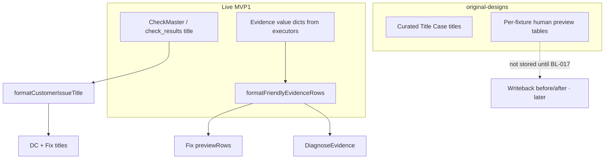

# PRD-FE-09 — DCS title casing + Fix evidence (no raw JSON)

**Status:** Complete (frontend implemented Aug 2026)  
**Module:** see folder path  
**Surfaces:** `/data-consistency` · `/fix` (live path) · shared `src/lib/dcs.ts` / `src/lib/fix-live-plan.ts`  
**Depends on:** FE-08 live Fix bridge (merged) · live worklist + issue detail APIs · existing `formatFriendlyEvidenceRows`  
**Design source of truth:** frontend branch **`original-designs`** — human Title Case titles + human evidence tables (never JSON blobs)  
**Pack:** `Klints_MVP1_Rohan_Build_Pack_v1.2_20260718` — `check_result.schema.json` evidence `{source, locator, value, observed_at}`; no writeback preview until BL-017  
**Out of scope:** New backend endpoints · BL-017 approve tokens · inventing before/after Manago rows · UC-01B Opportunities · Lifecycle · changing FE-03 lock rules

---

## 0. Cursor agent brief (paste this)

```text
Implement PRD-FE-09 (frontend only).

Read: docs/frontend/PRD_FE_09_DCS_COPY_AND_FIX_EVIDENCE.md
Design SoT: original-designs Data Center issue titles + Fix preview tables
  (human columns — never raw JSON in VALUE).

Bugs on main after FE-08 / soft-language polish:
1. Issue titles render lowercase ("duplicate purchases") — original used
   Title / sentence case ("Campaign promise mismatch").
2. Fix live evidence table dumps JSON.stringify(value) while Data Center
   already shows friendly rows via formatFriendlyEvidenceRows.
3. Fix preview feels identical/generic for every check.

Do:
1. Capitalize customer-facing issue titles everywhere formatExecutiveIssueCard
   (and Fix hero) is used — sentence case minimum; preserve intentional acronyms.
2. buildLiveFixPlan previewColumns/previewRows MUST reuse
   formatFriendlyEvidenceRows (same as DiagnoseEvidence) — forbid JSON blobs.
3. Keep original-designs Fix chrome; keep Coming soon / no Manago write claims.
4. Optional: improve "Where it changes" from evidence sources (Shopify · Manago)
   not "klints".
5. No backend changes in this PRD.

Acceptance: §10.
```

---

## 1. Problem (what operators see today)

| Surface | Symptom | vs `original-designs` |
|---------|---------|------------------------|
| Data Center expanded issue | Title all-lowercase: `duplicate purchases` | Title Case / sentence case: `Campaign promise mismatch` |
| Data Center | Evidence often OK (friendly table) | Human “what we found” rows |
| Fix (live `?issue=LE-04`) | Same lowercase title | Curated `plan.title` |
| Fix evidence table | `VALUE` = raw JSON `{"side":"duplicate_purchase",…}` | Human columns (Element / Offer / Confidence…) — **never JSON** |
| Fix kv | “Where it changes: klints” | Connector names (Shopify · Manago.ai) |

**Root cause (code):**

1. `cleanIssueTitle()` in `src/lib/dcs.ts` strips codes but **does not capitalize**; soft-language replacements often produce lowercase phrases.  
2. `buildLiveFixPlan` → `buildPreviewRows` → `formatEvidenceValue` → `JSON.stringify` in `src/lib/fix-live-plan.ts`.  
3. Data Center already uses `formatFriendlyEvidenceRows` in `DiagnoseEvidence.tsx` — Fix did not reuse it.

**Not the root cause:** Missing Architecture data, or empty DB. Worklist already returns `title`, `suggested_fix`, `evidence` / `mismatches` with structured `value` objects.

---

## 2. What we already store (do not rebuild)

| Store | Useful for this PRD |
|-------|---------------------|
| CheckMaster | `check_name`, `suggested_fix`, `systems_compared`, `fix_type`, `fix_owner` |
| Worklist list/detail | `title`, `detail`, `suggested_fix`, `revenue_impact`, `evidence_preview` / full `mismatches`+`evidence` |
| Evidence item | `{ source, locator?, value?, observed_at }` — `value` is often a metric dict |

Pack contract (`03_Machine_Contracts/check_result.schema.json`): evidence is samples for diagnosis — **not** writeback before/after. FE-09 formats samples for humans; it does **not** invent BL-017 previews.

---

## 3. Product decisions (locked)

| # | Decision |
|---|----------|
| 1 | **Titles** are sentence case at minimum (first letter capital). Prefer Title Case for short check names when the cleaned string is a name/phrase (≤ ~8 words), matching original-designs density. |
| 2 | **One capitalizer** in `dcs.ts` — used by `formatExecutiveIssueCard` (and thus Fix + Data Center + Overview cards that use it). |
| 3 | **Fix evidence = Data Center evidence language** — call `formatFriendlyEvidenceRows`; map to Fix table columns. |
| 4 | **Never** show raw JSON / `{…}` blobs in Fix `previewRows` or Data Center evidence tables. |
| 5 | If friendly formatter yields no rows → single honest row: “No row-level preview yet” (FE-08). |
| 6 | Writeback before/after columns stay **out of scope** until BL-017 — helper text remains “Writeback preview requires BL-017…”. |
| 7 | **Frontend only** — no new APIs; optional follow-up BE PRD for richer executor `value` shapes. |
| 8 | Do not regress FE-08 honesty (Approve Coming soon, no “queued for Manago”). |

---

## 4. Title casing rules

### 4.1 Helper (normative)

Add something like:

```ts
/** Customer-facing issue / check title. Never leave fully lowercase. */
export function formatCustomerIssueTitle(raw: string | null | undefined): string {
  const cleaned = cleanIssueTitle(raw); // existing
  return toCustomerTitleCase(cleaned);
}
```

Wire into `formatExecutiveIssueCard`:

```ts
title: formatCustomerIssueTitle(issue.title),
```

### 4.2 `toCustomerTitleCase` behavior

| Input (after clean) | Output |
|---------------------|--------|
| `duplicate purchases` | `Duplicate purchases` (sentence) **or** `Duplicate Purchases` if using Title Case for short names — **locked: Title Case for ≤8 words** |
| `consent data across systems completeness` | `Consent Data Across Systems Completeness` |
| `Purchase event count mismatch` | unchanged (already cased) |
| empty | `Data consistency issue` |

**Preserve as-is (do not smash):** `Manago.ai`, `Shopify`, check-id-like tokens if any remain, `VIP`, `UTM`, `API`.

**Do not** apply Title Case to long **summary/explanation** paragraphs — only to the **title** field (and Fix hero title).

### 4.3 Surfaces that must update

| Surface | Path |
|---------|------|
| Data Center ranked issue title | uses `formatExecutiveIssueCard` |
| Fix hero title | `buildLiveFixPlan` → `card.title` |
| Overview NBA / cards if they use the same helper | automatic if card helper fixed |
| AppShell / FlowStepper issue title | already from worklist / Fix resolve — ensure they use formatted title when from live issue |

---

## 5. Fix evidence — bind friendly rows

### 5.1 Forbidden (live path)

In `src/lib/fix-live-plan.ts`:

- `JSON.stringify` of evidence `value` into a table cell  
- Columns that force operators to read developer locators as the primary story  

### 5.2 Required mapping

Reuse:

```ts
formatFriendlyEvidenceRows(items, { currency })
```

Map to FixPlan preview:

| FixPlan | Source |
|---------|--------|
| `previewColumns` | Friendly headers aligned to Data Center: e.g. `["Where it came from", "What we found", "Details", "Checked"]` (same meaning as DiagnoseEvidence) |
| `previewRows` | Each friendly row → `[system, what, detail, when]` as strings |
| `previewTitle` | Keep `Evidence · {check_id}` |
| `previewHelper` | Keep BL-017 honesty line from FE-08 |

**Item source priority** (unchanged FE-08 intent):

1. Issue detail `mismatches`  
2. Else detail `evidence`  
3. Else list `evidence_preview`  
4. Else empty → one “No row-level preview yet” row  

### 5.3 “Where it changes” kv

| Bad (today) | Good |
|-------------|------|
| `klints` | `Shopify · Manago.ai` from evidence sources / `friendlyEvidenceSystem` |
| `Connected stack (see evidence)` when samples exist | Derive from unique friendly system labels on samples |

Fallback when no samples: `Shopify · Manago.ai` or CheckMaster `systems_compared` if ever exposed — else keep “Connected stack (see evidence)”.

### 5.4 Same chrome, better values (not same fake plan)

Keep one FixPlan **structure** for all live checks (FE-08).  
Do **not** rebuild 6 hard-coded fixture plans.  
Enhance **values**:

| kv key | Enhancement |
|--------|-------------|
| What changes | Keep `formatCustomerSuggestedFix` |
| Where it changes | Friendly systems (§5.3) |
| Scope | `{check_id} · {dimension}` |
| Evidence | Human summary (“8 mismatch samples”) — keep |
| Revenue / Status / Check ID | Keep |

Preview rows become check-specific **because evidence differs**, not because of separate templates.

---

## 6. Data Center — light alignment

| Item | Action |
|------|--------|
| Issue title | Fixed via shared `formatCustomerIssueTitle` |
| Evidence tables | Already on `formatFriendlyEvidenceRows` — **verify** no path still dumps JSON; add regression assert if needed |
| Soft-language copy | Keep; do not revert customer explanations — only fix titles + Fix evidence |

---

## 7. original-designs vs live (honest delta)



Operators get **design-grade readability** from live evidence. They do **not** get fixture-only “After fix” columns until writebacks exist — say so in helper text (already FE-08).

---

## 8. Files to touch

| File | Change |
|------|--------|
| `src/lib/dcs.ts` | Add `formatCustomerIssueTitle` / `toCustomerTitleCase`; use in `formatExecutiveIssueCard` |
| `src/lib/fix-live-plan.ts` | Replace JSON `buildPreviewRows` with friendly mapper; improve Where-it-changes |
| `src/components/klints/DiagnoseEvidence.tsx` | Smoke: ensure still friendly; no JSON path |
| `src/routes/fix.tsx` | Only if preview render assumes old column count — keep chrome |
| `scripts/verify-fe08-frontend.mjs` or new `verify:fe09` | Assert no `JSON.stringify` in fix-live-plan preview path; assert title helper exists |

**Do not touch:** backend, Lifecycle, Opportunities, lock allowlist.

---

## 9. Implementation phases

| Phase | Deliverable | Exit |
|-------|-------------|------|
| **A** | Title capitalizer + wire into `formatExecutiveIssueCard` | DC + Fix titles sentence/Title Case |
| **B** | Fix `buildLiveFixPlan` uses `formatFriendlyEvidenceRows` | No JSON in Fix VALUE column |
| **C** | Where-it-changes from friendly systems | No bare `klints` when samples exist |
| **D** | Verify script / manual checklist | §10 green |

---

## 10. Acceptance checklist

### Titles

- [x] Live FAIL/WARN titles on Data Center are not all-lowercase  
- [x] Fix hero title matches the same casing for the same check  
- [x] Acronyms / Manago.ai / Shopify not mangled  

### Fix evidence

- [x] Live Fix preview shows human “what we found” style rows (same language family as Data Center)  
- [x] No cell contains raw JSON object dumps (`{`, `"side":`, etc.)  
- [x] Empty evidence → “No row-level preview yet”  
- [x] Helper still mentions BL-017 / no writeback claim  

### Honesty / scope

- [x] Approve still Coming soon / disabled for live  
- [x] No new backend APIs  
- [x] FE-08 Switch issue / `?issue=check_id` unchanged  

### Regression

- [x] Fixture `iss-*` Fix path still renders (if still supported)  
- [x] Data Center evidence tables still friendly  

---

## 11. Follow-ups (not this PRD)

| Item | Owner |
|------|--------|
| Executors emit richer row samples (`order.id`, human `summary` on value) | Backend / Engineering DCS |
| Expose `fix_type` / `fix_owner` on worklist **detail** | Backend small |
| Pack `finding.schema` persistence | Later |
| BL-017 before/after writeback preview | Approvals PRD |
| UC-01B Opportunities tracker restore | Engineering |

---

## 12. One-page summary

| Question | Answer |
|----------|--------|
| What? | Capitalize DCS issue titles; Fix evidence uses the same friendly formatter as Data Center |
| Why? | Main looks unprofessional vs `original-designs`; Fix shows JSON |
| Data? | Existing worklist evidence — no new APIs |
| Writes? | None |
| Pack? | Evidence samples only; writeback preview later |
| Engineering alone? | Yes — FE-only |

**PRD:** FE-09 · **Track:** delivery · **Design SoT:** `original-designs` titles + human tables · **Extends:** FE-08
