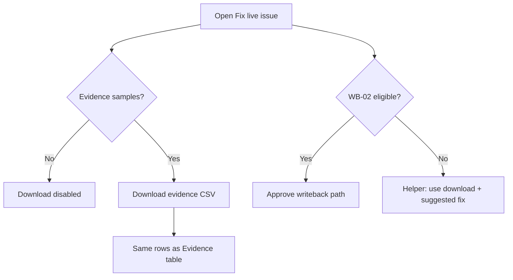

# PRD-FE-12 — Fix evidence Excel / CSV download

**Status:** Ready for implementation **after** WB-02  
**Owner track:** Engineering  — **PR 2 of 2** (follow-up; do not start until WB-02 merged)  
**Surfaces:** `/fix` (Phase 2) · optionally Data Consistency issue detail  
**Depends on:** FE-08 / FE-09 (live evidence) · WB-02 (Approve honesty — so download is clearly the path for non-writable checks)  
**Design SoT:** Keep `original-designs` Fix chrome; add one secondary control — do not redesign  
**Pack SoT:** Evidence samples from DCS (`check_result` evidence / mismatches); Catalogue Suggested Fix for helper copy  
**Out of scope:** Writeback execute · new mappings · MCP · Handoff · PDF assessment report (Engineering RPT) · inventing rows not in API evidence  

---

## 0. Cursor agent brief (paste this)

```text
Implement PRD-FE-12 — downloadable evidence from Fix (after WB-02).

Read:
- docs/engineering/PRD_FE_12_FIX_EVIDENCE_EXCEL_DOWNLOAD.md
- docs/engineering/PRD_WB_02_FIX_APPROVE_WRITEBACK_EXECUTE.md (§3.2 / §6.4)

Ship:
1. On /fix for a live issue, “Download evidence” exports the same
   friendly evidence/mismatch rows the UI shows (CSV required; XLSX nice).
2. Works for ALL live checks with samples — especially non-writable Excel rest.
3. Filename + columns locked in §4. Empty evidence → disabled + honest toast.
4. No fake writeback columns. No Approve changes except optional helper copy
   pointing non-writable checks to download.
5. Prefer FE-built file from already-loaded detail; optional BE endpoint only
   if payload too large (document choice in PR).

Acceptance: §9.
```

---

## 1. Why (after WB-02)

WB-02 turns **Approve writeback** on for **CI-01 / CC-03 / WB-SHOP-01** only.

For the rest of MVP1-A (and any live FAIL/WARN), operators still need a **human/integration** path: take the gap list / evidence offline. Today Fix **shows** evidence; it does **not** download. This PR adds that export — especially for Excel automated-writeback checks that are **not** mapped yet (LE-05 gap list, CI-03 merge plan evidence, etc.).

```text
Writable (WB-02)     → Preview → Approve → write
Not writable (FE-12) → Evidence on screen → Download Excel/CSV → human fixes outside
```

---

## 2. Deploy order (locked)

| Order | PRD | Ship |
|------|-----|------|
| **1** | [PRD-WB-02](./PRD_WB_02_FIX_APPROVE_WRITEBACK_EXECUTE.md) | Approve → sandbox execute |
| **2** | **This PRD (FE-12)** | Evidence download |

Do not combine into one PR. Reviewers must accept write honesty before export polish.

---

## 3. Screens

| Screen | Change |
|--------|--------|
| `/fix?issue=<check_id>` | Add **Download evidence** control near preview table / Evidence tab |
| `/data-consistency` | Optional stretch: same download on expanded issue — **not required** for v1 |
| Handoff / QA / Workflow | No change |

Placement (Fix):

- Prefer secondary button left of / under preview helper: `Download evidence (.csv)`  
- Style: border button (same family as Approve secondary), not spark primary  
- Visible for **all live** issues when samples exist; not only non-writable  

---

## 4. What gets downloaded

### 4.1 Source of rows (same as UI)

Priority (match FE-09):

1. Issue detail `mismatches` (friendly-formatted)  
2. Else detail `evidence`  
3. Else list `evidence_preview`  

Use existing `formatFriendlyEvidenceRows` / Fix preview row builder so **download ≡ screen**.

### 4.2 File formats

| Format | Required? | Notes |
|--------|-----------|-------|
| **CSV** | **Yes** | UTF-8, BOM optional for Excel open |
| **XLSX** | Nice-to-have | Only if dependency already acceptable; otherwise CSV-only is enough for acceptance |

Product may label the button “Download Excel” while shipping CSV that Excel opens — OK if helper says “CSV · opens in Excel”. If true `.xlsx` is easy (`sheetjs` / server), fine; do not block on it.

### 4.3 Filename

```text
klints-evidence-{check_id}-{yyyyMMdd-HHmm}.csv
```

Example: `klints-evidence-LE-05-20260814-2130.csv`

### 4.4 Columns (locked)

| Column | Content |
|--------|---------|
| `check_id` | e.g. `LE-05` |
| `check_name` | Friendly / catalogue title |
| `row_kind` | `mismatch` \| `evidence` \| `match` (if included) |
| `element` | Friendly element / platform field (FE-11B style if present) |
| `locator` | Evidence locator / entity key |
| `source` | Manago / Shopify / … |
| `value` | Human string (**never** raw JSON blob) |
| `observed_at` | ISO if present else empty |
| `suggested_fix` | Same short text as Fix hero / worklist (repeated per row OK) |

Do **not** add before/after writeback columns unless that row came from a writeback preview export (out of scope — separate if ever needed).

### 4.5 Empty / error

| State | UI |
|-------|-----|
| No samples | Button disabled; title/tooltip: “No row-level evidence on this run” |
| Still loading detail | Button disabled |
| Fixture issue | Hidden or disabled — “Demo data · export off” |
| Click with empty | Toast: “Nothing to download” |

---

## 5. Behaviour details

1. Click → build file in browser from in-memory detail (preferred).  
2. Trigger browser download (anchor / `URL.createObjectURL`).  
3. Toast soft success: “Downloaded · {filename}”.  
4. Optional audit: **not required** for v1 (download is local). If easy, `append_audit_event` `fix.evidence_exported` — only if BE endpoint exists; skip for pure FE blob.  
5. Helper under Evidence for non-writable checks (from WB-02 eligibility):  
   “Automated writeback is not available for this check. Download evidence for manual or integration fix.”

### 5.1 Optional BE endpoint (only if needed)

Use only if evidence payloads are truncated in worklist detail:

```http
GET /api/v1/dcs/worklist/issues/{check_id}/evidence.csv
```

Auth + company scope same as worklist. Return `text/csv`.  
**Default plan:** FE-only from detail JSON. Document in PR which path shipped.

---

## 6. Relationship to writable checks

| check_id | WB-02 Approve | FE-12 Download |
|----------|---------------|----------------|
| CI-01, CC-03, WB-SHOP-01 | Yes (sandbox) | Yes — export evidence **and/or** still useful pre-approve |
| Excel rest / LE-04 / stubs | No | **Primary** operator tool |
| Fixtures | No | No |

Download must **not** replace Approve for CI-01/CC-03.

---

## 7. Diagram



---

## 8. Files (expected)

| Area | Touch |
|------|-------|
| `src/routes/fix.tsx` | Download button + handler |
| `src/lib/fix-evidence-export.ts` (new) | Build CSV rows + filename |
| Reuse | `formatFriendlyEvidenceRows` / FE-09 helpers |
| Tests | Unit for CSV escaping (commas, quotes) |

---

## 9. Acceptance checklist

- [ ] WB-02 already merged (dependency)  
- [ ] Live Fix with evidence → downloads CSV that matches on-screen rows  
- [ ] Filename includes check_id + timestamp  
- [ ] Empty evidence → disabled / honest toast  
- [ ] Fixtures do not export as “live”  
- [ ] No raw JSON in cells  
- [ ] Non-writable checks show helper pointing at download  
- [ ] Approve / execute behaviour unchanged  
- [ ] No Handoff / MCP / new write mappings  

---

## 10. Done means

An operator on **LE-05** (or any non-writable FAIL) can open Fix, **Download evidence**, and hand the file to an integrator — without Klints pretending to write Manago.
