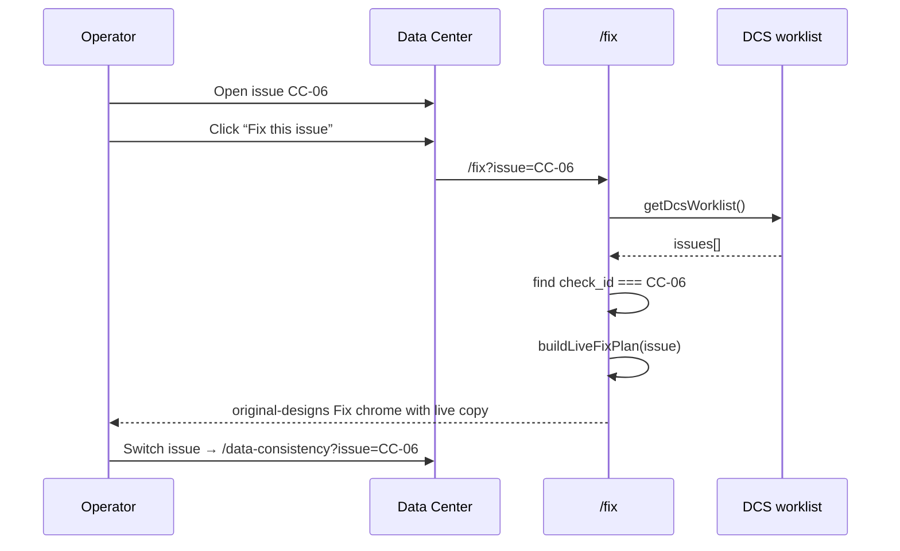

# PRD-FE-08 — Fix screen ↔ live Data Center issue bridge

**Status:** Complete (frontend implemented Aug 2026)  
**Owner track:** Maheep (`docs/maheep/`)  
**Surfaces:** `/fix` · `/data-consistency` (links only)  
**Depends on:** Live DCS worklist (`GET /api/v1/dcs/worklist/`) · existing Fix UI chrome  
**Design reference (authoritative UX):** frontend branch **`original-designs`** — `src/routes/fix.tsx` + `src/styles/fix.css` + fixture `fixPlans` layout  
**Out of scope:** BL-017 approval tokens · Manago writebacks · orchestration FIX tasks · UC-01 pilots · changing FE-03 lock rules · Workflow Studio live bind  

---

## 0. Cursor agent brief (paste this)

```text
Implement PRD-FE-08 (frontend only).

Read: docs/maheep/PRD_FE_08_FIX_LIVE_ISSUE_BRIDGE.md
Design reference: git show origin/original-designs:src/routes/fix.tsx
  (and fix.css) — KEEP the same visual structure / CSS classes.

Bug: Data Center links /fix?issue=CC-06 (check_id) but Fix looks up
fixture iss-* ids via getIssueById + fixPlans → empty “Please select an issue”.

1. Resolve search issue|check → check_id (reuse getCheckIdFromSearch).
2. Load live worklist; find issue by check_id (case-insensitive).
3. Render original-designs Fix layout for that live issue:
   - Prefer fixture fixPlans[iss-*] ONLY if issue param is still a fixture id.
   - Else buildLiveFixPlan(dcsIssue) filling the same FixPlan slots from live fields.
4. Approve writeback: NO fake “queued for Manago” toast.
   Use Coming soon / disabled until BL-017 — or toast without claiming Manago.
5. Trust timeline (4 steps) + fix-state-row: same behavior as original-designs (§3.1).
6. Switch issue → /data-consistency?issue=<check_id> and that issue expands
   (same intent as original-designs Switch — §3.2).
7. Empty states: no id / unknown check / worklist loading / error — honest copy.
8. Do not invent writeback preview rows when evidence is missing —
   show “Preview not available yet” inside the same chrome.

Acceptance: §10.
```

---

## 1. Design reference (original-designs)

**Branch:** `original-designs` (frontend repo)  
**Treat as the visual + interaction contract for the Fix page shell.**

Keep these blocks and CSS (class names in `fix.css`):

| Block | Role |
|-------|------|
| Empty state | “Please select an issue” + CTA to Data Consistency |
| `fix-trust` | Four steps: Review → Test → Approve → Audit |
| `fix-hero` | Eyebrow, title, summary, mode badge, change-set id |
| `fix-kv-grid` | What / where / scope / owner / rollback / id |
| Touchpoints pills | Affected surfaces |
| State row | Proposed → … → Applied |
| Preview table | Before/after style consistency check |
| `fix-gov` | Governance grid |
| Test badge | Sandbox status |
| CTA row | Approve + proceed |
| `fix-next-action` | Phase 3 Workflow Studio teaser |

**Do not** redesign the page into a new card dashboard. Bind live data **into** this composition.

Fixture `fixPlans` on that branch remain the **gold-standard content shape** for how dense the hero should feel when a rich plan exists.

---

## 2. Problem (today on main)

```text
Data Center (live)
  → Link to="/fix" search={{ issue: checkId }}   // e.g. CC-06, CI-08
       ↓
Fix page
  → getIssueById(issueId)  // looks up klints-data issues[] by iss-campaign …
  → fixPlans[issueId]
       ↓
MISS → empty “Please select an issue”
```

Round-trip “Switch issue” from Fix also uses fixture `working.id`, so Data Center cannot re-open the live issue either when coming from a broken Fix session.

---

## 3. Product decisions (locked)

| # | Decision |
|---|----------|
| 1 | **Primary key on Fix URL** = DCS `check_id` via `?issue=` or `?check=` (same as Data Center). |
| 2 | **UX chrome** = original-designs Fix layout (not a new design). |
| 3 | **Live content** = map `DcsIssue` → `FixPlan`-shaped view model. |
| 4 | **Fixture path** still works if `?issue=iss-*` (demo/regression); live path is default from Data Center. |
| 5 | **No Manago side effects** — Approve must not claim writeback queued. |
| 6 | **Workflow Studio CTA** — if no real `workflowId`, disable or link Data Center / Opportunities with honest label (“Build · Coming soon”); do not navigate to fake `/workflow/wf-*`. |
| 7 | **FE-03** — `/fix` stays locked until DCS unlock (no change to allowlist). |
| 8 | **Timeline / trust bar** — same interaction model as **original-designs** (§3.1). |
| 9 | **Switch issue** — returns to Data Center **on the same issue**, expanded — same as original-designs intent (§3.2). |

### 3.1 Timeline / trust bar (original-designs — locked)

There are **two** progress UIs on Fix; both must behave like `original-designs`:

**A. Trust strip (`fix-trust-steps`) — 4 steps**

| Step | original-designs behavior |
|------|---------------------------|
| 01 Review | `is-done` when plan is shown |
| 02 Test | `is-current` until approve; then done |
| 03 Approve | `pending` → done when local `approved === true` |
| 04 Audit | `pending` → done when local `approved === true` |

- Keep the same CSS (`is-done` / `is-current` / pending labels).  
- On issue change, reset `approved` to `false` (same `useEffect` as original-designs).  
- For **live** issues: advancing the bar on click is OK for **UI chrome only**; toast/copy must **not** say Manago was updated (Coming soon). Prefer disabling Approve and leaving steps 03–04 pending until BL-017 — **or** allow local advance with honest toast (product choice; default = **disable Approve**, keep bar visually at step 02 current like “plan ready / writeback not enabled”).

**B. Change-set state row (`fix-state-row`)**

- Render `plan.states[]` with `done` / `current` / `pending` classes exactly as original-designs.  
- Live `buildLiveFixPlan` must supply a full 5-state row (see §5); do not omit the bar.

### 3.2 Switch issue (original-designs — locked)

original-designs:

```tsx
<Link to="/data-consistency" search={{ issue: working.id }}>Switch issue</Link>
```

**Live path must preserve the intent:** land back on **that** issue in Data Center, not a blank list.

| | Fixture path | Live path |
|---|--------------|-----------|
| Link | `/data-consistency?issue=iss-campaign` | `/data-consistency?issue=CC-06` (`check_id`) |
| Data Center | Highlight/expand that issue | Already supported on main: `checkFromUrl` → `setExpandedId(checkFromUrl)` |

**Required:**

1. Switch uses **`check_id`** for live targets (`issue: checkId`), never a missing fixture id.  
2. After navigation, the matching worklist row is **expanded / focused** (main already does this when `?issue=` is a check id — do not regress).  
3. Optional polish (match “always see the issue”): append `#dcs-issues` if Data Center already scrolls to that hash — only if it already exists; do not invent new scroll logic unless needed.  
4. PageTitle **Switch issue** button stays in the same place as original-designs (actions slot).

---

## 4. Flows

### 4.1 Happy path (live)



### 4.2 Resolution order

```text
search = parseFixFlowSearch()
checkId = getCheckIdFromSearch(search)     // check param wins; else issue if CHECK_ID_PATTERN
fixtureId = search.issue if looks like iss-*

if fixtureId and fixPlans[fixtureId] and getIssueById(fixtureId):
  → render fixture path (original-designs content as-is)
else if checkId:
  → load worklist → find by check_id
  → if found: buildLiveFixPlan + render
  → if not found: “Issue not in latest worklist”
else:
  → empty “Please select an issue”
```

`CHECK_ID_PATTERN` already used in `resolveCheckIdFromSearch` — reuse; do not invent a second parser.

---

## 5. Live → FixPlan mapping

Target type: existing `FixPlan` in `klints-data.ts` (same fields the JSX already reads).

| FixPlan field | Live source |
|---------------|-------------|
| `eyebrow` | `"{dimension or area} · {status}"` e.g. `Channel & Consent · FAIL` |
| `title` | `issue.title` (customer-facing) |
| `summary` | `formatExecutiveIssueCard` / `suggested_fix` / detail — prefer existing dcs.ts formatters |
| `changeSetId` | `chg_pending_{check_id}` or `—` (not a real change set) |
| `mode` | `"approve"` if FAIL/WARN with suggested fix; `"build"` only if product marks opportunity — default **`approve`** for open FAIL/WARN |
| `kv` | Rows from: What changes ← `suggested_fix`; Where ← connectors; Scope ← check_id + dimension; Evidence ← sample/count fields if present; Revenue ← `revenue_impact` formatted; Status ← issue.status |
| `touchpoints` | From connectors / dimension label — max 6; fallback `["Manago.ai", "Shopify"]` when unknown |
| `states` | Static honest pipeline: Diagnosed(done) → Evidenced(done) → Plan ready(current) → Approved(pending) → Applied(pending) |
| `previewTitle` | `"Evidence · {check_id}"` |
| `previewHelper` | Short line: writeback preview requires BL-017; showing evidence summary only |
| `previewColumns` / `previewRows` | If issue has structured evidence samples → 2–5 rows; else **one** row or empty-state inside table: “No row-level preview yet”. **FE-09:** rows must use `formatFriendlyEvidenceRows` (human text — never raw JSON). |
| `govHead` | Fixed copy: Klints does not write to Manago until human approval tokens exist (BL-017). |
| `gov` | Approval owner ← “Workspace admin (pending)”; Production target ← “Not enabled”; Audit ← “Will attach on approval”; Source ← check_id |
| `testBadge` | `"Sandbox writeback · Coming soon"` (not “Test complete”) |
| `ctaLabel` | `"Approve writeback · Coming soon"` or keep Proceed disabled |

Reuse helpers already used on Data Center / Overview (`formatCustomerSuggestedFix`, `formatDcsRevenue`, etc.) — do not duplicate business copy inventively.

---

## 6. Approve / CTA honesty

### 6.1 Approve writeback button

| Today (fixture) | After FE-08 |
|-----------------|-------------|
| Toast: “Writeback approved · queued for Manago.ai” | **Forbidden** for live check_id path |
| Local `approved` state | Allowed for UI step chrome only |
| | Live path: button **disabled** with label “Approve writeback · Coming soon” **or** click → toast *“Writebacks are not enabled yet — this does not update Manago”* |

Fixture `iss-*` path may keep demo toast **only if** clearly still demo; preferred: same honesty everywhere.

### 6.2 Proceed to Workflow Studio

| Case | Behavior |
|------|----------|
| Fixture issue with `workflowId` | May keep Link to `/workflow/$id` (demo) |
| Live DCS issue | **No** fake workflow id — button becomes secondary: “Build · Coming soon” or link back to Data Center |

---

## 7. Empty / error / loading

| State | UI |
|-------|-----|
| No `issue`/`check` | Keep original-designs empty state + “Go to Data Consistency Score” |
| Worklist loading | `KlintsLoader` inside Fix page (same shell) |
| Worklist error | Retry + link to Data Center |
| check_id not in worklist | “CC-06 is not an open issue on the latest score” + link Data Center |
| App locked | FE-03 already blocks `/fix` — no special case |

---

## 8. Data Center link contract (verify only)

Already correct on main — **do not regress**:

```tsx
to="/fix"
search={{ issue: checkId }}  // check_id string
```

Fix “Switch issue”:

```tsx
to="/data-consistency"
search={{ issue: checkId }}  // same check_id, never iss-*
```

Optional hardening: also pass `check` param as alias (`search={{ issue: checkId, check: checkId }}`) — not required if `issue` carries check_id.

---

## 9. Implementation sketch

### 9.1 Files

| File | Change |
|------|--------|
| `src/lib/fix-flow.ts` | Add `isFixtureIssueId`, `resolveFixTarget(search)`, stop using fixture-only `getIssueById` as sole path |
| `src/lib/fix-live-plan.ts` (new) | `buildLiveFixPlan(issue: DcsIssue): FixPlan` |
| `src/routes/fix.tsx` | Worklist query + branch fixture vs live; preserve JSX structure from original-designs |
| `src/styles/fix.css` | Prefer no visual redesign; only tweaks if Coming-soon states need a muted CTA |
| `src/routes/data-consistency.tsx` | Smoke-check links still pass check_id |

### 9.2 Suggested helper API

```ts
export type FixTarget =
  | { kind: "fixture"; issueId: string; issue: GovernanceIssue; plan: FixPlan }
  | { kind: "live"; checkId: string; issue: DcsIssue; plan: FixPlan }
  | { kind: "missing"; checkId?: string }
  | { kind: "empty" };
```

---

## 10. Acceptance checklist

### Bridge

- [x] From Data Center “Fix this issue” on a live FAIL/WARN → Fix shows that issue’s title (not empty state)  
- [x] URL is `/fix?issue=<CHECK_ID>` (e.g. `CC-06`)  
- [x] “Switch issue” returns to `/data-consistency?issue=<CHECK_ID>` and Data Center can highlight/open that issue  
- [x] Unknown check_id → honest not-found, not blank forever  

### Design fidelity

- [x] Trust strip + hero + kv + preview + gov + CTA structure matches **original-designs** Fix page  
- [x] Same CSS classes (`fix-page`, `fix-hero`, …) retained  
- [x] Trust timeline (4 steps) + `fix-state-row` render like original-designs; `approved` resets on issue change  
- [x] **Switch issue** → `/data-consistency?issue=<check_id>` and that issue is expanded on Data Center  

### Honesty

- [x] No toast claiming Manago writeback queued for live issues  
- [x] No navigation to invented `/workflow/wf-*` for live issues  
- [x] Preview does not invent fake before/after rows when evidence missing  

### Non-goals

- [x] No new backend endpoints  
- [x] No BL-017 tokens  
- [x] No UC-01 / Opportunities changes  

---

## 11. Out of scope

| Item | Owner later |
|------|-------------|
| Diff-bound approval tokens + audit | BL-017 / Fix backend |
| Real sandbox test execution | Build pack execution |
| Orchestration `task_type=FIX` | ORCH-01 |
| Use Case Library | UC-01 (Sahil) |
| Restyling Fix away from original-designs | Design pass (not this PRD) |

---

## 12. One-page summary

| Question | Answer |
|----------|--------|
| What? | Make `/fix?issue=CC-06` open the original-designs Fix UI for the **live** DCS issue |
| Why? | Data Center → Fix is broken: fixture ids vs check_ids |
| Design? | **original-designs** Fix page = chrome reference |
| Data? | DCS worklist only |
| Writes? | None — Coming soon |
| Maheep alone? | Yes — FE-only |

**PRD:** FE-08 · **Track:** Maheep · **Design ref:** `original-designs` `/fix`
