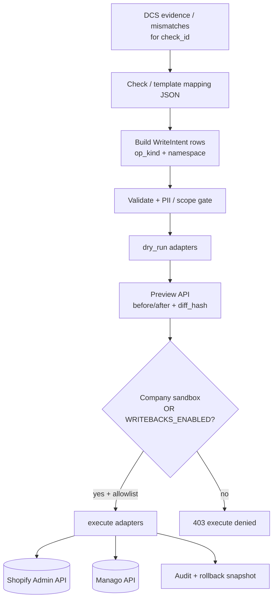

# PRD-WB-01 — Writeback adapter foundation (dry-run + check mappings)

**Status:** Implemented (backend complete)  
**Owner track:** Maheep (`docs/maheep/`)  
**Backlog bridge:** Prepares **BL-017** (approval tokens) + pack Fix Type “Automated writeback (approved)”  
**Depends on:** Shopify/Manago connectors (read already live) · DCS worklist evidence · CheckMaster `fix_type` / `fix_owner`  
**Pack:** `Klints_MVP1_Rohan_Build_Pack_v1.2_20260718`  
- `03_Machine_Contracts/approval_token.schema.json` (consume later — **do not issue tokens in v1**)  
- DCS sheet **02** Suggested Fix / Fix Type / Fix Owner  
- Orchestration: no writeback before consent gate (SP-07) — enforce as **preflight check**, not full ORCH yet  
**Out of scope:** Live production writes for non-sandbox tenants · FE Approve button live · MCP workflow upsert · BL-016 build packages · LLM · full BL-017 token issuance service

---

## 0. Cursor agent brief (paste this)

```text
Implement PRD-WB-01 — writeback adapter foundation (BE).

Read: docs/maheep/PRD_WB_01_WRITEBACK_ADAPTER_FOUNDATION.md
Pack: Klints_MVP1_Rohan_Build_Pack_v1.2_20260718
  - DCS sheet 02 Fix Type / Fix Template (T1–T11)
  - Manago Execution Capability Matrix (WRITE capabilities)
  - Pilot blueprints: namespace details=klints_ tags=klints:

Goal: common write pipeline for ALL write kinds (not only consent) —
  DB/canonical/evidence → connector map.json (REVERSE) → API payload
  → dry-run → optional REAL execute on sandbox/test companies.

1. REUSE dataruns/connectors/{shopify,manago_ai}/map.json —
   inbound today is api_key→db_key; writeback MUST reverse db_key→api_key.
   Add shared helper (e.g. reverse_map_record) used by writers + future export.
2. Library entrypoint callable from anywhere (Fix API, Celery, ORCH, tests):
   writeback_run(company, check_id|intents, *, mode, batch_size, …)
   Caller sets batch_size / max_rows — not hardcoded only in HTTP view.
3. New / unmapped fields: extend map.json OR pass extras with
   api_key explicitly; never silently drop required write fields.
4. Writer registry + op kinds; check mapping JSON for op_kind/namespace.
5. Pipeline: load → reverse-map → validate → dry_run → execute (gated).
6. HTTP thin wrapper around the same library function.
7. Sandbox company IDs for real execute; prod kill-switch default off.

Acceptance: §11.
```

---

## 1. Why this (and why Maheep)

| Today | Gap |
|-------|-----|
| Connectors **read** Shopify/Manago | No shared **write** path |
| Fix UI says Coming soon | No backend to preview a real diff |
| Pack / BL-017 | Needs adapters + diff hash before tokens |
| `DataFixAction` model exists | Unused / not wired |

**Maheep fit:** He owns connector surface (Shopify refresh, Manago v3 key, Integrations). Writers are the natural next layer.

**Product rules:**
1. Build plumbing + dry-run for **every write kind** the pack uses (details, tags, upserts, events, catalog — not only consent).
2. **Sandbox/test accounts must be able to prove real writes work** (see §5.3).
3. **Customer/prod tenants:** execute stays off by default until BL-017.

---

## 1b. Pack truth — what “writeback” means

From DCS Overview **Fix types** (authoritative):

> **Automated writeback (approved)** = Klints executes via API after human approval, **`klints_` namespaced**, audit-logged, rollback-noted.

Other Fix Types (writers do **not** execute these — they only surface as non-write intents / handoffs):

| Fix Type | Writer role |
|----------|-------------|
| Automated writeback (approved) | Preview + (gated) execute |
| Integration build (+ writeback) | Preview possible after pipe exists; execute only the writeback half |
| Configuration | No adapter write — emit `intent_kind=configuration` guidance |
| Manual (guided) | No adapter write — emit guided task payload |

### 1b.1 Namespace (pilots + writebacks)

Every MVP1 pilot blueprint `data_contract.namespace`:

| Surface | Prefix | Example |
|---------|--------|---------|
| Manago **details** | `klints_` | `klints_vip_candidate`, `klints_cohort`, `klints_erp_id`, `klints_next_refill` |
| Manago **tags** | `klints:` | `klints:vip_candidate` |

**Rule:** Prefer writing Klints-owned `klints_` / `klints:` unless the check’s Suggested Fix explicitly repairs a **native** field (email, phone E.164, externalId, consent flags, event value, catalog qty). Native repairs are higher risk — still allowed when mapping says so, still require approval/sandbox gates.

Rollback (pack): deactivate/revert using audit snapshot of prior detail/tag values.

### 1b.2 Write kinds the common function must understand

Map each mapping op to a **capability-shaped** kind. Align with Manago Capability Matrix WRITE rows where possible:

| `op_kind` | Typical target | Pack / capability anchor | Used by (examples) |
|-----------|----------------|--------------------------|--------------------|
| `contact_upsert` | Manago | `RESTV2.CONTACT.UPSERT` | T1/T2/T4 identity + field normalise (CI-01, CI-05, CI-09…) |
| `detail_set` | Manago | contact details (`klints_*` or native) | CI-06 cohort, CI-16 `klints_erp_id`, UC-23 VIP detail, SP-04 dates |
| `tag_add` / `tag_remove` | Manago | tags (`klints:` or native) | T9 SP-01, UC-23 `klints:vip_candidate`, suppression tags |
| `contact_merge` | Manago | merge survivor plan | T3 CI-03 |
| `event_ingest` | Manago | `RESTV2.EVENT.INGEST` / batchAddContactExtEvent | T5 LE-01/05/09/14 PURCHASE/RETURN backfill |
| `event_update` | Manago | updateContactExtEvent (CART close) | LE-08 |
| `event_correct` | Manago | value/date fix where externalId matches | T6 LE-02, LE-06 |
| `product_upsert` | Manago | `RESTV2.PRODUCT.IMPORT` / v3 product upsert | T7 PT-01/03/05/06 |
| `coupon_sync` | Manago↔Shopify | addContactCoupon / discount codes | PT-13 (later) |
| `consent_reconcile` | Manago (+ Shopify if mapped) | T8 | CC-01/CC-02 |
| `shopify_customer_update` | Shopify | Admin customer fields | when Suggested Fix writes commerce side |
| `shopify_metafield_set` | Shopify | metafields | birthday / custom attrs (CI-12 surface) |
| `erp_attribute_feed` | ERP/CSV stub | T10 | BR-* (stub adapter OK in v1) |
| `availability_gate` | Manago/Shopify | T11 | BR-03 (often config+tag; mapping decides) |

**v1 implement for real (adapters + ≥1 mapping each):**  
`contact_upsert`, `detail_set`, `tag_add`, `event_ingest` (dry-run + sandbox execute).  
**Stub with clear `adapter_not_implemented`:** merge, product, coupon, ERP, Shopify metafield (unless easy).

### 1b.3 Fix templates (parameterise mappings, don’t invent 40 writers)

Pack: 34 blueprint-eligible checks → **11 templates**. Mappings should key off template where possible:

| Template | Write shape |
|----------|-------------|
| T1 Identity backfill | `contact_upsert` batches |
| T2 Identity key repair | `contact_upsert` + optional `detail_set` (`klints_erp_id`) |
| T3 Contact merge | `contact_merge` |
| T4 Field normalisation | `contact_upsert` (phone/name/address) |
| T5 Event backfill | `event_ingest` |
| T6 Event correction | `event_correct` / `event_update` |
| T7 Catalog sync | `product_upsert` |
| T8 Consent reconciliation | `consent_reconcile` |
| T9 Tag consolidation | `tag_add` / `tag_remove` |
| T10 ERP attribute feed | stub / feed |
| T11 Availability gating | tag/detail or config |

Registry may list `check_id` → `template_id` + override file.

---

## 2. Architecture



### 2.1 Common interface (normative)

```python
class WriteAdapter(Protocol):
    target: Literal["shopify", "manago", "erp"]

    def dry_run(self, company, intents: list[WriteIntent]) -> WritePreview: ...
    def execute(self, company, intents: list[WriteIntent], *, approval_id: str | None) -> WriteResult: ...
```

`WriteIntent` (conceptual):

| Field | Meaning |
|-------|---------|
| `check_id` | e.g. `CI-06`, `CC-01` |
| `template_id` | e.g. `T9` (optional) |
| `op_kind` | from §1b.2 enum |
| `operation` | e.g. `manago.detail_set` |
| `target_system` | `shopify` \| `manago` \| `erp` |
| `namespace` | `klints_` / `klints:` / `native` |
| `entity_type` / `entity_key` | stable id (email / shopify gid / manago contactId / externalId) |
| `payload` | **connector-shaped** dict after reverse-map (+ extras) |
| `rollback_snapshot` | prior values captured at dry_run/execute |
| `source_evidence_ref` | locator / sample index |

### 2.2 Connector `map.json` is the column bridge (normative)

Today inbound import only:

```text
dataruns/connectors/shopify/map.json      # api_key → db_key
dataruns/connectors/manago_ai/map.json    # api_key → db_key
dataruns/connectors/import_data._map_record  # uses key_mapping one way
dataruns/connectors/export_data              # exports db_keys only — NOT reverse yet
```

**Writeback must close the loop:**

```text
canonical / DB / evidence (db_key)
        ↓ reverse key_mapping
connector API payload (api_key)     ← what Manago/Shopify HTTP expects
        ↓ adapter.execute
platform write
```

| Rule | Behavior |
|------|----------|
| Shared helper | e.g. `dataruns/connectors/mapping.py`: `load_connector_map(platform)`, `map_api_to_db`, `map_db_to_api` |
| Same files | Do **not** fork a second field dictionary for writers — extend `map.json` |
| Nested paths | Preserve dotted `api_key` (e.g. Shopify `customer.id`) on reverse via `_set_path` |
| Status | Reverse `status_map` where unambiguous; if many→one, mapping file may add `status_map_write` |
| Unknown db_key | See §2.3 — never invent `api_key` |

### 2.3 New / dynamic fields (robustness)

Writebacks must survive fields that are not in the original Contact/Order columns (e.g. `klints_cohort`, tags, metafields).

| Case | How it works |
|------|----------------|
| Already in `map.json` | Reverse-map automatically |
| New **native** connector field | Add `{entity, api_key, db_key}` to that connector’s `map.json` (same PR as the write mapping) |
| Klints namespace detail/tag | Not a Contact column — use `op_kind=detail_set` / `tag_add` with explicit `api_key` / detail key in **check** mapping; still goes through adapter |
| One-off override | Intent may include `extras: { "api_key": value }` merged **after** reverse-map (wins on conflict) |
| Missing reverse for a required field | Intent status `error` + reason `unmapped_field:<db_key>` — do not partial-write that row |

**Do not** require a Django model column for every writeable Manago detail — details/tags are first-class `op_kind`s.

### 2.4 Library API — call from anywhere (normative)

HTTP views are thin. Core is a pure service:

```python
def writeback_run(
    *,
    company: Company,
    check_id: str | None = None,
    intents: list[WriteIntent] | None = None,  # OR build from check_id + evidence
    mode: Literal["dry_run", "execute"] = "dry_run",
    batch_size: int = 25,          # caller-controlled chunk size for adapter HTTP
    max_rows: int | None = None,   # hard cap (sandbox default 10)
    approval_id: str | None = None,
    actor: User | None = None,
) -> WritebackResult: ...
```

| Caller | How |
|--------|-----|
| `POST /writebacks/preview/` | `mode=dry_run`, `batch_size` from body or default |
| `POST /writebacks/execute/` | `mode=execute` after gates |
| Celery / ORCH FIX task | Same function, own `batch_size` (e.g. 100 for backfill) |
| Tests / management command | Same function |
| Future Fix FE | Never bypasses this |

**Batching:** `batch_size` slices intents before adapter HTTP (respect Manago ≤1000/contact batch where relevant — clamp to connector max). Custom size from caller always honored up to connector + sandbox caps.

**Idempotency:** adapters should send stable idempotency keys per intent when the API supports it.

---

## 3. Check mapping JSON (ops / namespace — not field columns)

Field columns live in connector `map.json`. Check mappings decide **which op_kind** and **which values** to write.

Store versioned files in repo, e.g.:

```text
dataruns/writebacks/mappings/
  registry.json                 # check_id → mapping file + enabled
  CC-03.consent_parity.v1.json
  LE-04.duplicate_purchase.v1.json
  …
```

### 3.1 Mapping file shape (v1)

```json
{
  "schema_version": "1.0.0",
  "check_id": "CI-06",
  "template_id": null,
  "title": "Classify unexplained imports → klints_cohort",
  "enabled": true,
  "requires_consent_namespace_clean": false,
  "operations": [
    {
      "operation_id": "manago.detail_set.klints_cohort",
      "op_kind": "detail_set",
      "target": "manago",
      "namespace": "klints_",
      "capability_id": "RESTV2.CONTACT.UPSERT",
      "from_evidence": {
        "entity_key": "value.email",
        "fields": {
          "detail_key": { "const": "klints_cohort" },
          "detail_value": { "path": "value.cohort_label" }
        }
      },
      "guards": ["entity_key_required", "email_format", "klints_prefix"]
    }
  ]
}
```

Second example (tag + detail — pilot-shaped):

```json
{
  "check_id": "UC-23-SAMPLE",
  "operations": [
    {
      "op_kind": "detail_set",
      "namespace": "klints_",
      "from_evidence": { "fields": { "detail_key": { "const": "klints_vip_candidate" }, "detail_value": { "const": "true" } } }
    },
    {
      "op_kind": "tag_add",
      "namespace": "klints:",
      "from_evidence": { "fields": { "tag": { "const": "klints:vip_candidate" } } }
    }
  ]
}
```

**v1 honesty:** Ship **≥3 enabled mappings** covering different `op_kind`s (recommend: `detail_set` + `tag_add` + `contact_upsert` or `event_ingest`). Registry lists remaining automated-writeback checks as `"enabled": false` stubs with `template_id` filled.

Do **not** invent Manago/Shopify field names — pull from pack sheet 02 Suggested Fix / surfaces + Capability Matrix + existing fetch shapes; **STOP_AND_FLAG** if unknown.

---

## 4. Pipeline steps (implement in detail)

| Step | Function | Behavior |
|------|----------|----------|
| 1 Load | `get_check_mapping(check_id)` + `load_connector_map(target)` | Fail if check mapping missing/disabled |
| 2 Collect | Evidence / DB rows / caller-supplied intents | Apply `max_rows` |
| 3 Build canonical patch | Paths/consts from check mapping → `{db_key: value}` (+ details/tags) | No LLM |
| 4 Reverse-map | `map_db_to_api` via connector `key_mapping` + merge `extras` | Error row if required field unmapped |
| 5 Guard | Email format, required keys, connector connected | Reject row with reason |
| 6 Prefight | SP-07 etc. when mapping asks | Block whole job if needed |
| 7 Dry-run / Execute | Chunk by `batch_size` → adapter | Execute only if sandbox or global flag |
| 8 Hash + audit | `diff_hash` + events | BL-017 ready |

---

## 5. API contract (v1)

Base: `/api/v1/writebacks/` · JWT · company-scoped · roles: **admin** (execute) · admin/analyst (preview).

| Method | Path | Purpose |
|--------|------|---------|
| `GET` | `/writebacks/mappings/` | List check_ids + `op_kind`s + enabled + version |
| `GET` | `/writebacks/kinds/` | Static enum of supported `op_kind` + adapter status |
| `POST` | `/writebacks/preview/` | Body: `{ "check_id", "batch_size"?, "max_rows"? }` → intents + before/after + diff_hash |
| `POST` | `/writebacks/execute/` | Body: `{ "check_id", "diff_hash", "batch_size"?, "approval_id"? }` — see §5.3 |

### 5.1 Preview response (sketch)

```json
{
  "check_id": "CI-06",
  "mode": "dry_run",
  "diff_hash": "…",
  "blocked_reason": null,
  "intents": [
    {
      "op_kind": "detail_set",
      "operation": "manago.detail_set.klints_cohort",
      "target": "manago",
      "namespace": "klints_",
      "entity_key": "a***@example.com",
      "before": { "klints_cohort": null },
      "after": { "klints_cohort": "unexplained_import" },
      "status": "ready"
    }
  ],
  "summary": { "ready": 3, "skipped": 1, "errors": 0 },
  "execute_eligible": {
    "sandbox": true,
    "production": false
  }
}
```

Mask PII in API responses (email local-part redaction).

### 5.2 Execute gates (defaults)

| Condition | Result |
|-----------|--------|
| Company **not** in sandbox list **and** `WRITEBACKS_ENABLED=False` | **403** `{ "detail": "Writebacks are disabled." }` |
| Check not in `WRITEBACK_CHECK_ALLOWLIST` | **403** |
| `diff_hash` mismatch vs recomputed | **409** |
| Adapter returns `adapter_not_implemented` | **501** for that op |
| Prod path without `approval_id` | **403** once BL-017 lands; until then prod execute stays off |

Emit audit: `writeback.previewed` / `writeback.execute_denied` / `writeback.executed` (include `sandbox: true|false`).

### 5.3 Sandbox / test-account real writes (required)

Maheep **must** be able to prove writebacks work on connected **test** Manago + Shopify accounts — not only dry-run mocks.

| Setting | Purpose |
|---------|---------|
| `WRITEBACK_SANDBOX_COMPANY_IDS` | UUID list of Klints companies allowed to **execute for real** |
| `WRITEBACK_CHECK_ALLOWLIST` | Still required — even sandbox cannot write arbitrary checks |
| `WRITEBACK_SANDBOX_MAX_ROWS` | Cap entities per execute (default **10**) |

**Sandbox execute rules:**

1. Company id ∈ `WRITEBACK_SANDBOX_COMPANY_IDS`.
2. Connectors for that company are the **dev/demo** shops/accounts (operator responsibility).
3. Prefer `klints_` / `klints:` ops first so cleanup is obvious.
4. Capture `rollback_snapshot` before mutate. Sandbox **must** support revert for the first `detail_set`/`tag_add` mapping (library `writeback_rollback(job_id)` + thin `POST /writebacks/rollback/`). Other strategies can be snapshot-only until wired.
5. Audit every row with request/response hashes (no secrets).
6. Response includes `"mode": "sandbox_execute"` and external ids written.

**Not sandbox:** any other company → execute denied unless global `WRITEBACKS_ENABLED` (still default False for prod).

**Tests:**
- Unit: transform + dry-run (no network).
- Optional marked integration: `@pytest.mark.sandbox_writeback` skipped unless `WRITEBACK_SANDBOX_*` env present — writes one `klints_wb_test` detail then deletes/clears it.

---

## 6. Adapters

### 6.1 Shopify

- Reuse offline token from connector config (CONN-03 refresh path).  
- Support `op_kind`s: `shopify_customer_update`, `shopify_metafield_set` (stub OK if not in first 3 mappings).  
- Prefer GraphQL Admin mutations only when mapping specifies operation.

### 6.2 Manago

- Reuse API v2/v3 auth already used for reads.  
- **Must implement** for sandbox proof: `contact_upsert`, `detail_set`, `tag_add` (and dry_run before/after read).  
- `event_ingest` next (batchAddContactExtEvent) — dry-run can synthesise payload without POST until sandbox allowlisted.  
- Align operation names with Capability IDs where possible (`RESTV2.CONTACT.UPSERT`, `RESTV2.EVENT.INGEST`, …).

**Both adapters:** `execute` is a no-op / 403 unless sandbox company **or** `WRITEBACKS_ENABLED`. Unit tests mock transport; sandbox test may hit real APIs when env set.

---

## 7. DB

Prefer extending existing:

| Model | Use |
|-------|-----|
| `DataFixBlueprint` | Optional: one per preview session / check |
| `DataFixAction` | Persist intents + status `previewed` / `executed` / `failed` |

Or new thin:

- `WritebackJob` (uuid, company, check_id, diff_hash, mode, result JSON, created_at)

Pick one approach in implementation — don’t leave both half-wired.

---

## 8. Files (suggested)

```text
dataruns/connectors/mapping.py          # NEW shared: load map, api→db, db→api
dataruns/connectors/{shopify,manago_ai}/map.json  # EXTEND as new fields need write
dataruns/writebacks/
  __init__.py
  service.py                            # writeback_run(...) — call from anywhere
  mappings/…                            # check/op mappings (not column maps)
  registry.py
  transform.py
  pipeline.py
  adapters/base.py
  adapters/shopify.py
  adapters/manago.py
  views.py                              # thin HTTP → writeback_run
writebacks_urls.py
tests/test_connector_reverse_map.py
tests/test_writeback_transform.py
tests/test_writeback_batch_size.py
tests/test_writeback_preview_api.py
tests/test_writeback_execute_disabled.py
```

Settings:

```python
WRITEBACKS_ENABLED = False  # prod/global kill-switch
WRITEBACK_CHECK_ALLOWLIST = []  # e.g. ["CI-06", "SP-01"]
WRITEBACK_SANDBOX_COMPANY_IDS = []  # test tenant UUIDs — real execute allowed
WRITEBACK_SANDBOX_MAX_ROWS = 10
```

---

## 9. FE (optional thin — same PRD or skip)

**Not required to close WB-01.** If capacity:

- Fix page: “Preview writeback” button → call preview API → show before/after table (feeds FE-08 preview slot for real).  
- Still **no** Approve execute until BL-017.

Default: **BE only** for Maheep this sprint.

---

## 10. Pack alignment — covered vs missed (must bake into WB-01)

Cross-check vs `Klints_MVP1_Rohan_Build_Pack_v1.2_20260718`. Items below were easy to under-spec; **WB-01 must implement the “Bake now” column**, not only adapters.

### 10.1 Bake into this PRD (foundation)

| Pack source | Requirement | WB-01 behavior |
|-------------|-------------|----------------|
| Orchestration **05 Approval Model** | Tier: **batch-approvable** vs **individually-approved** vs auto (read-only) | Every check mapping declares `approval_tier`: `batch` \| `individual`. Consent / identity-key / merge → `individual`. Tag/detail `klints_` hygiene → `batch`. Preview response echoes tier. |
| DCS **Rollback Note** | Every automated writeback has a rollback story | Persist `rollback_snapshot` per intent **before** mutate; mapping may set `rollback.strategy` (`revert_detail`, `remove_tag`, `restore_prior_field`, `tagged_backfill_delete`). Sandbox: implement **one** reverse path for `detail_set`/`tag_add`. Document irreversible ops (below). |
| Catalogue rollback text | `klints_backfill` tag/detail for reversible identity/event backfills | When `op_kind` is backfill upsert/event, default-add `klints_backfill` (tag or detail20 per Suggested Fix) unless mapping disables it. |
| Catalogue (LE-01, CI-03) | Some writes are **not reversible in bulk** | Mapping flag `irreversible: true` + `operator_disclosure` string. Preview/execute must surface it. Never silent. |
| Capability Matrix | READ before WRITE; no fabricated capability; `CONFIRMED_LIVE` only | Adapter refuses execute if `capability_id` status ∉ `{CONFIRMED_LIVE, CONFIRMED_LIMITED}` (or local allowlist). `DISCOVERY_REQUIRED` / `NOT_SUPPORTED` → 501. |
| Capability Matrix | CONTACT.UPSERT ≤1000/request; approval + **idempotency key** | Clamp `batch_size`; generate `idempotency_key` per chunk (e.g. `{company_id}:{check_id}:{diff_hash}:{chunk_i}`) — AT-016. |
| Pilot blueprints | `approval.token_binds`: tenant, object, version, **diff_hash** | Already hashing intents; store binds fields on WritebackJob for BL-017. |
| Pilot blueprints | `rollback.max_partial_write_minutes` (e.g. 15) | If execute fails mid-batch, stop further chunks; mark job `partial`; snapshot remains for revert window. |
| AT-015 | No side effect without approval token (prod) | Keep prod execute off; sandbox is the explicit exception, audited. |
| BL-019 / AT-010 | MCP draft write/rollback | **Out of scope** for WB-01 (REST adapters only). Do not claim MCP covered. |
| BL-018 QA / handoff | QA≥80, handoff package | Out of scope — writers only emit artifacts QA can later attach. |
| Division of labour | Fix Owner may be Data lead / CRM / integrator | Mapping `fix_owner` from CheckMaster; if not `Klints (automated)`, default mode is preview-only guidance (no auto execute) even in sandbox unless override flag. |

### 10.2 Explicitly later (do not fake in WB-01)

| Item | Backlog / pack | Note |
|------|----------------|------|
| Issue + validate approval tokens | **BL-017** | Consume schema shape only |
| MCP sandbox write tests 12–14 | **BL-019** | Separate channel |
| Build packages from blueprints | **BL-016** | Not data writeback |
| Post-write DCS re-score / recheck parity | Orchestration / DCS | Callers may trigger later; writers return enough to enqueue |
| Workflow create/activate | Agent/MCP | Not REST contact/event writers |
| Full `POST /writebacks/rollback/` UX | Nice → should after sandbox detail/tag revert works | |

### 10.3 Downstream consumers

| Later | How WB-01 helps |
|-------|-----------------|
| BL-017 | `diff_hash` + approval_tier + token_binds fields on job |
| FE-08 Fix preview | Real before/after + irreversible disclosure |
| ORCH-01 FIX tasks | `writeback_ready` when mapping enabled + capability CONFIRMED |
| SP-07 | Prefight when mapping asks |

---

## 11. Acceptance checklist

- [x] Shared `map_db_to_api` uses the same `map.json` as import (round-trip unit test for contact/order keys)  
- [x] New field: either in `map.json` or `extras` / `detail_set` — unmapped required field fails the row, not silent skip  
- [x] `writeback_run(...)` callable without HTTP; `batch_size` honored (unit test)  
- [x] `op_kind` enum covers §1b.2; `GET /writebacks/kinds/` lists support status  
- [x] Check mapping registry loads; unknown check → clear 404/400  
- [x] ≥3 check mappings with distinct kinds (`detail_set` / `tag_add` / upsert-or-event)  
- [x] Namespace guard: `klints_` / `klints:` when mapping says so  
- [x] Mappings declare `approval_tier`; irreversible ops carry disclosure  
- [x] Rollback snapshot persisted before mutate; at least one sandbox revert for detail/tag  
- [x] Idempotency key per execute chunk; mid-batch failure → `partial` stop  
- [x] Capability status gate (no execute for DISCOVERY_REQUIRED / NOT_SUPPORTED)  
- [x] Preview: no mutating HTTP; returns diff_hash + masked keys  
- [x] Non-sandbox + flag off → execute **403**; sandbox allowlisted → can mutate  
- [x] Audit + SP-07 prefight when required  
- [x] No FE “queued for Manago” without execute success  
- [x] No claim of MCP write/rollback (BL-019) in this PRD’s done criteria

---

## 12. One-page summary

| Question | Answer |
|----------|--------|
| What? | Common `writeback_run` for all pack write kinds → dry-run → gated execute |
| Columns? | Reverse `connectors/*/map.json` (db→api); extend map or extras for new fields |
| Callable? | Library from anywhere; caller sets `batch_size` / `max_rows` |
| Test accounts? | Sandbox company IDs get real API execute |
| Prod writes? | Off until BL-017 |
| Who? | Maheep |

**PRD:** WB-01 · **Track:** Maheep · **Sandbox prove** · **Prod kill-switch on**
