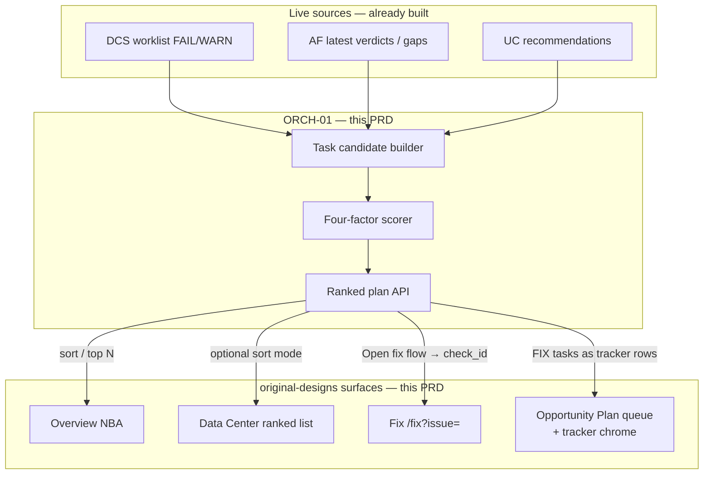
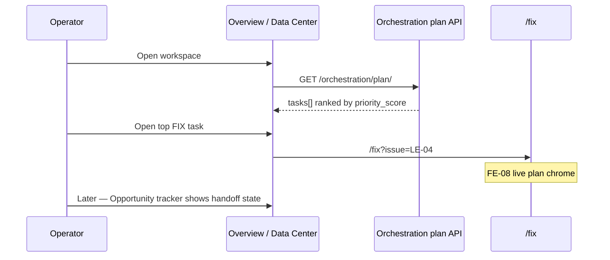

# PRD-ORCH-01 — Canonical orchestration priority (BL-011)

**Status:** Ready for implementation (pre-build locks in §15)  
**Module:** see folder path — **BE + FE in this PRD**  
**Backlog:** `BL-011` (P0, MVP1-B) — four-factor priority formula (0–3)  
**Milestone:** MVP1-B (after AF-01 + UC-01 + UC-01B)  
**Depends on:** Live DCS worklist enrichment · AF-01 latest · UC-01 recommendations (optional source) · FE-08 Fix `?issue=` · UC-01B tracker chrome (Plan queue sits with tracker)  
**Pack:** `Klints_MVP1_Rohan_Build_Pack_v1.2_20260718`  
- Spec: `01_Specifications/Klints_Spec_OnboardingOrchestrationBlueprint_v1.4.1_20260718.xlsx` (sheets **01–02**, **08–09**)  
- Schema: `03_Machine_Contracts/orchestration_task.schema.json` (**product projection** — see §15.1; not full row persistence)  
**Design SoT:** frontend `original-designs` / workspace `Frontend_design/` — Overview NBA · Data Center ranked list · Fix deep-link · Opportunity tracker queue  
**Out of scope:** BL-012 wave floors / full DAG · BL-017 · Manago writes · LLM ranking · Assessment Report · FE-09 title/JSON polish · inventing Completed/€ real impact

---

## 0. Cursor agent brief (paste this)

```text
Implement PRD-ORCH-01 (BL-011) — BE priority plan + FE bind.

Read: docs/orchestration/PRD_ORCH_01_CANONICAL_PRIORITY.md
Pack: Orchestration Blueprint sheets 02 + 09; orchestration_task.schema.json

BE:
1. priority_score = 0.40*blocker + 0.30*severity + 0.20*readiness + 0.10*effort_impact
   Factors 0–3; score 0–3. No LLM. No 0–100 scale.
2. Candidates: DCS FAIL/WARN → FIX (required); AF/UC optional.
3. GET /api/v1/orchestration/plan/ with priority_inputs + explain.
4. No BL-012 waves/DAG. wave may be null. Single-task GET not required.
5. Plan HTTP = product projection (not full orchestration_task.schema persistence).
6. Skip null check_id; full worklist cap=None; priority_class from score thresholds.
7. readiness v1 = 3 or 1 only; status always READY; depends_on [].

FE (same PRD — required):
8. src/lib/orchestration.ts — client + query keys; invalidate on DCS score success.
9. Overview NBA: order/top issues from plan FIX tasks (not revenue-only).
10. Data Center: default sort = plan priority; keep “Impact” as secondary toggle.
11. Opportunity tracker: “Plan queue” after tracker / before pilots;
    CTA Open fix flow → /fix?issue={check_id}.
12. Do not invent € or Manago writes. Keep FE-08 Fix chrome. Lock allowlist unchanged.

Acceptance: §13 (BE + FE). Pre-build locks: §15.
```

---

## 1. What this is (simple)

| Layer | Question | Status |
|-------|----------|--------|
| DCS | What’s broken in data? | Done — sorted today by **revenue_impact** |
| Architecture | What’s running / missing? | Done |
| Use Case Library | Which pilots are ready? | Done (BE) |
| **Orchestration priority (this PRD)** | **Which task should the operator do first?** | **Build now** |
| Waves / DAG (BL-012) | Which wave / dependency order? | Later |

**BL-011 does not redesign chrome** (keep original-designs / FE-08 layouts). It adds a **ranked plan** and **wires FE** so Overview, Data Center, and Opportunity tracker use plan order instead of revenue-only.

**Today vs after:**

| | Today | After ORCH-01 (BE + FE) |
|--|-------|-------------------------|
| Data Center / Overview order | `revenue DESC → optional → severity → check_id` | **Default = plan `priority_score`**; Impact sort kept as toggle |
| Single cross-source plan | None | `GET …/orchestration/plan/` + FE client |
| Opportunity tracker | Fixture / pilots layout | **Plan queue** band (FIX tasks) + Open fix flow |
| Explainability | “Highest €” | Factor breakdown available from API (FE may show compact score) |

---

## 2. Pack formula (locked — do not invent)

From Orchestration Blueprint sheet **02** / algorithm sheet **09**:

```text
priority_score =
  0.40 × blocker_status
+ 0.30 × severity_risk
+ 0.20 × dependency_readiness
+ 0.10 × effort_impact

Each factor ∈ {0, 1, 2, 3}
priority_score ∈ [0, 3]
```

| Factor | Weight | 3 | 2 | 1 | 0 |
|--------|--------|---|---|---|---|
| **blocker_status** | 0.40 | Unblocks many | Unblocks some | Unblocks one | Unblocks nothing |
| **severity_risk** | 0.30 | Critical | High | Medium | Low / info |
| **dependency_readiness** | 0.20 | All prereqs met | One unmet | Several unmet | Blocked on many |
| **effort_impact** | 0.10 | High impact / low effort | … | … | Low impact / high effort |

**Tie-break (sheet 09 / v1):** **`priority_score` DESC** → **`priority_class` P0 before P1 before P2** (when set) → **`task_id` ASC lexicographic**. Never time/random.

**`priority_class` derivation (v1 lock — missing from pack sheet for API):**

| `priority_score` | Class |
|------------------|-------|
| `≥ 2.0` | `P0` |
| `≥ 1.0` and `< 2.0` | `P1` |
| `< 1.0` | `P2` |

**Score precision:** round `priority_score` to **2 decimal places** for API + tests (±0.01). FE may display **1 decimal**.

**Invalid / missing factor inputs:** use §6 defaults; clamp out-of-range to `[0, 3]` and log. Do **not** invent mid values (e.g. always-1) without a documented rule.

---

## 3. How it connects to original UI

### 3.1 End-to-end



### 3.2 Operator journey



### 3.3 UI ownership (in this PRD)

| Surface | Now | After ORCH-01 (required) |
|---------|-----|---------------------------|
| **Overview NBA** | Top issues by revenue | Top **plan FIX** tasks by `priority_score`; link → `/fix?issue=` |
| **Data Center** | “Ranked by projected impact” only | **Default sort = Plan priority**; toggle “Impact” restores revenue sort |
| **Fix** | FE-08 live chrome | Unchanged chrome; entry from plan/NBA/tracker via `check_id` |
| **Opportunity tracker** | UC-01B tracker + pilots | Add **Plan queue** band (live FIX from plan) — placement §9.4 |
| **Lifecycle** | AF primary | Unchanged (optional ASSESS tasks link here later) |

**This PRD ships BE + FE.** Engineering owns both unless FE is explicitly split mid-PR — acceptance includes §9 + §13.

---


## 4. Task model (v1)

Align with `orchestration_task.schema.json` as a **forward-compat vocabulary**. The HTTP plan response is a **product projection** (see §15.1) — not a full schema-valid persisted task document.

### 4.1 Task types in v1

| `task_type` | Source | `href` / deep-link | Phases A–F |
|-------------|--------|---------------------|------------|
| `FIX` | DCS FAIL/WARN worklist row with non-null `check_id` | `/fix?issue={check_id}` | **Required** |
| `ASSESS` | AF incomplete / fix-first cluster | `/lifecycle` | Phase **G** optional |
| `PLAN` | UC pilot `ready` or `gap_suggested` | `/opportunities?uc={use_case_id}` | Phase **G** optional |

Defer `CONNECT` / `SCORE` / `REPORT` / `BUILD` / `QA` / `HANDOFF` as first-class emitters until later milestones (they exist in schema for forward-compat).

**Exit for A–F:** DCS `FIX` only. AF/UC builders may exist as empty stubs; do not block FE on multi-source.

### 4.2 Identity

```text
task_id = "FIX-{check_id}"           # e.g. FIX-LE-04
        | "AF-{verdict}-{asset_id}"  # if ASSESS emitted (phase G)
        | "UC-{use_case_id}"         # e.g. UC-UC-02 (phase G)
idempotency_key = "{company_id}:{task_id}:{source_run_fingerprint}"
```

- `company_id` = tenant company primary key as string (same pattern as other APIs).
- `source_run_fingerprint` = `dcs:{data_run_id}` when DCS-only; append `|af:{assessment_id}` when AF included.
- **Skip** worklist rows with `check_id` null/empty (e.g. synthetic failed-run row) — they cannot deep-link Fix. Do not emit `FIX-null`.

### 4.3 Status / depends_on / wave (v1)

| Field | v1 value |
|-------|----------|
| `status` | Always `READY` for emitted open FIX (compute-on-GET; no lifecycle transitions yet) |
| `depends_on` | Always `[]` (DAG is BL-012) |
| `wave` | Always `null` (wave floors are BL-012) |

Do not invent `BLOCKED` / `IN_PROGRESS` until persistence + BL-012.

### 4.4 Persistence options (pick one — locked default)

| Option | When |
|--------|------|
| **A — Compute on GET** (default for v1) | No table; pure function from latest DCS/AF/UC |
| **B — Persist `OrchestrationTask` rows** | If you need audit / status transitions soon |

**Locked default: A** for BL-011. Add table in BL-012 when status/wave lifecycle needs persistence.

If choosing B later: fields at minimum `task_id`, `company_id`, `task_type`, `status`, `priority_inputs` JSON, `priority_score`, `depends_on` JSON, `source_refs` JSON, `computed_at`.

---

## 5. Factor scoring — implementation mapping

### 5.1 DCS → FIX tasks (required)

For each enriched worklist FAIL/WARN issue:

#### `severity_risk` (0–3)

| DCS `severity` | Score |
|---------------|-------|
| Critical | 3 |
| High | 2 |
| Medium | 1 |
| Low / Informational / empty | 0 |

#### `blocker_status` (0–3)

Heuristic v1 (document in code; tune with tests). Evaluate top-down; first match wins:

| Condition | Score |
|-----------|-------|
| Foundation / gate-like: `CheckMaster.role == GATE` **or** `check_id` starts with `FD-` **or** dimension is foundation-gate family | 3 |
| Check appears in ≥1 MVP1 pilot `gating_check_ids` (from seeded blueprints / UC catalogue) | 2 |
| Non-optional FAIL with `revenue_impact > 0` | 1 |
| Optional-only, WARN with no unlock signal, or none of the above | 0 |

If UC pilots not loadable: skip the gating_check_ids branch (treat as not matched) — do not fail the plan.

#### `dependency_readiness` (0–3)

**v1 locked simplification** (ignore finer “same dimension sequence” until BL-012):

| Condition | Score |
|-----------|-------|
| No open foundation/gate FAIL in the worklist **or** this check itself is foundation/gate | **3** |
| At least one other open foundation/gate FAIL exists and this check is **not** foundation/gate | **1** |

Do not use 2/0 in v1 unless tests explicitly add them later.

#### `effort_impact` (0–3)

| Condition | Score |
|-----------|-------|
| `revenue_impact` in **top quartile** of open issues’ revenue **or** Critical severity | 3 |
| `revenue_impact > 0` **or** High severity | 2 |
| WARN / Medium severity | 1 |
| Optional + Low / empty revenue | 0 |

**Top quartile (v1):** among open issues with numeric `revenue_impact`, take values at or above the 75th percentile.  
Edge cases:

| Open issues with revenue | Behavior |
|--------------------------|----------|
| 0 | Skip quartile; use severity ladder only |
| 1–3 | Treat the **max** revenue as “top quartile” (that issue gets quartile credit if Critical/High not already) |
| ≥4 | Standard 75th percentile |

**Important:** Revenue feeds **only** this factor (and optional display). It must **not** replace `priority_score` ordering.

### 5.2 Pack worked example (regression tests)

From sheet **02** (illustrative — use same arithmetic in unit tests):

| Example | B | S | R | E | Score |
|---------|---|---|---|---|-------|
| CC-07 style consent harm | 1 | 3 | 3 | 3 | `0.4+0.9+0.6+0.3 = 2.2` |
| LE-09 style returns unblocker | 3 | 3 | 3 | 2 | `1.2+0.9+0.6+0.2 = 2.9` |
| UC-23 dependent on LE-09 (not ready) | 1 | 2 | 1 | 2 | `0.4+0.6+0.2+0.2 = 1.4` |

Assert LE-09-like score **>** dependent UC-like score.

### 5.3 AF / UC (optional in same PR)

| Source | Emit when | Notes |
|--------|-----------|-------|
| AF | `FIX_FIRST` / critical consolidate | `task_type=ASSESS` or paired FIX; readiness lower if graph incomplete |
| UC | `status=ready` or `gap_suggested` | `task_type=PLAN`; blocker low unless gap_suggested; readiness from pilot gates |

If time-boxed: **ship DCS FIX-only first**, leave AF/UC hooks as empty list + TODO tests skipped — but keep builder interface ready.

---

## 6. Defaults & failure handling

| Case | Behavior |
|------|----------|
| No DCS score yet / no terminal scored run | Plan `{ tasks: [], reason: "no_dcs", … }` **200** |
| Scored run but no FAIL/WARN | `{ tasks: [], reason: "no_open_issues", … }` **200** |
| Missing severity | `severity_risk = 0` |
| Missing revenue | Ignore for effort quartile; use severity-only ladder |
| Duplicate `check_id` | One FIX task |
| `check_id` null/empty (synthetic) | **Skip** — no FIX task |
| Invalid factor (not 0–3) | Clamp to `[0, 3]` + log; still emit task |
| Auth / wrong company | Same as DCS — 401/403 |
| AF/UC unavailable (phase G) | Omit those sources; DCS-only plan still 200 |

`reason` is optional string when `tasks` empty; omit or `null` when tasks present.

---

## 7. API contract

Base: `/api/v1/orchestration/` · JWT · company from user · roles: **admin / analyst / viewer** (same as DCS read).

| Method | Path | Purpose |
|--------|------|---------|
| `GET` | `/orchestration/plan/` | Ranked tasks for company (latest snapshots) |
| `GET` | `/orchestration/plan/{task_id}/` | **Defer** unless needed — not required for A–F acceptance |

### 7.1 `GET /orchestration/plan/` (normative)

```json
{
  "as_of": "2026-08-11T04:00:00Z",
  "reason": null,
  "sources": {
    "dcs_data_run_id": 123,
    "af_assessment_id": null,
    "uc_as_of": null
  },
  "summary": {
    "task_count": 12,
    "fix_count": 12,
    "max_priority_score": 2.9
  },
  "tasks": [
    {
      "task_id": "FIX-LE-04",
      "task_type": "FIX",
      "status": "READY",
      "title": "Duplicate purchases",
      "check_id": "LE-04",
      "priority_class": "P0",
      "priority_inputs": {
        "blocker_status": 2,
        "severity_risk": 3,
        "dependency_readiness": 3,
        "effort_impact": 3
      },
      "priority_score": 2.7,
      "priority_explain": [
        { "factor": "severity_risk", "value": 3, "weight": 0.3, "contribution": 0.9, "reason": "Critical severity" },
        { "factor": "blocker_status", "value": 2, "weight": 0.4, "contribution": 0.8, "reason": "Gates MVP1 pilots" }
      ],
      "depends_on": [],
      "wave": null,
      "href": "/fix?issue=LE-04",
      "revenue_impact": 1800.0,
      "currency": "USD",
      "idempotency_key": "1:FIX-LE-04:dcs:123"
    }
  ]
}
```

**Candidate source:** `build_enriched_issues(..., cap=None)` — **full** worklist, not status’s capped 30. Overview NBA still shows top **4** after plan sort.

**Title:** prefer worklist/enriched display title (same cleaning as DCS FE where BE already stores clean title); else `check_id`.

**Sort:** `priority_score` DESC → `priority_class` P0→P2 → `task_id` ASC.

**Do not** return raw evidence values / PII in this API (IDs + scores + titles only). Detail stays on worklist/Fix.

**App lock:** Plan API remains readable when app is hard/soft locked (same as DCS status/worklist reads). FE must still respect route lock: Overview can show NBA; Data Center / Opportunities remain blocked by existing allowlist (do **not** add `/opportunities` or `/data-consistency` to lock allowlist).

---

## 8. Backend code layout (suggested)

```text
dataruns/orchestration/
  __init__.py
  constants.py          # weights 0.40/0.30/0.20/0.10
  scoring.py            # compute_priority_score(inputs) + clamp
  factors_dcs.py        # map DcsIssue → priority_inputs
  candidates.py         # build_fix_tasks(company) …
  plan.py               # build_plan(company) → payload
  views.py
orchestration_urls.py
tests/test_orch_priority_scoring.py
tests/test_orch_plan_api.py
```

Mount: `path("api/v1/orchestration/", include("dataruns.orchestration_urls"))`.

Reuse:

- `dataruns.dcs.worklist.build_enriched_issues` / latest scored run helpers  
- AF `find_latest_architecture_assessment`  
- UC `build_recommendations_payload` (optional)

Register models in `DatarunsConfig.ready()` only if persisting.

---

## 9. Frontend bind (required — same PRD)

Design SoT: `original-designs` / `Frontend_design/` compositions; do **not** invent a new dashboard. Wire plan into existing surfaces.

### 9.1 New client

| File | Responsibility |
|------|----------------|
| `src/lib/orchestration.ts` | Types for plan response · `ORCH_PLAN_QUERY_KEY` · `getOrchestrationPlan()` · helpers: `fixTasksFromPlan`, `sortIssuesByPlanOrder` |
| Optional `src/lib/orchestration-ui.ts` | Map task → display row (rank, score label, href) |

```ts
export const ORCH_PLAN_QUERY_KEY = ["orchestration", "plan"] as const;
export function getOrchestrationPlan(): Promise<OrchestrationPlanResponse>;
```

Stale time ~8s (same family as AF/UC). **Invalidate** `ORCH_PLAN_QUERY_KEY` when DCS rescoring succeeds / status transitions to scored (mirror existing DCS invalidation patterns).

### 9.2 Overview NBA

| Rule | Behavior |
|------|----------|
| Data | `useQuery(ORCH_PLAN_QUERY_KEY)` + existing worklist/status for copy fields if needed |
| Order | Show top **N (4)** tasks with `task_type === "FIX"` by plan order |
| Card title | Plan `title` (or worklist title for that `check_id`) |
| CTA | Link `/fix` `search={{ issue: check_id }}` |
| Fallback | If plan empty/error → keep current revenue-ranked NBA (honest; show Retry on plan error) |
| Label | Section hint: “Ordered by onboarding plan” (not “projected impact” as the only story) |
| Cap note | Today Overview often uses status issues (cap 30). Prefer joining plan order to **worklist** issues when available so top-4 can include items beyond status cap |

Compact score optional: show `priority_score` to 1 decimal or omit — do not show raw factor math on Overview.

### 9.3 Data Center worklist

| Rule | Behavior |
|------|----------|
| Default sort | **Plan priority** — reorder FAIL/WARN list to match plan FIX `task_id` / `check_id` order; issues not in plan append after (revenue or check_id) |
| Toggle | Control: **Plan** (default) · **Impact** (existing `sortDcsWorklistIssues`) |
| Copy | Section title when Plan: “Ranked by onboarding plan”; when Impact: keep “Ranked by projected impact” |
| Deep-link | Existing Fix this issue → `/fix?issue=` unchanged |
| Loading | Plan pending: show worklist with Impact sort or skeleton — do not blank the page |

Keep `sortDcsWorklistIssues` helper — still used for Impact mode.

### 9.4 Opportunity tracker — Plan queue

Respect UC-01B (tracker chrome primary). Placement **locked:**

| Block | Behavior |
|-------|----------|
| **Placement** | **Between** the three summary cards + tracker table **and** the MVP1 pilots band (i.e. after tracker table, before pilots) — or immediately **above** the tracker table if that matches design density better; **do not** replace tracker chrome |
| **Section** | `Plan queue` (or “In plan · fix first”) |
| **Rows** | Live FIX tasks from `getOrchestrationPlan()` — rank, title, `priority_score`, status chip `READY`, revenue if present |
| **CTA** | **Open fix flow →** → `/fix?issue={check_id}` |
| **Empty** | “No open fix tasks in the plan” when plan loaded empty |
| **Error** | Retry — do not show fixture as live plan |
| **Fixture tracker** | Keep design tracker chrome; Plan queue is additional live band |

Do **not** invent Completed/€ real impact from plan (needs handoff later). Cards “In fix flow / Queued / Completed” stay as today until BL-012/status — Plan queue is the live truth for “what to do next.”

### 9.5 Fix page

No chrome changes (FE-08 / FE-09). Only ensure all new CTAs use `check_id` in `?issue=`.

### 9.6 FE files checklist

| File | Change |
|------|--------|
| `src/lib/orchestration.ts` | **New** |
| `src/components/klints/OverviewPanel.tsx` | NBA from plan FIX |
| `src/routes/data-consistency.tsx` | Plan/Impact sort toggle; default Plan |
| `src/routes/opportunities.tsx` | Plan queue section |
| `src/lib/dcs.ts` | Keep revenue sort helper; do not remove |

### 9.7 FE honesty

- No fake banked € from plan  
- No “queued for Manago”  
- Plan error ≠ silent fixture  
- `/opportunities` / `/data-consistency` **not** added to lock allowlist  
- While locked, NBA on Overview still may fetch plan; Opportunity Plan queue only when route reachable 

---

## 10. Implementation phases

| Phase | Deliverable | Exit |
|-------|-------------|------|
| **A** | BE `scoring.py` + pack arithmetic tests | Sheet 02 numbers match |
| **B** | BE DCS → FIX candidates + factor maps | Plan lists open FAIL/WARN |
| **C** | BE `GET /orchestration/plan/` + explain | Contract §7 |
| **D** | FE `orchestration.ts` + Overview NBA bind | Top cards follow plan |
| **E** | FE Data Center Plan/Impact toggle | Default Plan |
| **F** | FE Opportunity Plan queue + Fix links | Open fix flow works |
| **G** | (Optional) AF/UC candidates on BE | Multi-source plan |

**BL-012 next PRD:** wave floors, Kahn topo, cycle detection — consumes these tasks.

---

## 11. Relationship to current revenue sort

| System | Keep? |
|--------|-------|
| `sort_worklist_issues` / `sortDcsWorklistIssues` | **Keep** for Data Center **Impact** toggle |
| Orchestration plan | **New default** order for Overview + Data Center Plan mode + tracker queue |
| DCS-08 revenue | `effort_impact` input + display on rows |

Do **not** delete revenue sort helpers.

---

## 12. Out of scope (explicit)

| Item | Why |
|------|-----|
| BL-012 waves / DAG / cycles | Next PRD |
| BL-017 approvals | Side effects |
| LLM priority or copy | Separate if ever |
| Full Opportunity “Completed · real €” live loop | Needs handoff measurement |
| Finding schema persistence | Unused here |
| Changing Fix trust/approve chrome | FE-08 / FE-09 |
| UC-01B full tracker restore | Separate PRD — Plan queue still required |

---

## 13. Acceptance checklist

### Backend — scoring

- [ ] Formula exactly `0.40B + 0.30S + 0.20R + 0.10E`  
- [ ] Factors integers 0–3; score in `[0, 3]`  
- [ ] Unit tests reproduce sheet **02** worked arithmetic (±0.01)  
- [ ] Tie-break stable: score DESC, `task_id` ASC — no randomness  

### Backend — plan API

- [ ] `GET /api/v1/orchestration/plan/` auth + company scoped  
- [ ] DCS FAIL/WARN with `check_id` emit `FIX-{check_id}` with `href` `/fix?issue=…`  
- [ ] Synthetic / null `check_id` rows skipped  
- [ ] Full worklist (`cap=None`), not status cap-30  
- [ ] Each task includes `priority_inputs` + `priority_score` (2 dp) + `priority_class` + explain list  
- [ ] Empty plan when no DCS / no issues — **200** with `reason`  
- [ ] No evidence PII payloads  
- [ ] Single-task GET **not** required for exit  

### Frontend — required

- [ ] `src/lib/orchestration.ts` client + query key + invalidate on DCS score success  
- [ ] Overview NBA ordered by plan FIX tasks (fallback to revenue if plan empty/error)  
- [ ] Data Center default sort = Plan; Impact toggle still works  
- [ ] Opportunity Plan queue with **Open fix flow →** `/fix?issue=` (placement §9.4)  
- [ ] No invented € / no Manago write claims  
- [ ] Plan error shows Retry (no silent fixture as plan)  
- [ ] Lock allowlist unchanged  

### Non-goals verified

- [ ] No Manago writes  
- [ ] No full wave engine  
- [ ] Revenue sort helpers still present for Impact mode  
- [ ] Fix page chrome not redesigned  
- [ ] AF/UC candidates not required for A–F exit  

---

## 14. One-page summary

| Question | Answer |
|----------|--------|
| What? | BL-011 four-factor priority + plan API **and** FE bind |
| Why? | One explainable queue instead of €-only ranking |
| Formula? | 40% blocker · 30% severity · 20% readiness · 10% effort/impact |
| UI? | Overview NBA · Data Center Plan sort · Opportunity Plan queue → Fix |
| vs today? | Revenue sort becomes Impact toggle; Plan is default |
| Next? | BL-012 waves |
| Locks? | §15 pre-build decisions |

**PRD:** ORCH-01 · **Backlog:** BL-011 · **Track:** delivery (BE + FE) · **Pack:** Onboarding Orchestration Blueprint v1.4.1

---

## 15. Pre-build locks (gap analysis — Aug 2026)

Gaps found vs pack schema + live Klints code; **locked here** so implementation does not invent mid-flight.

### 15.1 Schema vs HTTP plan

`orchestration_task.schema.json` requires full task documents (`schema_version`, `tenant_id`, `capability_dependencies`, `approval`, `provenance`, integer `wave` 0–6, etc.).

**Lock:** Plan API returns a **product projection** suitable for UI ranking. It does **not** need to validate as a full schema instance. Fields we **do** emit: §7.1. Fields we **omit** until BL-012/persistence: `schema_version`, `tenant_id` (company implied by auth), `capability_dependencies`, `approval`, `provenance`, non-null `wave`. Optional `idempotency_key` on each task is recommended for debug/stability.

### 15.2 Candidate set

| Lock | Detail |
|------|--------|
| Source | `build_enriched_issues` with **no cap** |
| Skip | Null/empty `check_id` |
| Dedupe | One task per `check_id` |
| A–F | FIX only |

### 15.3 Factor edge cases

| Lock | Detail |
|------|--------|
| Readiness | Binary v1: 3 or 1 (§5.1) |
| Quartile | Defined for 0 / 1–3 / ≥4 open revenue rows |
| Class | Score thresholds → P0/P1/P2 (§2) |
| Status | Always `READY` |
| Depends | Always `[]` |

### 15.4 FE / product

| Lock | Detail |
|------|--------|
| Overview | Plan order; prefer worklist join over status-only cap-30 |
| Data Center | Default Plan; Impact = old revenue sort |
| Opportunities | Plan queue after tracker (or above table); never replace tracker |
| Lock allowlist | Unchanged |
| Fallback | Plan error/empty → revenue NBA/Impact honesty |
| Invalidate | On DCS score success |

### 15.5 Explicitly still open (do not block A–F)

| Item | When |
|------|------|
| AF `ASSESS` / UC `PLAN` emitters | Phase G |
| Single-task GET | Optional polish |
| Persisted task table / real status chips | BL-012+ |
| Finer same-dimension readiness | BL-012 |
| Factor weight tuning from production | Post-ship |

### 15.6 Build order (unchanged)

1. BE scoring + tests  
2. DCS → FIX candidates  
3. Plan API  
4. FE `orchestration.ts`  
5. Overview NBA  
6. Data Center Plan/Impact  
7. Opportunities Plan queue  
8. (Optional) AF/UC candidates