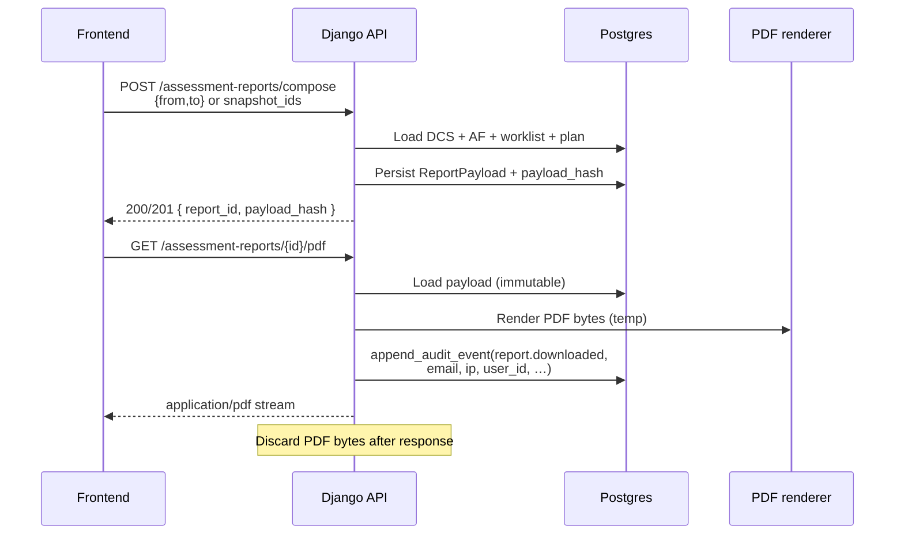

# PRD-RPT-01 — Full Assessment Report PDF (on-demand) + download audit

**Status:** Ready for implementation  
**Module:** see folder path — BE compose/render + thin FE export  
**Backlog bridge:** Pack **BL-013 / BL-014 / BL-015** (compose · render · security) — **v1 ships FULL content** (no free/paid lock for now)  
**Depends on:** DCS scored run + worklist · AF latest (if present) · ORCH-01 plan (optional for priority column) · AUDIT-01 `append_audit_event`  
**Pack:** `Klints_MVP1_Rohan_Build_Pack_v1.2_20260718`  
- Orchestration sheet **10** Assessment Report Contract  
- `03_Machine_Contracts/assessment_report.schema.json`  
- `03_Machine_Contracts/assessment_report_api.openapi.json`  
- Fixtures: `05_Test_Fixtures/reporting/`  
**Client / security (agreed):** `docs/security/KLINTS_AI_SECURITY_AND_DATA_PROCESSING_RESPONSE.md` §9 — PDF **on demand**, **do not retain PDF bytes**; retain **canonical payload** + hash + **audit**  
**Out of scope:** Free vs paid section locking · signed long-lived PDF URLs · MCP · writeback execute · emailing the PDF · LLM narratives (optional later)  
**Follow-up:** [PRD_RPT_01B_ASSESSMENT_PDF_POLISH.md](./PRD_RPT_01B_ASSESSMENT_PDF_POLISH.md) — content/design polish after first live PDF sample

---

## 0. Cursor agent brief (paste this)

```text
Implement PRD-RPT-01 — full Assessment Report PDF + download audit.

Read: docs/reports/PRD_RPT_01_FULL_ASSESSMENT_REPORT_PDF.md
Pack: Orchestration sheet 10 + assessment_report.schema.json
Client: security doc §9 — stream PDF, no PDF file retention.

Goal: beautiful FULL diagnostic PDF (score, all checks, what's wrong,
what to fix, architecture, plan) for a selected period / run.
PDF generated on the fly and returned to FE; do NOT store PDF bytes.
DO store immutable report payload + payload_hash.
DO audit every download: user email, user id, timestamp, IP, report id.

1. POST compose (or sync compose) from snapshot ids / date range → payload.
2. GET/POST download → render PDF → stream → discard file; audit event.
3. Full content (§3) — ignore free/paid locks for v1.
4. No contact-level PII in PDF (aggregate + check-level only).
5. FE (required): wire existing Overview control
   OverviewPanel.tsx — button label "Export brief" (Download icon).
   Today it has NO onClick — hook it to compose+PDF download using the
   Overview period dropdown already next to that button.
6. Tests: payload shape, PDF non-empty, audit row has email+ip+time.

Acceptance: §11.
```

---

## 1. Product decision (Rohan lock)

| Decision | v1 |
|----------|----|
| Free vs paid gating | **Off** — include **full** report sections |
| PDF persistence | **No** — render → stream → delete temp bytes |
| Canonical payload | **Yes** — DB row / JSON blob with `payload_hash` (replay render without re-scoring) |
| Download audit | **Required** — email, user id, time, **IP address**, report id, company id |
| Period | UI “selected days” / run → resolve to DCS (+ AF) snapshot ids |

---

## 2. Architecture



**Pack note:** OpenAPI uses async 202 + stored artifacts. v1 may be **synchronous** compose+download for UX, but must still keep payload + audit. Document deviation: *no object-storage PDF*; payload retained.

---

## 3. What goes in the PDF (FULL — organized)

Beautiful, stakeholder-ready. Page flow:

### 3.1 Cover
- Klints brand + company name / domain  
- Title: **Data consistency assessment report**  
- Period: `from`–`to` or “Run of {finished_at}”  
- Generated at (UTC) · Report id (short) · Template version  

### 3.2 Executive snapshot
- Headline **DCS score** + state (ready / incomplete)  
- Severity counts (Critical / High / Medium / Low / open FAIL+WARN)  
- Architecture mode + weighted score (if AF present; else “Not assessed”)  
- Business-impact rollup (currency + total at-stake if available; never invent)  
- Top 5 one-line risks  

### 3.3 Score & dimensions
- Overall score  
- Table/chart-friendly dimension scores (all DCS dimensions + foundation gate summary)  
- Coverage / NOT_CONNECTED / UNKNOWN callouts  

### 3.4 Full check register (what’s wrong)
For **every** check in the scored run (or all open FAIL/WARN + summary of PASS):

| Column | Source |
|--------|--------|
| Check ID | worklist / CheckMaster |
| Title | customer-facing title |
| Dimension | |
| Status | PASS/FAIL/WARN/… |
| Severity | |
| What’s wrong | short message / detection summary |
| Systems | Shopify · Manago · … |
| Revenue impact | if present |
| Priority | ORCH plan `priority_class` / score if available |

PASS checks may be a compact appendix (“Healthy checks”) to keep the main narrative on failures.

### 3.5 What to fix (per open issue)
For each FAIL/WARN (full list in v1):

- Suggested fix (CheckMaster)  
- Fix type / Fix owner  
- Root cause codes (if present)  
- Rollback note (short)  
- Deep-link hint: `Fix · check_id` (URL path only, no secrets)  

**Include** remediation / plan-oriented detail that pack called “paid” — **unlocked for v1**.  
Still **no** contact-level evidence samples (emails, phones, raw events).

### 3.6 Architecture
- Verdict mode + summary  
- Asset counts by Keep / Improve / Fix-first / Consolidate / Retire (if AF data exists)  
- Optional top gaps table  

### 3.7 Prioritised execution plan
- ORCH-01 FIX task list (rank, check_id, title, priority_score, class)  
- If plan empty: say so honestly  

### 3.8 Pilots / opportunities (optional band)
- MVP1 pilots blocked vs ready (from UC-01 APIs if cheap to include)  

### 3.9 Scope & method
- Snapshot ids used · connector status at run time  
- “Aggregate report — no contact-level PII”  
- Footer: `payload_hash` (first 12 chars) · template version  

### 3.10 Explicitly excluded from PDF body
- Raw emails, phones, contact ids, event payloads  
- Connector secrets  
- Free/paid “locked section” placeholders (not used in v1)

---

## 4. API contract (v1)

Base under `/api/v1/` · JWT · company-scoped · roles: admin/analyst (download) · admin for compose if split.

| Method | Path | Purpose |
|--------|------|---------|
| `POST` | `/assessment-reports/` | Compose full payload from body; return `report_id` |
| `GET` | `/assessment-reports/{id}/` | Metadata + status (no PDF) |
| `GET` | `/assessment-reports/{id}/pdf` | Stream PDF; **audit download** |
| `GET` | `/assessment-reports/` | List recent reports for company (metadata only) |

### 4.1 Compose body

```json
{
  "period": {
    "from": "2026-08-01",
    "to": "2026-08-11"
  },
  "dcs_run_id": null,
  "include_architecture": true,
  "include_plan": true
}
```

Resolution rules:

1. If `dcs_run_id` set → use that run (must belong to company).  
2. Else resolve **latest terminal scored run** whose `finished_at` falls in `[from, to]` (inclusive); if none → **422** with clear message.  
3. AF: latest architecture assessment compatible with that run (or latest for company if no link).  
4. Plan: compute ORCH plan from that run’s worklist (or skip if ORCH unavailable).

### 4.2 PDF response
- `Content-Type: application/pdf`  
- `Content-Disposition: attachment; filename="klints-assessment-{company_slug}-{date}.pdf"`  
- Body: bytes  
- After send: no persistent PDF object in S3/local media  

### 4.3 Idempotency (light)
Optional header `Idempotency-Key` on compose: same key + same resolved snapshot set → return existing `report_id` (payload already stored).

---

## 5. Download audit (normative — required)

Every successful PDF response **must** append a company audit event (AUDIT-01).

| Field | Required | Example |
|-------|----------|---------|
| `action` | yes | `report.downloaded` |
| `summary` | yes | `Assessment report PDF downloaded` |
| `actor` / user id | yes | requesting user |
| **email** | yes | `user.email` at request time |
| **downloaded_at** | yes | event `created_at` (UTC) |
| **ip_address** | yes | from request (see §5.1) |
| `report_id` | yes | |
| `payload_hash` | yes | |
| `user_agent` | recommended | truncated |
| `company_id` | yes | via audit company FK |

Also emit `report.composed` on successful compose.

### 5.1 IP extraction
Use first public IP from `X-Forwarded-For` when behind proxy, else `REMOTE_ADDR`. Store as string (IPv4/IPv6). Never store if you cannot determine — then audit with `ip_address: null` + `ip_resolution: "unknown"` and still record email/time (prefer always capturing IP in deployed env).

### 5.2 Activity UI
Downloads must appear on **Activity** timeline (existing governance feed). Metadata visible to admins: email · time · IP · report id.

### 5.3 Failed download
If render fails after authorize: audit `report.download_failed` with email/ip/time + error code; no partial PDF to client.

---

## 6. Data model

| Store | Contents |
|-------|----------|
| `AssessmentReport` (new) | id, company, variant=`FULL` (or `PAID_FULL`), status, dcs_run_id, af_run_id?, period_from/to, payload JSON, payload_hash, template_version, created_by, created_at |
| PDF file | **Not stored** |
| AuditLog | via `append_audit_event` |

Payload should be renderable again later (same hash → same PDF bytes ideally). Historical reports: **re-render from stored payload**, never re-query live DCS as if it were the same report.

---

## 7. Renderer

- Prefer WeasyPrint / Playwright / ReportLab — pick one already operable in the stack; document choice.  
- Brand: Klints colors/fonts consistent with product (not generic purple AI template).  
- Multi-page, clear H1/H2, tables for checks, page numbers, footer hash.  
- Sync render OK if &lt; ~10s; else Celery + poll — still stream PDF without long-term storage.

---

## 8. FE — Overview **Export brief** (required)

There is already a button on the Overview toolbar (next to the period dropdown):

```1106:1109:klints_frontend/src/components/klints/OverviewPanel.tsx
          <button type="button" className="ov-btn">
            <Download className="h-3.5 w-3.5" />
            Export brief
          </button>
```

**v1 must wire this button** — do not add a second export entry elsewhere unless product asks.

| Behavior | Spec |
|----------|------|
| Label | Keep **Export brief** (design chrome) |
| Period | Use the **same** Overview `period` state already selected in the dropdown beside the button |
| Click | Disable + spinner while compose + PDF download runs |
| Success | Browser downloads `klints-assessment-….pdf` |
| Error | Toast (e.g. no scored run in period / 422 / network) — button re-enabled |
| Auth | Same JWT session as rest of app |
| Gating | If Overview is DCS-locked / no score yet: disable button or toast honesty (same rules as other Overview actions) |

Optional later: Data Center “Export fix plan” stays separate / Coming soon — **not** this PRD’s primary CTA.

No in-app PDF viewer required for v1.

---

## 9. Pack / client alignment

| Pack / client | v1 stance |
|---------------|-----------|
| FREE vs PAID locks | **Ignored** — full content |
| Stored PDF artifacts in OpenAPI | **Deviate** — stream only; payload retained |
| PII aggregate | **Honor** |
| Tenant isolation | **Honor** |
| Download audit | **Stronger than pack minimum** — email + IP + time |

When free/paid returns later: add `variant` + `locked_sections` without rewriting renderer.

---

## 10. Files (suggested)

```text
dataruns/reports/
  compose.py
  payload.py
  render_pdf.py
  views.py
  urls.py
dataruns/migrations/00xx_assessment_report.py
dataruns/tests/test_report_compose.py
dataruns/tests/test_report_pdf_download_audit.py
# FE
src/lib/assessment-report.ts
src/components/klints/OverviewPanel.tsx  # wire existing "Export brief" button
```

---

## 11. Acceptance checklist

- [ ] Compose resolves period → DCS run; 422 if none  
- [ ] Payload includes score, dimensions, **all** open issues with what’s wrong + what to fix, architecture, plan when available  
- [ ] PDF streams successfully; **no** PDF left on disk/S3 after request  
- [ ] Payload + `payload_hash` persisted; re-download re-renders from payload  
- [ ] Each download: audit with **email**, **timestamp**, **IP**, user id, report id  
- [ ] Activity page shows download events  
- [ ] No contact-level PII in payload/PDF (test fixture scan)  
- [ ] Cross-tenant 404  
- [ ] Overview **Export brief** button downloads PDF for the selected Overview period  
- [ ] Button shows loading state; errors toast; no second competing export CTA required  

---

## 12. One-page summary

| Question | Answer |
|----------|--------|
| What? | Full beautiful Assessment PDF + period select |
| FE entry? | Overview **Export brief** (existing button) |
| Store PDF? | **No** — stream only |
| Store what? | Canonical payload + hash |
| Audit? | Email · time · IP · user · report id |
| Free/paid? | **Not now** — full report |
| Who? | Engineering |

**PRD:** RPT-01 · **Track:** delivery · **Bar:** full PDF + download audit  
