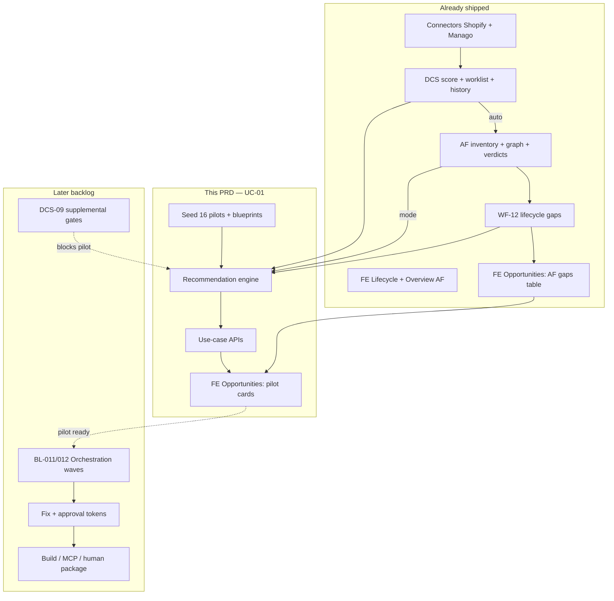
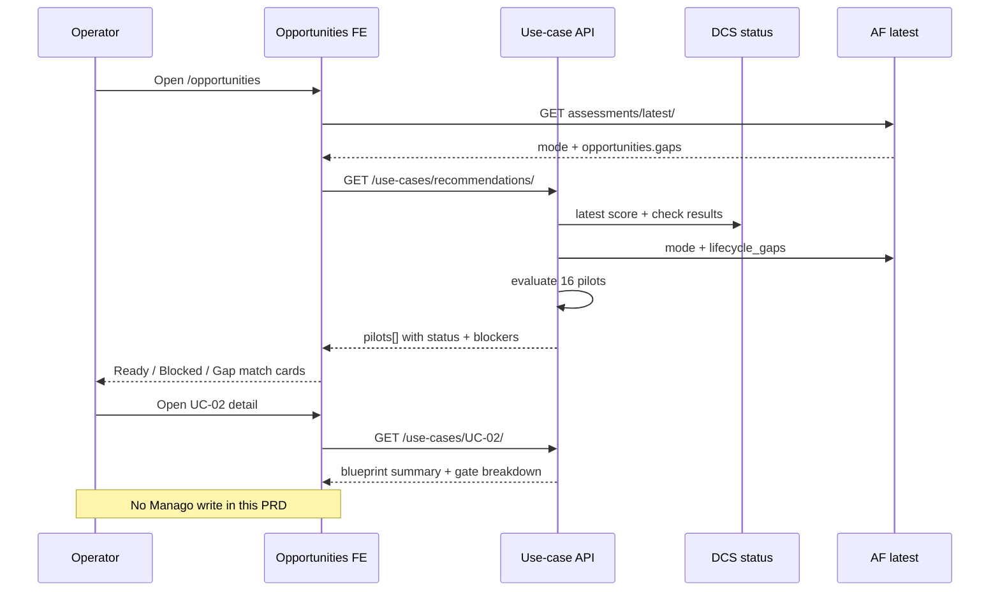
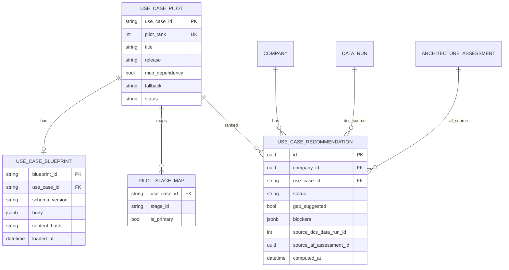

# PRD-UC-01 — Use Case Library & MVP1 Pilots (BL-010)

**Status:** BE Ready · **FE layout superseded by UC-01B**  
**Owner track:** Sahil (`docs/sahil/`)  
**Backlog:** `BL-010` (load exact 16-pilot registry; preserve UC-06 parent / UC-06B variant)  
**Milestone:** MVP1-B (after Architecture AF-01)  
**Surfaces:** APIs under `/api/v1/use-cases/` · FE pilots band via **[PRD-UC-01B](./PRD_UC_01B_OPPORTUNITIES_ORIGINAL_DESIGNS_RECONNECT.md)** (not Opportunities hero)  
**Depends on:** Live DCS status/worklist · AF-01 `latest` + WF-12 gaps · pack blueprints  
**Out of scope:** Full 40+ catalogue · Orchestration waves (BL-011/012) · Fix/Build Manago writes · MCP workflow upsert · Assessment Report · inventing € economics  

> **FE correction:** Client SoT is frontend branch `original-designs` Opportunity **tracker**. Do **not** implement §4.2 / §10 as written below for page hero — follow **UC-01B**. BE APIs and gate algorithm in this PRD remain authoritative.  

---

## 0. Cursor agent brief (paste this)

```text
Implement PRD-UC-01 (BL-010) — Use Case Library for MVP1’s 16 pilots only.

Read: docs/sahil/PRD_UC_01_USE_CASE_LIBRARY_AND_PILOTS.md

1. Load pack pilot_manifest.json + 16 UC-*_blueprint.json into app
   (DB tables or versioned seed — validate against workflow_blueprint.schema.json).
2. GET catalogue + GET recommendation for company:
   - Join latest DCS (headline + check results)
   - Join latest AF (mode + WF-12 gaps)
   - Score each pilot: ready / blocked / gap_match / mode_excluded
3. FE: STOP — do not replace Opportunity tracker with pilots.
   Follow PRD-UC-01B: original-designs tracker PRIMARY; pilots SECONDARY;
   AF gaps on /lifecycle. Client: src/lib/use-cases.ts; ?uc=UC-XX on pilots band.
   Deep-link blockers to Data Center with ?issue=<check_id> (not ?check=).
4. Do NOT build Manago workflows. Do NOT invent €. Do NOT load non-MVP1 UCs.
5. Supplemental gates (DCS-09): readiness flag stub OK; full eval deferred.
6. gap_suggested is a boolean FLAG on a pilot row — never a status enum value.

Acceptance: BE checklist in §12; FE checklist in UC-01B §9.
```

---

## 1. What this is (simple)

| Layer | Question | Status |
|-------|----------|--------|
| **DCS** | Is the data sound? | Done |
| **Architecture** | What’s already running? Which lifecycle stages are empty? | Done |
| **Use Case Library (this PRD)** | Which of the **16 MVP1 plays** should we recommend, and are they safe to plan? | **Build now** |
| **Orchestration / Fix / Build** | Ordered waves + human approve + build in Manago | Later |

A **use case** is a business opportunity (e.g. “welcome series continuity”) — **not** a DCS issue and **not** an AF asset.  
A **blueprint** is the recipe (triggers, nodes, gates, measurement) for that play.

**MVP1 ships only 16 pilots.** The Excel catalogue has ~40+ rows — **ignore non-pilots**.

---

## 2. Original references (authoritative)

**Pack root:** `klints_backend/Klints_MVP1_Rohan_Build_Pack_v1.2_20260718/`

| Need | Path | Notes |
|------|------|-------|
| Backlog BL-010 | `06_Implementation/implementation_backlog_v1.2.xlsx` → **01 Backlog** | Count=16; IDs unique; gates resolvable |
| Library workbook | `01_Specifications/Klints_Spec_DefaultUseCaseLibrary_v1.4.1_20260718.xlsx` | Sheets **01–08**; catalogue + blueprints narrative |
| Pilot registry | `04_MVP1_Pilot_Blueprints/pilot_manifest.json` | **Authoritative MVP1 list** |
| Blueprint JSON ×16 | `04_MVP1_Pilot_Blueprints/UC-*_blueprint.json` | Per-pilot recipe |
| Blueprint schema | `03_Machine_Contracts/workflow_blueprint.schema.json` | Validate on load |
| AF stages (gap join) | AF sheet **07** / `dataruns/architecture/lifecycle_model.py` | 16 stages · `uc_group` |
| Orchestration (later) | `Klints_Spec_OnboardingOrchestrationBlueprint_v1.4.1_…xlsx` | Consumes recommended pilots |
| Supplemental gates (later) | `docs/dcs_scoring/PRD_DCS_09_…md` | BL-003 — blocks pilot, not headline score |

---

## 3. Product decisions (locked)

### 3.1 Scope = 16 pilots only

| Rank | ID | Title |
|------|-----|--------|
| 1 | UC-02 | Welcome series continuity |
| 2 | UC-04 | First-purchase incentive delivery |
| 3 | UC-05 | Double opt-in completion nudge |
| 4 | UC-06B | Second Purchase Accelerator — omnichannel flagship |
| 5 | UC-08 | Post-purchase education / product usage |
| 6 | UC-09 | Review & UGC request |
| 7 | UC-10 | Account creation nudge |
| 8 | UC-11 | Replenishment reminder |
| 9 | UC-12 | Back-in-stock notification |
| 10 | UC-13 | Price-drop alert |
| 11 | UC-16 | Churn-risk save |
| 12 | UC-17 | Winback lapsed customers |
| 13 | UC-21 | Cart abandonment recovery |
| 14 | UC-23 | VIP candidate progression |
| 15 | UC-28 | Complementary product cross-sell |
| 16 | UC-36 | Post-purchase upsell to premium tier |

**Excluded from MVP1 runtime:** UC-06A, UC-41, and every catalogue ID not in the table above (including **UC-01**).

**UC-06 vs UC-06B:** Load **UC-06B** only (manifest). Do not invent UC-06A as a pilot.

### 3.2 Recommendation is read-only

- Klints **recommends** pilots; it does **not** create Manago workflows in this PRD.  
- MCP dependency on every pilot → execution path = **HUMAN.WORKFLOW.BUILD** fallback until MCP discovery passes.  
- UI CTA: “Open build guide” / “Send to Fix plan (soon)” — no silent write.

### 3.3 Economics

- **No invented €** from the library in v1.  
- Optional later: attach DCS `revenue_impact` / UC economics fields when product supplies them.

### 3.4 When recommendations refresh

| Trigger | Behavior |
|---------|----------|
| DCS score SUCCEEDED | Recompute readiness for company (async or on next GET) |
| AF assessment SUCCEEDED | Recompute gap matches from WF-12 |
| Operator opens `/opportunities` | GET recommendations (stale-while-revalidate OK) |

Do **not** require a “Run use cases” button.

### 3.5 App lock (FE-03) — locked

`/opportunities` is **not** on the DCS locked-allowlist today (`/dashboard`, `/integrations`, `/settings`, `/activity` only).

**Decision:** keep it that way for UC-01. Operators reach Opportunities only after the app is unlocked (publishable DCS headline). Recommendations still handle “no AF yet” / blocked gates honestly once the route is reachable.

Do **not** add `/opportunities` to `LOCKED_ALLOWED_ROUTES` in this PRD (would show an empty/blocked library before scoring).

---

## 4. How it connects to work already shipped



### 4.1 Backend inputs (reuse — do not rebuild)

| Input | Source today | Used for |
|-------|--------------|----------|
| Headline score | `GET /api/v1/dcs/status/` / latest score run | `gates.min_dcs` (all pilots use **70**) |
| Check results | Worklist / run snapshot FAIL·WARN·PASS | `gates.gating_check_ids` |
| AF mode | `GET …/architecture/assessments/latest/` → `assessment.mode` | `gates.architecture_modes` |
| Stage gaps | `latest.opportunities.gaps` / `probe_coverage.lifecycle_gaps` | Gap → pilot matching |
| Graph complete | `graph_complete` | Soft signal only in v1 (do not hide library) |

### 4.2 Frontend today vs after

> **Superseded by [UC-01B](./PRD_UC_01B_OPPORTUNITIES_ORIGINAL_DESIGNS_RECONNECT.md).** Correct target below.

| Surface | Correct after UC-01B |
|---------|----------------------|
| `/opportunities` | **`original-designs` tracker PRIMARY** · pilots **secondary** · no AF gaps table hero |
| `/lifecycle` | **PRIMARY AF** — mode, coverage, WF-12 gaps (pack sheet 07) |
| `/fix` | FE-08 live check_id bridge |
| Overview | AF summary + optional “N pilots ready” → Opportunities (pilots band) |
| App lock | `/opportunities` blocked until DCS unlock — **unchanged** (§3.5) |

### 4.3 Frontend files to touch

| File | Change |
|------|--------|
| `src/lib/use-cases.ts` | **New** — types, query keys, `getUseCaseRecommendations()`, `getUseCase(id)` |
| `src/routes/opportunities.tsx` | Fetch recommendations; pilot list + detail; keep AF gaps Section; demote/remove fixture tracker as primary |
| `src/lib/klints-data.ts` | Stop using `opportunityTracker` as primary list (keep export only if other demos need it) |
| `src/lib/architecture.ts` | No change required (gaps band already uses `latest.opportunities`) |
| `src/components/klints/OverviewPanel.tsx` | **Optional** Phase E — “N pilots ready” → `/opportunities` |
| `src/lib/dcs.ts` `LOCKED_ALLOWED_ROUTES` | **Do not change** |

### 4.4 Route search params (FE)

| Param | Where | Behavior |
|-------|--------|----------|
| `?uc=UC-02` | `/opportunities` | Open blueprint / readiness detail for that pilot (drawer or inline panel) |
| `?issue=CC-06` | `/data-consistency` | Existing Data Center deep-link — **use this**, not `?check=` |

Validate `uc` against `^UC-[0-9]{2}[A-Z]?$`. Unknown id → toast / ignore, still show list.

---

## 5. End-to-end flow (operator)



### 5.1 Recommendation states (per pilot)

**`status` enum** (exactly one):

| Status | Meaning | UI |
|--------|---------|-----|
| `ready` | min_dcs OK · all gating checks PASS · mode allowed | Primary CTA |
| `blocked_dcs_score` | Headline &lt; `min_dcs` (or no score) | Show score vs 70 · link Data Center |
| `blocked_checks` | One or more `gating_check_ids` not PASS (or missing from latest run) | Link Data Center `?issue=<check_id>` |
| `blocked_mode` | AF mode null / `INCOMPLETE` / not in `architecture_modes` | Link Lifecycle |
| `unavailable` | Blueprint missing / invalid seed | Hide or admin-only error |

**Flags** (booleans — never status values):

| Flag | Meaning | UI |
|------|---------|-----|
| `gap_suggested` | Any primary stage ∈ WF-12 `lifecycle_gaps` | Badge “Fills coverage gap” (on any status) |
| `covered` | Optional v1.1: AF already has Keep/Improve on that stage | Lower sort weight |

**v1 priority sort:** `ready` + `gap_suggested` first → other `ready` → `blocked_checks` (by `pilot_rank`) → `blocked_dcs_score` → `blocked_mode` → `unavailable`.

---

## 6. Gap → pilot mapping (locked for MVP1)

WF-12 emits uncovered `stage_id`s. Map pilots to primary stages / UC groups so Opportunities can say “this gap → these plays.”

| Pilot | Primary stage_id(s) | AF `uc_group` |
|-------|---------------------|---------------|
| UC-02 | stage_02, stage_04 | 1 Acquisition & Welcome / 2 Second Purchase… |
| UC-04 | stage_03 | 1 Acquisition & Welcome |
| UC-05 | stage_02 | 1 Acquisition & Welcome |
| UC-06B | stage_05 | 2 Second Purchase & Onboarding |
| UC-08 | stage_04 | 2 Second Purchase & Onboarding |
| UC-09 | stage_04 | 2 Second Purchase & Onboarding |
| UC-10 | stage_04 | 2 Second Purchase & Onboarding |
| UC-11 | stage_06 | 3 Replenishment & Repeat |
| UC-12 | stage_07 | 3 Replenishment & Repeat |
| UC-13 | stage_08 | 3 Replenishment & Repeat |
| UC-16 | stage_09 | 4 Churn & Winback |
| UC-17 | stage_10 | 4 Churn & Winback |
| UC-21 | stage_03 | 1 Acquisition & Welcome |
| UC-23 | stage_12 | 5 VIP & Loyalty |
| UC-28 | stage_14 | 6 Cross-sell & Expansion |
| UC-36 | stage_15 | 6 Cross-sell & Expansion |

**Rules:**
1. Persist this map in code/seed (`pilot_stage_map`) — editable later without FE change.  
2. A pilot is `gap_suggested` if **any** of its primary stages is in `lifecycle_gaps`.  
3. Do not invent pilots outside the 16 to fill a gap.

---

## 7. Gate evaluation (per blueprint)

Example **UC-02** from pack:

```json
"gates": {
  "min_dcs": 70,
  "gating_check_ids": ["CC-03", "CC-06", "CI-08"],
  "architecture_modes": ["AUGMENT", "SELECTIVE_REBUILD", "REBUILD"]
}
```

### 7.1 Algorithm

```text
for each pilot in seeded_mvp1_pilots (order by pilot_rank):
  blueprint = load(pilot)
  score = latest_dcs_headline()
  mode = latest_af_mode()          # may be null / INCOMPLETE
  results = latest_check_results() # map check_id → PASS|FAIL|WARN|…

  if score is null:
    status = blocked_dcs_score
  else if score < gates.min_dcs:
    status = blocked_dcs_score
  else if mode is null or mode == "INCOMPLETE" or mode not in gates.architecture_modes:
    status = blocked_mode
  else:
    failing = [id for id in gates.gating_check_ids if results.get(id) != "PASS"]
    # WARN: treat as blocked for planning (strict). Product may soften later.
    if failing:
      status = blocked_checks
    else:
      status = ready

  # Flag only — does not change status enum
  gap_suggested = any(stage in af_gaps for stage in pilot.primary_stages)

  # DCS-09 supplemental (deferred): if readiness API exists and fails → keep blocked_*;
  # never invent a separate status until DCS-09 PRD lands.
```

### 7.2 Full gating checklist per pilot (from blueprints)

| Pilot | min_dcs | gating_check_ids |
|-------|---------|------------------|
| UC-02 | 70 | CC-03, CC-06, CI-08 |
| UC-04 | 70 | PT-13, CC-03 |
| UC-05 | 70 | CC-06, CC-03 |
| UC-06B | 70 | LE-01, LE-05, PT-04, CC-01, CC-02, SP-10 |
| UC-08 | 70 | PT-01, BR-09 |
| UC-09 | 70 | LE-01, LE-10, PT-01 |
| UC-10 | 70 | CI-02, LE-01 |
| UC-11 | 70 | SP-04, PT-01, BR-09 |
| UC-12 | 70 | PT-01, PT-06, BR-02 |
| UC-13 | 70 | PT-05, PT-01 |
| UC-16 | 70 | LE-01, PT-04, SP-08 |
| UC-17 | 70 | LE-01, PT-04, CC-01 |
| UC-21 | 70 | LE-07, CC-01, PT-06 |
| UC-23 | 70 | PT-04, LE-04, SP-07 |
| UC-28 | 70 | PT-01, PT-11, BR-03 |
| UC-36 | 70 | LE-01, PT-01, BR-01 |

**Note:** Some IDs (e.g. PT-13, LE-07, BR-09) may be **supplemental / pilot-only** (DCS-09). Until DCS-09 ships:
- If check absent from headline 42-result set → treat as `unknown` and **do not** mark `ready` (show “Gate not evaluated yet”) **or** document a temporary allowlist.  
- **Locked default:** missing gate check ⇒ `blocked_checks` with reason `gate_not_in_latest_score` (honest). Prefer this over false `ready`.

---

## 8. Database schema

Prefer **tenant-global seed** (same 16 for all companies) + **per-company recommendation cache** (optional).



### 8.1 Table notes

| Table | Purpose |
|-------|---------|
| `use_case_pilots` | Manifest rows (16). Seed from `pilot_manifest.json`. |
| `use_case_blueprints` | Full blueprint JSON (`body`) + hash for drift detection. |
| `pilot_stage_maps` | §6 mapping. |
| `use_case_recommendations` | Optional cache per company; can also compute on GET without persist in v1. |

**Do not** reuse `dataruns.DataFixBlueprint` — that is data-fix writebacks, not UC library.

### 8.2 Seed / load command

```bash
python manage.py load_use_case_pilots \
  --manifest Klints_MVP1_Rohan_Build_Pack_v1.2_20260718/04_MVP1_Pilot_Blueprints/pilot_manifest.json
```

- Validate each file against `workflow_blueprint.schema.json` (or a pragmatic subset if Draft-2020-12 tooling is heavy — still reject missing `gates` / `use_case_id`).  
- Idempotent upsert on `use_case_id` / `blueprint_id`.  
- Fail CI if count ≠ 16 or UC-06B missing.

---

## 9. API contract

Base: `/api/v1/use-cases/` · JWT · company from user · roles: same as DCS read (admin/analyst/viewer).

| Method | Path | Purpose |
|--------|------|---------|
| `GET` | `/use-cases/` | List 16 pilots (catalogue metadata, no huge workflow nodes) |
| `GET` | `/use-cases/{use_case_id}/` | Pilot + blueprint summary (nodes truncated OK) + gate defs |
| `GET` | `/use-cases/recommendations/` | Company-scoped evaluation (§5–§7) |
| `GET` | `/use-cases/recommendations/{use_case_id}/` | Single pilot deep readiness |

### 9.1 `GET /use-cases/recommendations/` (normative)

```json
{
  "as_of": "2026-08-10T04:00:00Z",
  "dcs": {
    "headline_score": 67,
    "min_dcs_required": 70,
    "data_run_id": 123,
    "score_ready": true
  },
  "architecture": {
    "mode": "SELECTIVE_REBUILD",
    "assessment_id": "…",
    "gap_count": 11,
    "gap_stage_ids": ["stage_05", "stage_06"]
  },
  "summary": {
    "ready": 0,
    "blocked": 16,
    "gap_suggested": 3
  },
  "pilots": [
    {
      "use_case_id": "UC-02",
      "pilot_rank": 1,
      "title": "Welcome series continuity",
      "status": "blocked_dcs_score",
      "gap_suggested": false,
      "gap_stages": ["stage_02", "stage_04"],
      "gates": {
        "min_dcs": 70,
        "gating_check_ids": ["CC-03", "CC-06", "CI-08"],
        "architecture_modes": ["AUGMENT", "SELECTIVE_REBUILD", "REBUILD"]
      },
      "blockers": [
        {
          "code": "min_dcs",
          "detail": "Score 67 < 70",
          "href": "/data-consistency"
        }
      ],
      "check_results": [
        {"check_id": "CC-03", "result": "PASS"},
        {"check_id": "CC-06", "result": "FAIL", "href": "/data-consistency?issue=CC-06"},
        {"check_id": "CI-08", "result": "PASS"}
      ],
      "execution": {
        "mcp_dependency": true,
        "fallback": "HUMAN.WORKFLOW.BUILD",
        "build_available": false,
        "note": "Human build guide only until MCP discovery."
      },
      "cta": {
        "label": "View blueprint",
        "href": "/opportunities?uc=UC-02"
      }
    }
  ]
}
```

### 9.2 Auth / empty company

Same pattern as AF latest: 400 if no company; empty pilots list only if seed missing (should not happen in prod).

---

## 10. Frontend — `/opportunities`

### 10.1 Layout (one composition, two jobs)

1. **Architecture coverage gaps** (already live) — keep.  
2. **MVP1 pilots** (this PRD) — replace fixture tracker as the main list.  
3. Fixture “handoff results” tracker (`opportunityTracker` in `klints-data.ts`) — demote to secondary (“Past handoffs · demo”) or remove from primary UX when pilots live.

### 10.2 Pilot card contents

- Rank · title · **status** chip (`ready` / `blocked_*`)  
- **Gap badge** when `gap_suggested === true` (independent of status)  
- Blockers as short list; each check blocker → `/data-consistency?issue=<check_id>`  
- Mode blockers → `/lifecycle`  
- CTA: View blueprint → set search `uc=<use_case_id>` — **not** “Build in Manago”  

### 10.3 Blueprint detail (`?uc=`)

When `uc` is present and valid:

- Open drawer or dedicated panel for that pilot  
- Show: business objective, trigger, audience, gate table + live check_results, node count / simplified steps, measurement summary  
- Close clears `uc` from the URL  

Do not render a fake € impact.

### 10.4 Loading / empty

| Condition | Copy |
|-----------|------|
| Recommendations pending | Loader on pilot list (gaps band can still show AF data) |
| App unlocked but no AF yet | Pilots show `blocked_mode` / waiting — “Architecture updates after scoring” |
| Recommendations error | Retry button; do not fall back to fixture tracker as if live |

---

## 11. Implementation phases

| Phase | Deliverable | Exit |
|-------|-------------|------|
| **A** | Models + `load_use_case_pilots` + schema validate | 16 rows in DB |
| **B** | Gate evaluator + `GET …/recommendations/` | Lumera-like fixture: blocked/ready correct |
| **C** | Stage map + gap_suggested | Matches AF gaps |
| **D** | FE Opportunities bind | No primary fixture tracker |
| **E** | (Optional) Overview “pilots ready” chip | Link only |

**Do not start** Orchestration (BL-011) inside this PRD.

---

## 12. Acceptance criteria

### Backend

- [ ] Exactly **16** pilots seeded from `pilot_manifest.json`; UC-06B present; UC-06A absent  
- [ ] Blueprints load; invalid JSON fails load command  
- [ ] Recommendations join **latest DCS + latest AF**  
- [ ] `min_dcs` and `gating_check_ids` enforced; missing checks ≠ silent ready  
- [ ] `architecture_modes` excludes INCOMPLETE / null mode from `ready`  
- [ ] `gap_suggested` true when mapped stage ∈ WF-12 gaps  
- [ ] No Manago write APIs called  
- [ ] Unit tests for UC-02 blocked vs ready transitions  

### Frontend

- [ ] `src/lib/use-cases.ts` client + query keys for recommendations / detail  
- [ ] `/opportunities` lists live pilots from recommendations API (not `opportunityTracker` as primary)  
- [ ] AF gaps band remains above pilots  
- [ ] `?uc=UC-02` opens blueprint detail; invalid `uc` ignored safely  
- [ ] Blockers deep-link with `/data-consistency?issue=<check_id>` and `/lifecycle`  
- [ ] `gap_suggested` renders as a badge/flag, not a status chip value  
- [ ] No fake revenue on cards  
- [ ] Empty/waiting/error copy when no AF or API fails (no silent fixture fallback)  
- [ ] `/opportunities` remains behind FE-03 unlock (not added to locked-allowlist)  

---

## 13. Out of scope (explicit)

| Item | Why |
|------|-----|
| Non-MVP1 catalogue UCs | Post-MVP1 |
| BL-011/012 orchestration waves | Separate PRD |
| BL-017 approval tokens / `/fix` writes | Fix module |
| BL-016 Manago build packages | Build module |
| DCS-09 full supplemental evaluator | Separate PRD — stub honesty only here |
| MCP workflow upsert | BLOCKED_EXTERNAL |
| Assessment Report PDF | BL-013+ |
| Learning loop / vertical overlays | Library sheets 05–06 — later |

---

## 14. Suggested split / owners

| Slice | Owner | Focus |
|-------|-------|--------|
| **BE-A** Seed + models | Sahil | load command + tests |
| **BE-B** Recommendations API | Sahil | DCS + AF join |
| **FE-A** Opportunities pilots | Sahil / FE | Replace fixtures |
| **Follow-up** DCS-09 | Backend | Real supplemental readiness |

---

## 15. One-page summary

| Question | Answer |
|----------|--------|
| What? | Load **16 MVP1 pilots** + blueprints; recommend per company using DCS + AF |
| Why? | Turn AF stage gaps + clean-enough data into named plays on Opportunities |
| When? | After DCS + AF exist; refresh on score/AF success or page load |
| Where UI? | `/opportunities` primary; Lifecycle unchanged |
| DB? | `use_case_pilots`, `use_case_blueprints`, `pilot_stage_maps`, optional recommendations cache |
| Connects to? | DCS gates · AF mode · WF-12 gaps · existing Opportunities gaps table |
| Never? | Auto-build Manago · invent € · load full Excel catalogue · treat UC-01 as MVP1 |

**Backlog:** BL-010 · **PRD:** UC-01 · **Pack:** Default Use Case Library v1.4.1 + `pilot_manifest.json` + 16 blueprints
