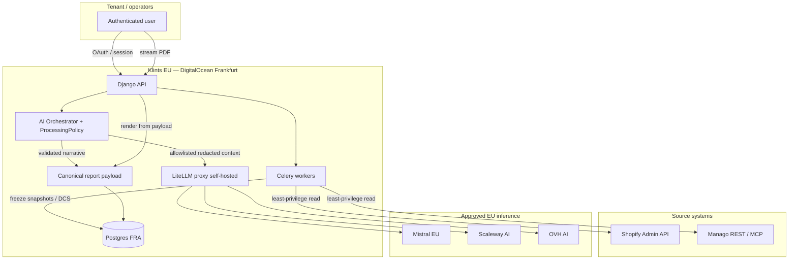

# Klints — AI Security, Data Processing & Architecture Response

**Audience:** Klints product / legal / design-partner security review  
**Status:** Architecture gate — must be reviewed before live customer data is connected to any AI path  
**Date:** 2026-08-03  
**Related:** DataPack v1.2 / DCS workbook v1.4.1 · Assessment Report schema · [LiteLLM](https://www.litellm.ai/)

---

## Executive position

Klints treats customer-data security as a **core product capability**, not a later compliance layer.

We have absorbed the lessons from the Malfini ↔ Manago exchange: security claims must rest on an **exact, verified data flow and configuration**, not platform-level marketing statements. Where a fact is not yet confirmed in writing (DPA, retention, region pin, subprocessor), this document marks it **OPEN** and treats it as a go / no-go criterion for live data.

**MVP1 baseline**

| Layer | Location / control |
|-------|--------------------|
| Application (API, workers) | EU — DigitalOcean **Frankfurt** (`fra1`) |
| Primary database | EU — DigitalOcean Managed Postgres **Frankfurt** |
| Object / ephemeral artifacts | EU — same region (no signed long-lived PDF URLs required) |
| AI gateway | **Self-hosted [LiteLLM](https://www.litellm.ai/)** in the same EU stack (~**+3 development days**) |
| Approved inference providers (MVP1 EU policy) | **Mistral (EU)** · **Scaleway AI** · **OVH AI** · optional EU fallback **Nebius** (only if region + DPA approved) |
| Provider abstraction | Owned by **Klints integration layer**; LiteLLM is the first adapter. Direct provider SDKs remain possible without redesign. |

OpenRouter is **not** the production path for EU-governed tenants. It remains a possible future adapter only after Enterprise EU routing, DPA, and zero-data-retention terms are approved in writing. Until then it must not receive design-partner or production customer context.

Until the configuration and contractual basis below are approved, AI paths use **synthetic or properly anonymized data only**.

---

## 1. What the Malfini ↔ Manago exchange revealed — and how Klints responds

### 1.1 What went wrong (summary)

Malfini asked for exact answers on data sent to external models, storage locations, EU pinning, subprocessors, DPAs, training use, field-level control, and comparison to Microsoft Copilot Enterprise. Manago answered transparently but exposed gaps: generative context flowing through Google Vertex / Claude, inaccurate docs on export and location, no Agent-specific security document, incomplete written confirmation of retention / DPAs / EU pinning, no field-level selector, and inability to guarantee data only in two named Polish locations.

### 1.2 Klints design principles drawn from that exchange

| Gap observed | Klints control |
|--------------|----------------|
| Docs implied data did not leave the platform | Publish an exact data-flow diagram; never claim “data stays in Manago” when Klints retrieves via MCP/API and calls a model |
| Location described inaccurately | Pin Klints storage + LiteLLM + approved providers to **named regions**; refuse requests when policy cannot be satisfied |
| No Agent-specific security document | This document + Processing Policy + security-control matrix are the Agent / AI path contract |
| Retention / DPA / EU pin not confirmed in writing | **OPEN items** block live data (see §11) |
| No field-level selector | Field-level **allowlist** before any prompt assembly |
| “Minimum access” was vague | Operational definition: least-privilege connector scopes + per-task retrieval + no model-driven arbitrary queries |
| Comparison to Copilot Enterprise | Klints is not a general workplace copilot; AI assists **explanation / narrative only** over deterministic DCS results (see §7) |

**Klints will not ship an AI path that cannot answer the same questions Malfini asked.**

---

## 2. Consequences for the Klints architecture

### 2.1 Responsibility chain

Using Manago MCP or REST does **not** keep customer data “inside Manago” once Klints retrieves it and submits context to a model. MCP/API is the connector. Model-side processing becomes a **Klints** processing activity.

```text
Tenant
  → Klints (controller / processor per contract)
    → Manago MCP / REST / Shopify Admin API  (source systems; read-scoped)
      → Klints AI orchestration (prepare task context; redact; policy check)
        → LiteLLM gateway (self-hosted EU; Klints-controlled)
          → Approved EU model provider (Mistral / Scaleway / OVH [/ Nebius if approved])
```

For **every** hop we must be able to state:

| Question | Klints answer location |
|----------|------------------------|
| What data is transferred? | Data inventory (§10.2) + field allowlist |
| Why is it required? | Task-scoped purpose codes (explain finding, compose report narrative, …) |
| Where processed / stored? | Frankfurt app+DB; LiteLLM in EU; provider EU endpoints only |
| How long retained? | Processing Policy + logging/retention spec (§6, §10.7) |
| Who can access? | Role / org map (§10.3) |
| Contractual role? | Controller / processor / subprocessor map (§10.3) |
| Revocation & deletion? | Connector disconnect, credential wipe, retention jobs, provider ZDR where available |
| Logs / caches / temps? | Security logging policy (§6); LiteLLM message logging off; no prompt content in app logs |

### 2.2 What AI is *not* allowed to do

- Call Manago / Shopify / ERP with model-chosen queries or tools  
- Perform writes or external actions without human approval  
- Alter DCS pass/fail, scores, severity, gating, or Check IDs  
- Fall back to an unapproved provider, model, or region  

The model receives **prepared task context**, never unrestricted tenant source access.

---

## 3. Data minimization and access control

### 3.1 Controls (mandatory before live AI)

| Control | Implementation intent |
|---------|----------------------|
| Least-privilege connectors | Shopify: read-only scopes required for DCS (customers/orders/products as needed; no write scopes for MVP1 AI or DCS). Manago: API v2 + v3 keys with minimum rights; MCP tools allowlisted after discovery. |
| Endpoint / domain allowlists | Outbound HTTP only to approved Shopify / Manago / LiteLLM / provider hostnames; deny by default. |
| Field-level AI allowlist | Versioned map per task type: which fields may enter a prompt. Default **deny**. |
| Exclusion / redaction / pseudonymization | Strip emails, phones, names, addresses, payment tokens, free-text that is not required; hash or tokenize IDs where correlation is enough. |
| Per-request retrieval | Fetch only records/fields needed for the specific finding or report section — not “whole tenant dump into context”. |
| Tenant isolation | Company-scoped DB rows, caches, credentials, prompts, report payloads, LiteLLM virtual keys / metadata tags. |
| Prompt-injection defense | Treat product titles, campaign copy, customer notes as untrusted; delimiters + instruction hierarchy; no tool-calling from content. |
| No model-controlled queries | Klints code selects endpoints and filters; model never receives connector credentials or a query DSL. |
| Human approval for writes | Any proposed write / external action requires explicit human approval token (DataPack approval contract). |

### 3.2 AI context assembly pipeline

```text
1. Authorize tenant + task
2. Load tenant Processing Policy
3. Select approved route (region + provider + model) or FAIL SAFE
4. Load only allowlisted fields for that task
5. Redact / pseudonymize
6. Build structured prompt (schema-bound)
7. Call LiteLLM with policy headers / tags
8. Schema-validate model output
9. Persist provenance (prompt version, model, provider, policy version) — not raw PII in ops logs
10. Attach narrative to frozen DCS / report payload
```

---

## 4. LiteLLM, models, and EU processing

### 4.1 Decision (recommended and adopted for MVP1 EU)

| Option | Verdict |
|--------|---------|
| **LiteLLM self-hosted in EU + EU providers** | **Best overall — selected** |
| OpenRouter (incl. Enterprise EU routing) | Deferred; not assumed EU-only; contractual/config gaps remain |
| Direct single-provider SDK only | Viable fallback; worse multi-model ops |
| Manago Agent / Vertex / Claude for Klints narratives | **Out of scope** for Klints-owned AI path; Manago’s own Agent is a separate product with its own gaps |

**Why LiteLLM** ([product overview](https://www.litellm.ai/), [self-host privacy](https://docs.litellm.ai/docs/data_security)):

- OpenAI-compatible multi-model gateway under **Klints infrastructure**  
- No SaaS middleman in the request path when self-hosted (no LiteLLM cloud telemetry)  
- Klints controls routing, budgets, allowlists, fallbacks, and logging  
- Provider swap without rewriting product code  
- Estimated schedule impact: **~3 development days** for deploy, config, Klints adapter, health checks, and policy wiring  

This is intentionally “OpenRouter-like capability, under our control.”

### 4.2 MVP1 EU provider set

| Provider | Role | Notes / OPEN items |
|----------|------|--------------------|
| **Mistral AI** (La Plateforme, EU) | Primary | French entity; EU processing for API; DPA available; confirm ZDR / abuse-log retention in writing for our plan tier |
| **Scaleway AI** | Secondary / capacity | EU (France) cloud AI — confirm model list, DPA, retention, training exclusion |
| **OVH AI** | Secondary / sovereign option | EU — confirm endpoint, DPA, retention |
| **Nebius** | Optional fallback | Only if EU region + DPA + no training + no unapproved subprocessors confirmed; otherwise **disabled** in EU policy |

### 4.3 Production configuration (EU tenant policy)

Must be enforced in code + LiteLLM config, not only in docs:

| Setting | Requirement |
|---------|-------------|
| Inference region | EU-only providers / endpoints |
| Model allowlist | Explicit list (versioned) |
| Fallback | Only to another **approved** EU provider/model; never to OpenAI/Anthropic/US or OpenRouter by default |
| Message / prompt logging in LiteLLM | **Off** (`turn_off_message_logging` / equivalent); spend metadata OK |
| Provider data collection | Deny / no training — confirm per provider account settings |
| Zero-data-retention | Enable where the plan supports it (e.g. Mistral ZDR on eligible plans/calls) |
| Version tracking | Persist model id, provider, LiteLLM config hash, policy version per AI call |
| Fail closed | If no route satisfies policy → error; do not silently degrade |

### 4.4 Klints owns the abstraction

```text
Klints AI Orchestrator
  └── ProviderPort (interface)
        ├── LiteLLMAdapter   ← MVP1
        ├── DirectMistralAdapter  (optional later)
        └── OpenRouterAdapter     (only after EU Enterprise + DPA approval)
```

Application code never hard-codes a single vendor SDK for product features.

### 4.5 OpenRouter — answers if reconsidered later

| Question | Current answer |
|----------|----------------|
| Guaranteed EU in-region routing? | Enterprise capability on request — **not default**; do not assume |
| DPA / subprocessors? | **OPEN** — obtain before any use with customer data |
| Exact EU endpoint / config? | **OPEN** |
| Models under EU routing? | **OPEN** — must be allowlisted explicitly |
| Prompt/output/cache/provider-log retention? | **OPEN** |
| Zero-data-retention? | **OPEN** |
| Training use? | **OPEN** — must be contractually excluded |
| OpenRouter own logging? | **OPEN** |
| Fallback behavior? | Must be disabled or constrained to approved set; else reject |

**MVP1:** do not send live or design-partner customer context to OpenRouter.

### 4.6 Comparison note vs Microsoft Copilot Enterprise

| Dimension | Copilot Enterprise (typical) | Klints AI (MVP1) |
|-----------|------------------------------|------------------|
| Role | Broad productivity assistant over M365 graph | Narrow assistant over **deterministic DCS / report** artifacts |
| Scoring / governance decisions | N/A or org-specific | **Never AI-owned** — app logic only |
| Data boundary | Microsoft tenancy + Copilot controls | Klints Frankfurt + self-hosted LiteLLM + EU allowlisted providers |
| Customer field selector | Graph / DLP / sensitivity labels | Explicit Klints field allowlist + Processing Policy |
| Writes | Often policy-gated | Human approval required; no silent connector writes |

---

## 5. Global compliance readiness (tenant Processing Policy)

EU / GDPR is the **launch baseline**. The architecture must **not** hard-code EU-only forever; it must support other jurisdictions later **without redesigning** the backend, data layer, or AI integration.

### 5.1 Tenant-level `ProcessingPolicy` (configurable)

| Field | Example EU default |
|-------|--------------------|
| `storage_regions` | `["eu-central-1" / DO fra1]` |
| `inference_regions` | `["EU"]` |
| `approved_providers` | `["mistral", "scaleway", "ovh"]` (+ `nebius` only if approved) |
| `approved_models` | Versioned allowlist |
| `permitted_data_categories` | Aggregates, check evidence summaries; limited pseudonymous IDs |
| `field_allowlist_ref` | Policy → allowlist version |
| `redaction_rules_ref` | Rule pack version |
| `provider_data_collection` | `DENY` |
| `max_retention` | Per artifact class (see §6) |
| `logging_mode` | `METADATA_ONLY` for AI ops logs |
| `cross_border_processing` | `false` |
| `allow_provider_fallback` | `true` only within approved set |
| `require_human_approval_for_actions` | `true` |
| `ai_enabled` | Feature flag |

If no available route satisfies the policy → **fail safely**.

### 5.2 Future jurisdictions

US / UK / CH / APAC tenants would get different policy rows (regions, SCCs, providers, retention). MVP1 does **not** claim certification for those regimes; it only keeps the knobs configurable.

### 5.3 What stays configurable (never hard-code)

Data residency · AI inference location · storage/backup location · model/provider allowlists · retention/deletion · cross-border rules · subprocessor restrictions · sensitive-data classification · customer-specific contractual overlays.

---

## 6. Logging and observability

### 6.1 Split: financial vs security logging

| Class | Examples | Content allowed |
|-------|----------|-----------------|
| Financial / capacity | Input/output tokens, cost, latency, model, provider | Yes |
| Security / ops metadata | Tenant id, run id, report id, policy version, route decision, success/fail, fallback denied | Yes |
| Customer content | Raw prompts, completions, PII fields, full findings dumps | **No** in ordinary app, deploy, or LiteLLM message logs |

Where content must be retained for a product purpose (e.g. customer-facing report narrative), it is stored **deliberately** in the canonical report payload: tenant-scoped, access-controlled, retention-bound — not in stdout.

### 6.2 Per AI call — logged metadata (allowed)

- `tenant_id`, `company_id`  
- `assessment_run_id` / `dcs_run_id` / `report_id` (as applicable)  
- `task_type` (e.g. `explain_finding`, `report_narrative`)  
- `prompt_template_version`, `policy_version`, `allowlist_version`  
- `provider`, `model`, `model_version`, `litellm_config_hash`  
- Token counts, estimated cost, latency, HTTP status  
- `route_decision` / `failure_reason` / `fallback_attempted` (boolean + target if any)  
- Redaction profile id (not the redacted secrets)  

### 6.3 Prompts and responses

| Store | Policy |
|-------|--------|
| Application logs (Django/Celery) | Never raw prompt/response |
| Deployment / platform logs | Never raw prompt/response |
| LiteLLM DB / spend logs | Message logging **off**; spend aggregates OK |
| Canonical report payload | Final customer-facing narratives **yes** (immutable); optional hashed prompt fingerprint |
| Provider side | Prefer ZDR; otherwise document retention window in inventory |

### 6.4 Redaction

Before any optional debug sink (staging only): emails, phones, tokens, Authorization headers, connector secrets, free-text customer messages.

### 6.5 Retention (proposed defaults — confirm with legal)

| Artifact | Retention |
|----------|-----------|
| AI ops metadata logs | 90 days |
| LiteLLM spend aggregates | 90 days (or billing cycle + 30) |
| Canonical Assessment Report payload | Per product / contract (e.g. tenure of customer + 30 days or explicit policy id) |
| Temporary PDF bytes | Delete after stream delivery (minutes) |
| Connector raw snapshots for DCS | Existing DCS retention (product-defined; tenant-scoped) |

### 6.6 Access to production logs

- Least-privilege ops roles; MFA; no standing broad access  
- Tenant support access only via authorized break-glass + audit event  
- Incident procedure: freeze relevant logs, export metadata, reconstruct from canonical payloads — **do not re-prompt the model** to “recover” what the customer saw  

### 6.7 Events that must be auditable

Failures · denied fallbacks · policy violations · access to reports · connector credential changes · LiteLLM config changes · AI enable/disable per tenant.

---

## 7. AI responsibility boundary

### 7.1 Deterministic — application logic only (acceptance-tested)

- DCS check execution and pass/fail/warn/unknown  
- Score calculations and weighting  
- Severity and confidence rules  
- Gating decisions and `run_state`  
- Check IDs and registry relationships  
- Acceptance and deployment decisions  
- Supplemental pilot preflight gate outcomes (block pilot only; do not mutate headline 42)

### 7.2 AI may assist (schema-validated)

- Explain a detected issue  
- Propose a root-cause hypothesis (mapped to existing RC taxonomy where possible)  
- Describe potential business impact (must not invent revenue figures not produced by deterministic engines)  
- Propose remediation steps  
- Generate customer-readable narrative for Assessment Report sections  

### 7.3 Hard rules

1. AI output is **schema-validated**; invalid → fail safe (omit AI section or mark incomplete — never invent scores).  
2. Every AI artifact links to **prompt template version + model + provider + policy version**.  
3. Model **must not** change source check result, score, severity, or implementation contract.  
4. Token/cost logging **does not** replace this boundary — both are required.  
5. Acceptance tests: mutate model output / inject score fields → assert ignored; deterministic fixtures unchanged.

---

## 8. DCS implementation contract

Preserved exactly (DataPack v1.2 / workbook v1.4.1 / `CHECK_MASTER_42.md`):

| Item | Contract |
|------|----------|
| Headline checks | **42** = **28** RULE_BASED + **14** DRIFT/FRESHNESS |
| Supplemental gates | **12** on-demand pilot preflight gates — do **not** change headline score |
| Check IDs | Immutable and versioned |
| Forbidden | Silent renumbering, reuse, or semantic change of an existing ID |

Any discrepancy between this structure, the v1.4.x workbooks, and database masters must be **flagged before implementation** (stop-and-flag rule from Build Pack).

---

## 9. Assessment Report

Agreed approach:

- Generate PDF **on demand** and stream to an authenticated, tenant-authorized user.  
- **No** requirement to retain PDF binary or use signed file URLs.  
- Activity log alone is **insufficient**.

### 9.1 Immutable canonical report payload (retained)

Aligned with `assessment_report.schema.json`:

- Tenant, report, assessment-run / input snapshot identifiers  
- Frozen DCS results and included findings  
- Exact customer-facing narratives (including AI-generated text)  
- Template, renderer, prompt, model, provider versions (`provenance.source_versions`)  
- Generation timestamp and requesting user  
- `payload_hash` (SHA-256 of canonical payload)  
- Report generation and access events (governance / activity log)  
- `access_policy`: tenant-scoped; `AGGREGATE_NO_CONTACT_LEVEL_PII` for free diagnostic variant per schema  

PDF is rendered temporarily from this payload and deleted after delivery.  
**Historical reports must never be recreated by re-running the model.**

---

## 10. Required security and architecture deliverables

### 10.1 Data-flow diagram



**Flows**

1. **Onboarding / connect** — OAuth / API keys → encrypted credentials in FRA DB → bootstrap fetch → no AI.  
2. **DCS execution** — fresh import → snapshot → 42 checks (+ optional supplemental gates for pilots) → persist → email/UI — **deterministic, no model**.  
3. **AI explanation** — load finding + allowlisted fields → policy check → LiteLLM → schema validate → store explanation with provenance.  
4. **Assessment Report** — compose canonical JSON from frozen DCS (+ architecture artifacts) → optional AI narratives → hash → stream PDF → delete temp PDF; retain payload.

### 10.2 Data inventory (summary)

| Data class | Example fields | Purpose | Destination | Retention | Sensitivity | Policy |
|------------|----------------|---------|-------------|-----------|-------------|--------|
| Connector credentials | Manago secrets, Shopify offline token | Auth to sources | FRA DB encrypted | Until disconnect + wipe | Critical secret | EU storage |
| Commerce / CDP snapshots | Orders, contacts, events, catalog ids | DCS scoring | FRA DB | Product retention | High (PII possible) | Tenant isolation; **not** sent whole to AI |
| DCS results | Check ID, status, score, evidence locators | Governance score | FRA DB | Product retention | Medium | Deterministic |
| AI task context | Redacted aggregates, check summaries | Explanation / narrative | LiteLLM → EU provider | Transient at gateway; provider per ZDR/DPA | Controlled | Field allowlist |
| AI ops metadata | Tokens, cost, model, ids | Cost + security ops | FRA logs | ~90d | Low | No content |
| Report payload | Narratives, frozen DCS, versions, hash | Customer report + audit | FRA DB | Policy id | Medium | Immutable |
| Temp PDF | Bytes | Download | Memory / ephemeral disk | Minutes | Medium | Delete after send |

Full field-level spreadsheet should be maintained alongside the allowlist versions (living artifact).

### 10.3 Controller / processor / subprocessor map

| Party | Typical role | Processes | Notes |
|-------|--------------|-----------|-------|
| **Customer (brand)** | Controller | Decides purposes of marketing/commerce data | Instructs Klints via ToS/DPA |
| **Klints** | Processor (often) / may be controller for platform telemetry | Hosting, DCS, report, AI orchestration | Frankfurt |
| **Manago** | Independent controller or processor to customer | CDP / marketing automation; source for Klints reads | Klints is **not** Manago Agent; Manago’s own LLM path is out of Klints control |
| **Shopify** | Independent controller/processor to customer | Commerce platform | Cross-border: Shopify may process outside EU — disclose in customer DPA / transfer impact |
| **LiteLLM (self-hosted)** | Software only — processing stays on Klints infra | Gateway | [No LiteLLM cloud telemetry when self-hosted](https://docs.litellm.ai/docs/data_security) |
| **Mistral / Scaleway / OVH (/ Nebius)** | Subprocessors of Klints for inference | Prompt context → completion | DPAs + region + training exclusion **required before live data** |

### 10.4 Model / provider decision matrix

| Provider | Quality (MVP1 narrative) | Latency | Cost | EU residency | Retention / ZDR | Training | Fallback use |
|----------|--------------------------|---------|------|--------------|-----------------|----------|--------------|
| Mistral | Strong default | Good | Mid | EU default for La Plateforme | Confirm ZDR on our plan | API: no training by default — **confirm account** | Primary |
| Scaleway AI | Good / varies by model | Good | Mid-low | EU (FR) | **OPEN confirm** | **OPEN confirm** | Secondary |
| OVH AI | Good / varies | Good | Mid-low | EU | **OPEN confirm** | **OPEN confirm** | Secondary |
| Nebius | TBD | TBD | TBD | **OPEN** | **OPEN** | **OPEN** | Disabled until approved |
| OpenRouter | Broad | Good | Variable | Not default EU | **OPEN** | **OPEN** | Not for EU MVP1 |
| OpenAI / Anthropic direct | High | Good | Variable | Often US | Varies | Varies | Not for EU MVP1 policy |

### 10.5 Processing Policy design

See §5. Stored per tenant (JSON/JSONB or normalized tables), evaluated on every AI call and on report composition when AI is involved. Versioned; changes audited.

### 10.6 Security-control matrix (requirements → implementation → test)

| Requirement | Implementation | Acceptance test |
|-------------|----------------|-----------------|
| Least-privilege connectors | Scope constants + FD-02 / auth preflight | Connect with excess write scopes unused; AI path cannot invoke write tools |
| Endpoint allowlist | Egress allowlist / client wrappers | Call to non-allowlisted host fails |
| Field allowlist | Versioned allowlist module | Non-allowlisted field never appears in assembled prompt fixture |
| Redaction | Redaction pack | Email/phone stripped in unit tests |
| Per-task retrieval | Task context builders | Builder requests only expected keys |
| Tenant isolation | `company_id` on all queries + report ACL | Cross-tenant report/AI call → 404/403 |
| Prompt injection | Delimiters + no tools from content | Hostile product title cannot trigger tool call |
| No model queries | No credentials/tools in model schema | Schema forbids tool calls for MVP1 explain/report |
| Human approval writes | Approval token gate | Write without token rejected |
| EU routing | Policy + LiteLLM model_list | US provider in config → rejected for EU tenant |
| Fail closed | Orchestrator | Empty allowlist / no route → error, no call |
| AI cannot change DCS | Boundary in assembler | Injected score in model JSON ignored |
| Schema validation | Pydantic/JSON Schema | Invalid narrative → safe failure |
| Report immutability | Persist payload + hash | Re-download matches hash; no model re-call |
| No prompt in logs | Logging filters + LiteLLM settings | Assert log sink has no prompt body |
| Check ID immutability | Master seed + tests | Renaming ID fails CI |

### 10.7 Logging and retention specification

See §6. Normative for MVP1 AI and report paths.

### 10.8 Staged deployment plan

| Stage | Data | AI | Exit criteria |
|-------|------|----|---------------|
| **S0 — Synthetic** | Fixtures (e.g. Lumera) | On | Golden tests green; LiteLLM up in FRA |
| **S1 — Anonymized / restricted** | Scrubbed extracts | On | Allowlist + redaction verified; no raw PII in prompts (spot audit) |
| **S2 — Design partner read-only** | Live read connectors | On only if §11 go criteria met | DPAs signed; policy enforced; monitoring live |
| **S3 — Approved production** | Live | On | Security review sign-off; incident runbook rehearsed |

### 10.9 Go / no-go for live customer data on AI path

**GO only if all are true:**

1. LiteLLM self-hosted in Frankfurt (or equivalent EU), message logging off, model allowlist loaded.  
2. Written DPAs (or equivalent) with each enabled inference provider; training excluded; retention/ZDR documented.  
3. Tenant Processing Policy persisted and enforced (fail closed).  
4. Field allowlist + redaction packs reviewed.  
5. Security logging policy implemented; spot-check shows no prompts in app/deploy logs.  
6. AI responsibility boundary covered by automated tests.  
7. Canonical report payload + hash path implemented before any AI narrative is customer-visible.  
8. Shopify/Manago transfer disclosures acknowledged in customer-facing privacy/DPA materials.  
9. Incident runbook exists (who accesses logs, how to revoke keys, how to delete tenant AI artifacts).

**NO-GO (keep synthetic/anonymized) if any OPEN item in §11 that is marked blocker remains unresolved.**

---

## 11. Open items, inconsistencies, and implementation concerns (flag before build)

| ID | Item | Severity | Notes |
|----|------|----------|-------|
| O-01 | Written DPAs + retention/ZDR confirmation for Mistral, Scaleway, OVH (and Nebius if used) | **Blocker for S2** | Do not connect live AI until filed |
| O-02 | Nebius EU region + subprocessor list | Blocker if enabled | Default: leave out of EU allowlist |
| O-03 | Manago MCP tool schemas / scopes still `DISCOVERY_REQUIRED` (Build Pack) | High | Read-only discovery before any write; AI must not depend on unverified MCP tools |
| O-04 | Manago’s own Agent / Vertex path | Info | Out of Klints AI boundary; customer may still ask — answer with pointer to Manago docs, not Klints guarantees |
| O-05 | Shopify may process data outside EU | High (disclosure) | Klints FRA storage does not make Shopify EU-only; document transfers |
| O-06 | Field-level AI allowlist not yet implemented in code | **Blocker for S2** | Architecture gate |
| O-07 | `ProcessingPolicy` model not yet in schema | **Blocker for S2** | Design before AI feature merge |
| O-08 | LiteLLM misconfiguration risk (message logging / Redis semantic cache storing prompts) | High | Checklist in deploy; disable prompt caches for EU policy unless encrypted + TTL + policy-approved |
| O-09 | Revenue / business-impact figures | Medium | AI must not invent € amounts; only cite deterministic engines (e.g. DCS-08 when present) |
| O-10 | Supplemental 12 gates vs DB masters | Medium | Reconcile IDs with workbook before pilot AI/report copy references them |
| O-11 | OpenRouter Enterprise EU terms | Low for MVP1 | Only if product later reconsiders; adapter already planned |
| O-12 | Schedule: +~3 days for LiteLLM self-host | Planning | Explicitly accepted vs faster OpenRouter path |
| O-13 | Comparison pack vs Copilot Enterprise | Low | Legal/marketing — keep technical boundary clear |
| O-14 | Backup / PITR region for DO Postgres | Medium | Confirm backups remain in FRA / EU |

Decide these explicitly; do not let assumptions harden into production.

---

## 12. Implementation checklist (engineering)

- [ ] Deploy LiteLLM (Docker/Compose or sidecar) on FRA droplet/VPC; Postgres/Redis EU; no public admin UI without auth  
- [ ] Configure `model_list` allowlist only; disable unapproved providers  
- [ ] `turn_off_message_logging` (or equivalent); disable prompt-bearing caches for EU tenants  
- [ ] Klints `ProviderPort` + `LiteLLMAdapter`  
- [ ] `ProcessingPolicy` persistence + evaluator  
- [ ] Field allowlist + redaction packs + tests  
- [ ] AI orchestrator task types: explain + report narrative  
- [ ] Schema validation + provenance persistence  
- [ ] Report canonical payload + hash + stream PDF  
- [ ] Security metadata logging (no content)  
- [ ] Acceptance tests for boundary + fail-closed routing  
- [ ] Stage S0 → S1 before any design-partner AI  

---

## 13. Document control

| Version | Date | Author | Change |
|---------|------|--------|--------|
| 0.1 | 2026-08-03 | Klints engineering | Initial response to client architecture gate; LiteLLM + EU providers selected |

**Next review:** before first design-partner AI enablement (Stage S2 go/no-go).
