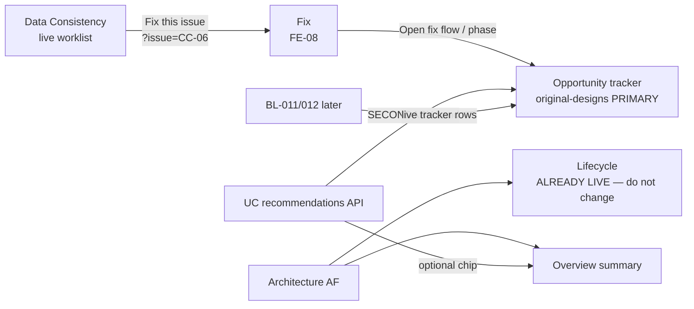

# PRD-UC-01B — Opportunity tracker reconnect to `original-designs` (FE correction)

**Status:** Ready for implementation — **supersedes UC-01 FE layout** (merged FE PR #23 put the wrong page job on `/opportunities`)  
**Module:** see folder path  
**Scope:** **Frontend `/opportunities` only**  
**Depends on:** BE UC-01 APIs (already merged) · FE-08 Fix `?issue=` links  
**Design source of truth:** frontend branch **`original-designs`** — `src/routes/opportunities.tsx`  
**Pack:** `Klints_MVP1_Rohan_Build_Pack_v1.2_20260718`  
**Out of scope:** `/lifecycle` · Overview AF bind · BE changes · BL-011/012 live tracker rows · BL-017 · Fix redesign · inventing banked €

---

## 0. Cursor agent brief (paste this)

```text
Implement PRD-UC-01B — FE /opportunities only.

Read: docs/use_cases/PRD_UC_01B_OPPORTUNITIES_ORIGINAL_DESIGNS_RECONNECT.md
Design SoT: git show origin/original-designs:src/routes/opportunities.tsx

DO NOT touch /lifecycle — Architecture is already live there
(getArchitectureLatest + coverage APIs).

1. PRIMARY = original-designs Opportunity tracker:
   - Title: "Every fix, its phase, and its result"
   - 3 cards: In fix flow / Queued / Completed
   - Tracker table + filters (same structure as original-designs)
2. REMOVE from Opportunities: Architecture coverage-gaps table
   and hero "Pilots ready when the data is".
3. SECONDARY (below tracker) = MVP1 pilots from
   GET /api/v1/use-cases/recommendations/ (keep use-cases.ts).
   ?uc= sheet; gap_suggested badge; blockers → ?issue= /lifecycle.
4. Tracker rows: fixture OK if labeled demo; no fake banked €.
5. Do not change LOCKED_ALLOWED_ROUTES.

Acceptance: §8.
```

---

## 1. Problem (what shipped wrong)

FE PR #23 merged a page that treats Opportunities as an **Architecture + pilots** screen.

| | Merged on main (wrong) | Client SoT (`original-designs`) |
|--|------------------------|--------------------------------|
| Page job | “Pilots ready when the data is” | “Every fix, its phase, and its result” |
| Hero | AF coverage-gaps table + pilots | Handoff **results tracker** |
| Tracker | Demoted to “Past handoffs · demo” | **Primary** |

**Locked decision:** Restore tracker as primary. Pilots stay, but **below**. Architecture stays on Lifecycle — already covered.

---

## 2. Where things live (do not confuse)

```text
/lifecycle     → Architecture (ALREADY LIVE — leave alone)
/opportunities → Results tracker (PRIMARY) + pilots band (SECONDARY)
/fix          → FE-08 live issue bridge (leave alone)
/dashboard     → Overview summary chips (optional pilots-ready chip OK)
```

### 2.1 Connection diagram



### 2.2 Architecture — already on Lifecycle

**Current main** `src/routes/lifecycle.tsx` already calls:

- `GET /api/v1/architecture/assessments/latest/`
- `GET /api/v1/architecture/assessments/{id}/coverage/`

| AF data | Where |
|---------|--------|
| Mode, gaps, stages, verdicts | **`/lifecycle` only** (this PR does not edit it) |
| Overview mode / coverage chip | Overview (already) |
| Pilot “Gap suggested” badge | Opportunities pilots band only |
| AF gaps **table** on Opportunities | **Remove** — duplicate of Lifecycle |

### 2.3 Pilots — secondary on Opportunities

| Data | UI |
|------|-----|
| Recommendations list | Band **below** tracker |
| Blueprint | `?uc=UC-02` sheet |
| Overview | Optional “N pilots ready →” (scroll to pilots band) |

### 2.4 Tracker — primary on Opportunities

| Data | UI |
|------|-----|
| In flow / queued / done · est vs real | Tracker from `original-designs` |
| Live orchestration rows | Later (BL-011+) — fixture/demo OK until then |

---

## 3. Target `/opportunities` composition

**Copy structure from:** `origin/original-designs:src/routes/opportunities.tsx`

### 3.1 Primary (must restore)

1. **PageTitle** — “Every fix, its phase, and its result” (+ original description)  
2. **Three cards** — In fix flow now · Queued · Completed  
3. **Tracker section** — filters + table columns as in original-designs  
4. Row CTA **Open fix flow →** → `/fix?issue=<id>`  
   - Prefer `check_id` when row is live DCS-linked  
   - Fixture `iss-*` only for demo rows  

### 3.2 Secondary (keep from UC-01)

**Section:** `MVP1 pilots · readiness` (below tracker)

- `GET /api/v1/use-cases/recommendations/` via existing `src/lib/use-cases.ts`  
- Status chip · `gap_suggested` badge · blockers · `?uc=` sheet  
- Optional link: `Architecture coverage → Lifecycle`  
- Error → Retry (no silent fake pilots)

### 3.3 Remove from this page

- Architecture coverage-gaps **table**  
- Hero title “Pilots ready when the data is”  
- Any `getArchitectureLatest` usage whose only job was that gaps table  

---

## 4. Honesty

| Rule | Behavior |
|------|----------|
| Tracker € | Fixture must say demo/fixture; no banked revenue claims |
| Pilot cards | No invented € |
| Manago writes | None |

---

## 5. Files

| File | Change |
|------|--------|
| `src/routes/opportunities.tsx` | **Only file that must change** — restore tracker primary; pilots secondary; drop AF gaps table |
| `src/lib/use-cases.ts` | Keep |
| `src/lib/klints-data.ts` | Keep `opportunityTracker` for fixture rows if needed |
| `src/routes/lifecycle.tsx` | **Do not touch** |
| `src/lib/dcs.ts` lock routes | **Do not touch** |
| Overview pilots-ready chip | Keep if already present |

---

## 6. Relationship to other work

| Item | Status |
|------|--------|
| UC-01 BE APIs | Done — reuse |
| UC-01 FE layout (PR #23) | Wrong — this PRD corrects it |
| Lifecycle AF bind | Done — out of scope |
| FE-08 Fix | Done — out of scope |
| BL-011/012 | Future live tracker rows |

---

## 7. Phases

| Phase | Deliverable |
|-------|-------------|
| **A** | Restore original-designs tracker as primary |
| **B** | Keep/move pilots band below + `?uc=` |
| **C** | Delete AF gaps table from Opportunities |

No Lifecycle phase.

---

## 8. Acceptance

- [ ] `/opportunities` matches original-designs job: **tracker first**  
- [ ] Three cards + Tracker section + filters/table  
- [ ] **No** Architecture coverage-gaps table on Opportunities  
- [ ] Pilots band below tracker still uses live recommendations  
- [ ] `?uc=` sheet works; blockers use `?issue=`  
- [ ] `/lifecycle` unchanged  
- [ ] No invented banked €; lock allowlist unchanged  

---

## 9. One-page summary

| Question | Answer |
|----------|--------|
| What? | Revert Opportunities to **original-designs tracker**; pilots below |
| Why? | PR #23 swapped the page job; client design is SoT |
| Architecture? | Already on **Lifecycle** — do not re-add gaps table here |
| Touch Lifecycle? | **No** |
| BE? | No change |

**PRD:** UC-01B · **Engineering** · **SoT:** `original-designs` `/opportunities`
