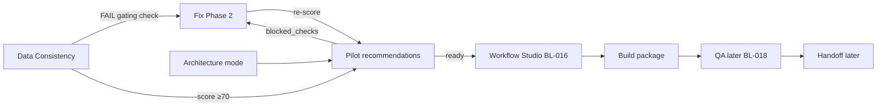
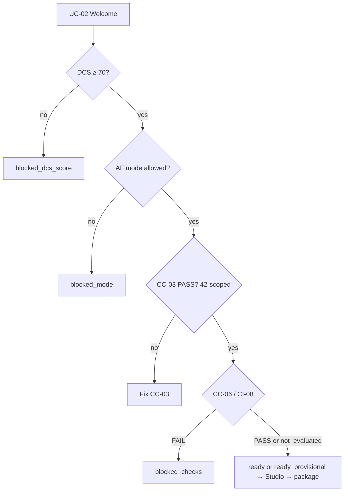

# PRD-WF-01 — Workflow Blueprint Studio (BL-016)

**Status:** Ready for implementation  
**Owner track:** Engineering   
**Backlog:** **BL-016** — Generate Manago build package from blueprint JSON (MCP route **or** human fallback resolved)  
**Surfaces:** `/workflow` · `/workflow/$id` · Data Consistency Build CTA (rules below) · Opportunities ready pilots · Fix “Proceed to Workflow Studio”  
**Depends on:** UC-01 pilots seeded + recommendations · AF-01 latest mode · live DCS check results · pack `04_MVP1_Pilot_Blueprints/*`  
**Design SoT:** frontend `original-designs` → Workflow Studio chrome  
**Pack SoT:**  
- `04_MVP1_Pilot_Blueprints/pilot_manifest.json` + `UC-*_blueprint.json`  
- `03_Machine_Contracts/workflow_blueprint.schema.json` (+ `handoff_package.schema.json` for later stub shape)  
- `06_Implementation/implementation_backlog_v1.2.xlsx` → BL-016  
- `06_Implementation/Klints_MVP1_Rohan_Implementation_Blueprint_v1.2` — Milestone C build packages; acceptance mentions **UC-02 and UC-06B**  
- `02_Execution_Capabilities/Klints_Manago_ExecutionCapabilityMatrix_v1.1_20260718.xlsx` — resolve MCP vs `HUMAN.WORKFLOW.BUILD`  
- Related PRDs: `PRD_UC_01_*` (gates/status) · `PRD_AF_01_*` (mode) · `PRD_ORCH_01_*` (plan queue → Fix/Build later)  
**Out of scope:** MCP live upsert (BL-019) · QA score engine full BL-018 · Handoff Send live · Engineering writebacks (WB-02) · BL-012 waves · inventing pilots outside the 16 · enabling LE-04 writeback · UC-06A / UC-41 (excluded in manifest)  

---

## 0. Cursor agent brief (paste this)

```text
Implement PRD-WF-01 / BL-016 — Workflow Blueprint Studio + build package.

Read:
- docs/engineering/PRD_WF_01_WORKFLOW_BLUEPRINT_STUDIO.md
- Pack: 04_MVP1_Pilot_Blueprints/ (esp UC-02) + workflow_blueprint.schema.json
- original-designs: src/routes/workflow*.tsx

Must ship:
1. Studio binds to live pilot/blueprint (start UC-02), not only fixtures.
2. API: generate build package from blueprint JSON (human guide + SM-agent JSON).
3. Gate honesty: only ready pilots (min_dcs 70 + gating checks PASS + AF mode).
4. Data Consistency Build button rules per §5 — Fix vs Build vs none.
5. No MCP write. Handoff format may be shaped for later; activation STAGED_NOT_LIVE.
6. First E2E flows: UC-02 + UC-06B (§6). Supplemental missing ≠ hard block (§3.2).

Acceptance: §12.
```

---

## 1. What BL-016 is (and is not)

| IS | IS NOT |
|----|--------|
| Turn pack **blueprint JSON** into an operator-visible **build package** | Writing contacts/fields (that is Fix / WB-02) |
| Workflow Studio UI for a **use case / pilot** (UC-xx) | A DCS check detail page |
| Human fallback guide + SM-agent-ready JSON | Live `MCP.WORKFLOW.UPSERT` (deferred) |
| Respect **gates** before “ready to build” | Ignoring FAIL gating checks |
| Stage package for later QA/Handoff | Production activation in Manago |

**Pack acceptance (BL-016):** *MCP route **or** human fallback resolved.*  
MVP1 default = **human fallback** (`HUMAN.WORKFLOW.BUILD`). MCP remains capability dependency with status discovery-required.

---

## 2. Core objects (do not conflate)

```text
DCS check (CI-01, CC-03, …)
  └─ FAIL/WARN → Fix flow (Phase 2) — data integrity

Pilot / Use case (UC-02, UC-06B, …)
  └─ gates.gating_check_ids must be PASS + min_dcs + AF mode
       └─ ready → Workflow Studio (Phase 3) — build package

Blueprint JSON (UC-02_blueprint.json)
  └─ recipe: audience, trigger, workflow.nodes, QA, approval, handoff

Build package (BL-016 output)
  └─ human guide + agent JSON derived from blueprint + tenant context
```

A **check** never “is” a blueprint. A check **gates** one or more pilots. When those checks fail, Data Consistency shows **Fix**; when a pilot is ready, surfaces show **Build**.

---

## 3. Which checks become part of Blueprint Studio?

### 3.1 Only as **gates** (not as the Studio subject)

Every pilot lists `gates.gating_check_ids`. Those checks **must PASS** (WARN = blocked in UC-01 strict rule) before Studio treats the pilot as buildable.

#### Full matrix (pack — authoritative)

| Pilot | Title | min_dcs | gating_check_ids |
|-------|-------|---------|------------------|
| **UC-02** | Welcome series continuity | 70 | **CC-03, CC-06, CI-08** |
| UC-04 | First-purchase incentive | 70 | PT-13, CC-03 |
| UC-05 | Double opt-in nudge | 70 | CC-06, CC-03 |
| UC-06B | Second Purchase Accelerator | 70 | LE-01, LE-05, PT-04, CC-01, CC-02, SP-10 |
| UC-08 | Post-purchase education | 70 | PT-01, BR-09 |
| UC-09 | Review & UGC request | 70 | LE-01, LE-10, PT-01 |
| UC-10 | Account creation nudge | 70 | CI-02, LE-01 |
| UC-11 | Replenishment reminder | 70 | SP-04, PT-01, BR-09 |
| UC-12 | Back-in-stock | 70 | PT-01, PT-06, BR-02 |
| UC-13 | Price-drop alert | 70 | PT-05, PT-01 |
| UC-16 | Churn-risk save | 70 | LE-01, PT-04, SP-08 |
| UC-17 | Winback lapsed | 70 | LE-01, PT-04, CC-01 |
| UC-21 | Cart abandonment | 70 | LE-07, CC-01, PT-06 |
| UC-23 | VIP candidate | 70 | PT-04, LE-04, SP-07 |
| UC-28 | Complementary cross-sell | 70 | PT-01, PT-11, BR-03 |
| UC-36 | Post-purchase upsell | 70 | LE-01, PT-01, BR-01 |

Also required (every pilot in pack):

- Headline DCS **≥ 70** (`gates.min_dcs`)  
- AF mode ∈ `architecture_modes` (usually `AUGMENT` \| `SELECTIVE_REBUILD` \| `REBUILD`)

### 3.2 Supplemental preflight checks (DCS-09 — headline ≠ these)

From `pilot_manifest.json` → `supplemental_preflight_checks`:

`BR-03, BR-09, CC-06, CI-08, LE-07, LE-10, PT-05, PT-06, PT-11, PT-13, SP-04, SP-10`

These **block the dependent pilot only**; they do **not** change the 42-check headline score. Several appear in gating lists above (e.g. **CC-06, CI-08** on UC-02).

**BL-016 v1 — locked supplemental policy (CRITICAL):**

Headline DCS only runs the **42** checks. These gating IDs are **not** in the 42 and will usually be **missing** until DCS-09:

`BR-03, BR-09, CC-06, CI-08, LE-07, LE-10, PT-05, PT-06, PT-11, PT-13, SP-04, SP-10`

| Gate class | Rule for `ready` / package |
|------------|----------------------------|
| Gating check **in** MVP1 42 (A or B) | Must be **PASS**. FAIL/WARN/missing → hard `blocked_checks` |
| Gating check in **supplemental** list | If **no result** yet: do **not** hard-block Studio. Mark `supplemental_status=not_evaluated` and stamp package `provisional_supplemental=true` + UI banner. If DCS-09 later returns FAIL → hard block |
| Supplemental with real FAIL | Hard `blocked_checks` |

**Why:** Pack demo pilots **UC-02** (gates include CC-06, CI-08) and **UC-06B** (SP-10) cannot ever become `ready` under “missing = blocked” without DCS-09. Implementation Blueprint also asks to validate **UC-02 and UC-06B** packages.

**Do not invent PASS** for supplementals. Provisional package is honest staging, not a fake green gate.

### 3.3 Reverse index — full (if this check fails, Builds stay locked)

| check_id | In 42? | Blocks pilots |
|----------|--------|---------------|
| BR-01 | Yes (A) | UC-36 |
| BR-02 | Yes (B) | UC-12 |
| BR-03 | Supplemental | UC-28 |
| BR-09 | Supplemental | UC-08, UC-11 |
| CC-01 | Yes (A) | UC-06B, UC-17, UC-21 |
| CC-02 | Yes (A) | UC-06B |
| CC-03 | Yes (A) | UC-02, UC-04, UC-05 |
| CC-06 | Supplemental | UC-02, UC-05 |
| CI-02 | Yes (A) | UC-10 |
| CI-08 | Supplemental | UC-02 |
| LE-01 | Yes (A) | UC-06B, UC-09, UC-10, UC-16, UC-17, UC-36 |
| LE-04 | Yes (A) | UC-23 |
| LE-05 | Yes (A) | UC-06B |
| LE-07 | Supplemental | UC-21 |
| LE-10 | Supplemental | UC-09 |
| PT-01 | Yes (A) | UC-08, UC-09, UC-11, UC-12, UC-13, UC-28, UC-36 |
| PT-04 | Yes (A) | UC-06B, UC-16, UC-17, UC-23 |
| PT-05 | Supplemental | UC-13 |
| PT-06 | Supplemental | UC-12, UC-21 |
| PT-11 | Supplemental | UC-28 |
| PT-13 | Supplemental | UC-04 |
| SP-04 | Supplemental | UC-11 |
| SP-07 | Yes (A) | UC-23 |
| SP-08 | Yes (B) | UC-16 |
| SP-10 | Supplemental | UC-06B |

**Engineering note:** Fixing **CC-03** via writeback unlocks welcome pilots (UC-02/04/05) for Build once headline gates clear (supplementals may still be provisional).

### 3.4 Pilots whose gates are all inside the 42 (no supplemental dependency)

Useful if you need a hard-green demo without provisional stamp: **UC-10, UC-16, UC-17, UC-23, UC-36**.  
Still ship **UC-02** (+ **UC-06B**) as primary pack targets with §3.2 provisional rule.

### 3.5 Exclusions / variants

| ID | Rule |
|----|------|
| UC-06A | Excluded (non-pilot simple fallback) — do not seed as buildable |
| UC-06B | Flagship variant — **in** MVP1 16; parent note `parent_use_case_id` may be set |
| UC-41 | Excluded (MCP surface write) — never |

---

## 4. Ready vs blocked (when Studio may generate a package)

Reuse UC-01 recommendation `status`, with one BL-016 extension:

| Status | Meaning | Studio behaviour |
|--------|---------|------------------|
| `ready` | All **42-scoped** gating checks PASS + min_dcs + AF mode; all supplementals PASS | Open brief · **Generate build package** |
| `ready_provisional` (BL-016) | Same hard gates OK but ≥1 supplemental `not_evaluated` | Studio allowed · banner · package `provisional_supplemental=true` |
| `blocked_checks` | Any **42-scoped** gating check not PASS, or supplemental **FAIL** | Gate list · **Fix** links |
| `blocked_dcs_score` | Headline &lt; `min_dcs` (or no score) | Show score vs 70 · link Data Consistency |
| `blocked_mode` | AF mode null / `INCOMPLETE` / not in `architecture_modes` | Link Lifecycle |
| `unavailable` | Blueprint missing / invalid seed | Hide / error |

If UC-01 API cannot emit `ready_provisional` yet, FE may derive it: `status=ready` from API **or** (`blocked_checks` solely due to missing supplementals) → treat as provisional. Prefer extending recommendations payload with `supplemental_status` + flag.

**Do not** generate a fake fully-cleared package when **42** gates fail. Provisional is only for unevaluated supplementals (§3.2).

---

## 5. Data Consistency — when to show **Build** vs **Fix**

### 5.1 Client fixture rule (`original-designs`)

On Data Consistency expanded row:

- `status === "Opportunity"` → primary CTA **Build** → `/workflow/$id?issue=…`  
- else → **Fix this issue** → `/fix?issue=…`

Fixture example: `iss-untapped` = Opportunity / Second Purchase / no data writeback.

### 5.2 Live product rule (locked for BL-016)

Live worklist rows are **DCS checks** (FAIL/WARN/PASS), not pilots. Map CTAs as follows:

| Worklist row | Primary CTA | Why |
|--------------|-------------|-----|
| FAIL / WARN (any check) | **Fix this issue** → `/fix?issue=<check_id>` | Data integrity — Phase 2 |
| PASS check that **gates** a `ready` pilot | Optional secondary: **Build {UC}** → Studio for that UC | Only if product wants deep-link; **not required v1** |
| Optional / opportunity-style row (if FE still labels some `Opportunity`) | **Build** | Match original-designs |
| Score header “build-ready” (DCS ≥ threshold) | Copy only — not a per-row Build | Explains gate for workflows |

**v1 recommendation (simplest, accurate):**

1. Data Consistency rows → **always Fix** for FAIL/WARN (never pretend Build writes data).  
2. **Build** primary entry points:  
   - `/opportunities` when pilot `status=ready`  
   - `/workflow` list of ready pilots  
   - Fix page “Proceed to Workflow Studio” **after** fix path (may land on Studio empty/ready list)  
3. Optional later: on a FAIL gating check, show footer “Blocks UC-02 Build” with link — educational, not a Build button.

**Do not** show Build on LE-04 / integrity FAIL implying the workflow can ship.

### 5.3 Score strip (“N pts to build-ready”)

Pack pilots use **min_dcs = 70**. Align Overview / Data Consistency “build-ready” copy with **70** (or existing product threshold if already unified — if product uses another number, document deviation in PR; pack says 70).

---

## 6. First flows (implement in this order)

### Flow A — Happy path (demo) · **UC-02 first** (provisional OK)

```text
1. DCS headline ≥ 70
2. CC-03 PASS (42-scoped). CC-06 / CI-08 may be not_evaluated → ready_provisional
3. AF mode allowed
4. Opportunities / Workflow: UC-02 ready or ready_provisional
5. Open Workflow Studio ?uc=UC-02 (see §7.5 deep-link bridge)
6. Show blueprint brief (audience, trigger, nodes, measurement, suppressions…)
7. Generate build package (human + JSON); stamp provisional if needed
8. CTA: “Approve workflow → send to QA” (soft link /qa?uc=UC-02&package=…)
9. No Manago MCP write — package staged (handoff.activation_state = STAGED_NOT_LIVE)
   content.agent_output_state remains DRAFT; human_signoff still required later
```

### Flow A2 — Pack second target · **UC-06B**

Same as A with UC-06B gates (LE-01, LE-05, PT-04, CC-01, CC-02 hard; SP-10 may be provisional). Implementation Blueprint explicitly calls out UC-02 **and** UC-06B packages.

### Flow B — Blocked by data · Fix then Build

```text
1. CC-03 FAIL → UC-02 blocked_checks (hard)
2. Data Consistency / Fix: Fix CC-03 (Engineering writeback if eligible)
3. Re-score / refresh recommendations
4. When 42-scoped gates PASS → Flow A (possibly provisional on CC-06/CI-08)
```

### Flow C — Build opportunity without writeback (fixture parity)

```text
1. Pilot ready / ready_provisional (e.g. UC-06B or UC-17)
2. Studio: “Built from validated data — no customer writeback required” when true
3. Generate package → QA link
```

### Flow D — Entry from Fix / ORCH / Lifecycle (do not miss)

| Entry | Behaviour |
|-------|-----------|
| Fix “Proceed to Workflow Studio” | Prefer `?uc=` for pilots unblocked by the fixed `check_id`; else `/workflow` ready list — **never** fake `/workflow/wf-*` fixture ids |
| Opportunities ready card | `/workflow/?uc=UC-xx` or detail route |
| ORCH-01 Plan queue | May still deep-link Fix first; Build only when pilot ready (ORCH does not replace gates) |
| Lifecycle gap badge | `gap_suggested` sorts Opportunities; still requires gates for package |
| Studio “Open approved fix” | Back-link to `/fix?issue=<check_id>` for a blocking or related check |

### Flow E — Explicitly out of first ship

- MCP upsert / Send to Manago instances  
- Full QA hard-test engine (BL-018) — Studio may link to QA chrome with package id stub  
- Diff-bound **workflow** approval tokens (BL-017) — copy blueprint `approval.roles` into package for later  
- All 16 equally polished UX — **UC-02 + UC-06B** required; others generic generator OK  

---

## 7. Build package — what to generate

### 7.1 Inputs

- Blueprint JSON (validated against `workflow_blueprint.schema.json`)  
- Tenant id / company  
- Latest DCS run id + gate snapshot (check_id → status)  
- AF mode snapshot  
- Capability resolution: prefer MCP if CONFIRMED else **HUMAN.WORKFLOW.BUILD**

### 7.2 Outputs (minimum)

| Artifact | Content |
|----------|---------|
| `package_id` | Stable id |
| `use_case_id` / `blueprint_id` / `variant_id` / version | From pack |
| `route` | `HUMAN_FALLBACK` \| `MCP` — default human until Capability Matrix evidence CONFIRMED for `MCP.WORKFLOW.UPSERT` |
| `capability_resolution[]` | Each `capability_dependencies[]` row → resolved status + fallback used (`HUMAN.WORKFLOW.BUILD`) |
| `human_guide` | Node-by-node steps from `workflow.nodes` + `content` (brand_dna, localisation, human_signoff) |
| `agent_spec` JSON | SM-agent-ready: audience, trigger, nodes, measurement, suppressions, frequency_policy, collision_policy |
| `data_contract` | required_entities/fields, identity_key_priority, namespace klints_ / klints: |
| `gates_snapshot` | min_dcs, each gating_check_id → PASS\|FAIL\|WARN\|not_evaluated + `provisional_supplemental` |
| `qa_requirements` | `minimum_score: 80` + `hard_tests[]` from blueprint (for BL-018) |
| `approval_requirements` | `required_before_write/activation`, roles (`CRM_OWNER`, `DATA_OWNER`), token_binds fields |
| `rollback` | strategy + max_partial_write_minutes from blueprint |
| `handoff_stub` | format `MCP_ACTION_OBJECT_AND_A2A_TASK_SPEC`, idempotency_key_template, `STAGED_NOT_LIVE` |
| `content_state` | `agent_output_state: DRAFT` |
| `connected_instances` | From live Integrations (Manago / Shopify labels) — FE can merge |
| `hashes` | content hash for later approval binding |
| `provenance` | blueprint provenance + generate actor/time + dcs_run_id + af snapshot |

### 7.3 API sketch

```http
GET  /api/v1/use-cases/                          # existing UC-01
GET  /api/v1/use-cases/recommendations/          # statuses + blockers (+ supplemental flags)
GET  /api/v1/use-cases/{uc_id}/                  # blueprint summary + gate breakdown
POST /api/v1/use-cases/{uc_id}/build-package/    # BL-016 — ready | ready_provisional
GET  /api/v1/build-packages/{package_id}/        # fetch generated package
```

**403/409** if hard-blocked.  
Audit: `workflow.build_package_generated` (include provisional flag in metadata).

### 7.4 FE Studio bind (original-designs chrome)

Keep blocks:

| Chrome block | Live bind source |
|--------------|------------------|
| Built from… | Gate snapshot / last fix check_id or “validated data” |
| Touchpoints | Blueprint / solution channels |
| Connected instances | Integrations API |
| Workflow identity | blueprint_id, use_case_id, rank, route |
| Steps | `workflow.nodes` → title/desc/fields |
| Required fields | `data_contract.required_fields` + status vs latest evidence if cheap |
| Next → QA | Link `/qa` with `uc` + `package_id` (toast must not claim MCP send) |

### 7.5 Deep-link bridge (fixture → live) — was easy to miss

| original-designs | Live BL-016 |
|------------------|-------------|
| `/workflow/$id` with `wf-*` + `?issue=iss-*` | Prefer **`?uc=UC-02`** (and optional `package_id`) |
| `getStudioBlueprint(issueId)` fixtures | `GET use-cases/UC-02` + build-package |
| Empty: “select an issue” | Empty: “select a ready pilot” + link Opportunities / Data Consistency |
| Build from DCC `workflowId` | Build from Opportunities `use_case_id` or recommendation |

Do **not** keep navigating to fake `wf-second-purchase` ids after go-live.

### 7.6 Roles

Blueprint `approval.roles`: `CRM_OWNER`, `DATA_OWNER`.  
Map in v1 to Klints **ADMIN** (and optionally ANALYST for generate-but-not-approve). Document mapping in PR; do not invent new RBAC enums unless product asks.

---

## 8. Needed vs not (checklist)

### Needed for BL-016 v1

- [ ] Seed/load 16 blueprints (UC-01) if not already  
- [ ] Gate evaluation with §3.2 supplemental policy (+ provisional flag)  
- [ ] Studio live bind for **UC-02** and **UC-06B** (+ generic for any ready UC)  
- [ ] Build package generator including agent_spec fields in §7.2  
- [ ] Download / view package in UI  
- [ ] Honest blocked states with Fix links to **42-scoped** gating `check_id`s  
- [ ] Data Consistency CTA rules §5.2  
- [ ] Deep-link bridge §7.5 (no fake `wf-*`)  
- [ ] Audit event on generate  
- [ ] Capability Matrix: default `HUMAN.WORKFLOW.BUILD` until MCP confirmed  

### Not needed / defer

| Item | Defer to |
|------|----------|
| MCP.WORKFLOW.UPSERT execute | BL-019 / M3 |
| Handoff Send all instances | BL-018+ handoff PRD |
| QA ≥80 hard-test runner | BL-018 |
| Wave floors / DAG | BL-012 |
| Writeback Approve | Engineering WB-02 |
| DCS-09 full supplemental engine | DCS-09 future PRD (missing=blocked OK) |
| UC-41 / excluded pilots | Never in MVP1 |
| Prod activation | Human in Manago; package stays staged |

---

## 9. Diagrams

### 9.1 Journey



### 9.2 UC-02 gate detail



---

## 10. Collaboration with Engineering

| Engineering | Engineering |
|--------|-------|
| CC-03 (and CI-01) writeback on Fix | UC-02/04/05 unlock when CC-03 PASS |
| Evidence download for non-writable gates | Studio shows those check_ids as blockers with Fix links |
| Does not own `/workflow` | Owns Studio + build package |

---

## 11. Files (expected)

| Area | Touch |
|------|-------|
| `dataruns/use_cases/` | build_package service + views |
| Pack blueprints | Read-only load (already) |
| FE `workflow.index.tsx` / `workflow.$id.tsx` | Live bind + generate/download |
| FE Data Consistency | CTA rules §5.2 (Fix vs optional Build) |
| Opportunities | Ready → Studio (if not already) |
| Tests | UC-02 ready→package; blocked CC-03→409; schema validate |

---

## 12. Acceptance

- [ ] UC-02 path generates human + agent package (provisional OK if CC-06/CI-08 not_evaluated)  
- [ ] UC-06B path generates package (provisional OK if SP-10 not_evaluated)  
- [ ] Hard-blocked when any **42-scoped** gating check not PASS or score &lt; 70  
- [ ] Studio UI shows real blueprint nodes (not only fixture copy)  
- [ ] No MCP write claimed; route = human fallback by default  
- [ ] Data Consistency FAIL/WARN → Fix (not Build) per §5.2  
- [ ] Opportunities/Workflow → Studio via `?uc=` (§7.5)  
- [ ] Package includes qa_requirements, approval_requirements, rollback, handoff_stub, hashes  
- [ ] Audit `workflow.build_package_generated`  
- [ ] BL-016 acceptance met via **human fallback** resolved  

---

## 13. Suggested implementation slices

1. **BE** gate policy §3.2 + package generator for UC-02 / UC-06B + APIs  
2. **FE** Studio bind + download + provisional banner  
3. **FE** CTA honesty on Data Consistency + Opportunities + Fix proceed (§7.5)  
4. Genericize to all 16 ready pilots  

Ship 1–3 for first demo; 4 can be same PR if cheap.

---

## 14. Recheck log (gaps found vs first draft)

| Gap | Resolution in this PRD |
|-----|------------------------|
| UC-02/UC-06B gates include **supplementals** not in 42 → forever blocked if missing=blocked | §3.2 provisional policy |
| Implementation Blueprint requires **UC-02 and UC-06B** packages | Flows A + A2; acceptance |
| Reverse index truncated | §3.3 full table |
| Package omitted suppressions, collision, frequency, measurement, rollback, caps, DRAFT content | §7.2 expanded |
| original-designs deep-links `issue`/`wf-*` vs live `uc=` | §7.5 bridge |
| Capability Matrix path not cited | Pack SoT header |
| handoff_package.schema / idempotency / STAGED_NOT_LIVE | §7.2 handoff_stub |
| Approval roles CRM_OWNER/DATA_OWNER | §7.6 map to ADMIN |
| Fix / ORCH / Lifecycle entry flows | Flow D |
| Excluded UC-06A / UC-41 | §3.5 |
| Pilots with all gates in 42 (hard-green demos) | §3.4 |
| FE already uses `DCS_BUILD_READY_THRESHOLD = 70` | §5.3 aligned — no conflict |
| Connected instances | From Integrations in package/FE |
| QA hard_tests list | Copied into package for BL-018 |

**Still intentionally deferred (not misses):** MCP write, BL-018 runner, BL-012 waves, Handoff Send, Engineering writebacks, full DCS-09 executors.
