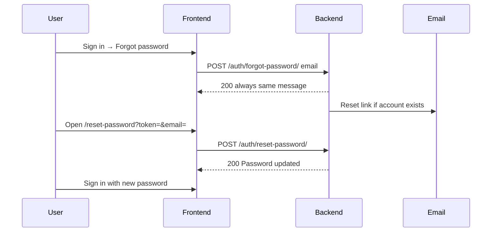
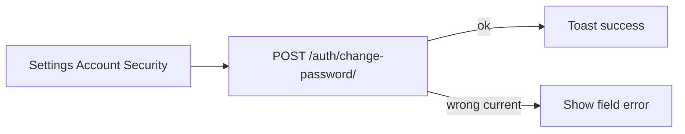
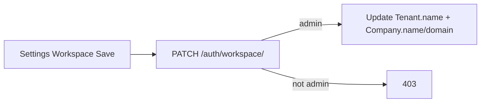

# Password + workspace settings — build guide

Junior-friendly spec. Implement in **`tenants/`** (backend) + sign-in / settings (frontend).  
Base URL: `/api/v1/`  
Auth header on protected routes: `Authorization: Bearer <access>`

**Goals**
1. Forgot password from **sign-in** (email link → set new password)
2. Change password from **Settings → Account** (logged in)
3. Edit **workspace details** from **Settings → Workspace**
4. Hydrate Account / Workspace from real `/auth/me/` data (stop using mock Lumera fields)

**Out of scope (v1):** change email, timezone/industry/currency DB fields, 2FA, team invites (see `docs/team/PRD_TEAM_INVITES.md`).

---

## 1. Flows

### 1.1 Forgot password (signed out)



### 1.2 Change password (signed in)



### 1.3 Edit workspace



---

## 2. What already exists

| Piece | Status |
|-------|--------|
| `POST /auth/login/` · `GET /auth/me/` | Real |
| Sign-in page | Real — **no** forgot link |
| Settings Account / Workspace | **Mock** fields; logout real |
| Password reset / change APIs | **Missing** |
| Workspace PATCH | **Missing** |

Models today (`tenants/models.py`):
- **User:** `name`, `email`, `role`, password hash
- **Tenant:** `name`, `slug`
- **Company:** `name`, `domain`

UI fields **without** DB columns yet (do **not** send in API v1): Industry, Reporting currency, Timezone. Keep them disabled or hide until a later PRD adds columns.

---

## 3. New table: `password_reset_tokens`

Same pattern as `email_verification_tokens`.

| Column | Type | Notes |
|--------|------|--------|
| `id` | UUID PK | |
| `user_id` | FK → `users` | CASCADE |
| `email` | EmailField | copy of user email |
| `token` | CharField(64) unique | `secrets.token_urlsafe(32)` |
| `expires_at` | DateTime | now + TTL hours |
| `used_at` | DateTime null | set when consumed |
| `created_at` | DateTime | auto |

`db_table = "password_reset_tokens"`

---

## 4. Settings (env)

```env
FRONTEND_RESET_URL=http://localhost:8082/reset-password
PASSWORD_RESET_TTL_HOURS=24
```

Reset link:

```text
{FRONTEND_RESET_URL}?token={token}&email={urlencoded_email}
```

---

## 5. Permissions

| Action | Who |
|--------|-----|
| Forgot / reset password | Public |
| Change password | Authenticated user (self) |
| PATCH `/auth/me/` (name) | Authenticated user (self) |
| PATCH `/auth/workspace/` | `role=admin` only |

---

## 6. API routes

Add to `tenants/auth_urls.py` (same `/api/v1/auth/` prefix).

| Method | Path | Auth | Purpose |
|--------|------|------|---------|
| `POST` | `/auth/forgot-password/` | — | Send reset email (opaque) |
| `POST` | `/auth/reset-password/` | — | Set new password with token |
| `POST` | `/auth/change-password/` | Bearer | Change while logged in |
| `PATCH` | `/auth/me/` | Bearer | Update display name |
| `PATCH` | `/auth/workspace/` | Bearer admin | Update tenant + company |

`GET /auth/me/` already exists — keep response shape; extend only if needed.

---

## 7. Exact request / response shapes

### 7.1 `POST /api/v1/auth/forgot-password/`

**Request**

```json
{ "email": "george@lumera.skin" }
```

**Response `200`** (always — do not reveal if email exists)

```json
{ "detail": "If an account exists, a reset link has been sent." }
```

**Server steps**
1. Normalize email lowercase.
2. Find active user with that email (`is_active=true`; optional: also allow unverified).
3. If found: invalidate previous unused tokens for that user (set `used_at`); create new token (`secrets.token_urlsafe(32)`, expires in `PASSWORD_RESET_TTL_HOURS`); send email with link `{FRONTEND_RESET_URL}?token=...&email=...`.
4. Always return the same `200` body.

**Backend**

- View: `tenants/auth/views.py` — `ForgotPasswordView` (`AllowAny`)
- Serializer: `tenants/auth/serializers.py` — `ForgotPasswordSerializer` (email required, strip + lowercase)
- Service: `tenants/auth/services.py` — `find_user_for_password_reset()`, `create_password_reset_token()`
- Email: `tenants/emails.py` — `send_password_reset_email()`
- URL: `tenants/auth/urls.py` → included from `tenants/auth_urls.py` as `POST /api/v1/auth/forgot-password/`

---

### 7.2 `POST /api/v1/auth/reset-password/`

**Request**

```json
{
  "token": "AbCd...",
  "email": "george@lumera.skin",
  "password": "NewSecurePass1"
}
```

**Response `200`**

```json
{ "detail": "Password updated. You can sign in." }
```

**Errors**

| Status | Body |
|--------|------|
| `400` | `{"detail": "Invalid or expired reset link."}` |
| `400` | `{"password": ["This field is required."]}` / too short |

Example password validation error:

```json
{ "password": ["This password is too short. It must contain at least 8 characters."] }
```

**Server steps**
1. Find token matching `token` + `email`, `used_at` null, `expires_at` > now.
2. Else → `400` invalid/expired.
3. `user.set_password(password)`; save.
4. Mark token `used_at=now`; invalidate other open reset tokens for user.
5. Return `200` — no JWT (user signs in fresh).

Password rules: same as register (min 8; Django validators).

**Backend**

- View: `tenants/auth/views.py` — `ResetPasswordView` (`AllowAny`)
- Serializer: `tenants/auth/serializers.py` — `ResetPasswordSerializer` (`token`, `email`, `password`; Django `validate_password`)
- Service: `tenants/auth/services.py` — `consume_password_reset_token()`, `reset_user_password()`
- URL: `tenants/auth/urls.py` → `POST /api/v1/auth/reset-password/`

---

### 7.3 `POST /api/v1/auth/change-password/`

**Request**

```json
{
  "current_password": "OldPass123",
  "new_password": "NewSecurePass1"
}
```

**Response `200`**

```json
{ "detail": "Password updated." }
```

**Errors**

| Status | Body |
|--------|------|
| `401` | Missing/invalid JWT |
| `400` | `{"current_password": ["Incorrect password."]}` |
| `400` | `{"new_password": ["..."]}` validation |

Example `new_password` validation error:

```json
{ "new_password": ["This password is too short. It must contain at least 8 characters."] }
```

**Server steps**
1. `check_password(current_password)`.
2. Validate `new_password`.
3. `set_password` + save.

**Backend**

- View: `tenants/auth/views.py` — `ChangePasswordView` (`IsAuthenticated`)
- Serializer: `tenants/auth/serializers.py` — `ChangePasswordSerializer` (`current_password`, `new_password`; Django `validate_password`)
- Service: `tenants/auth/services.py` — `change_user_password()`
- URL: `tenants/auth/urls.py` → `POST /api/v1/auth/change-password/`

---

### 7.4 `PATCH /api/v1/auth/me/`

**Request** (only `name` in v1)

```json
{ "name": "George L." }
```

**Response `200`** — same shape as `GET /auth/me/`:

```json
{
  "id": "uuid",
  "email": "george@lumera.skin",
  "name": "George L.",
  "role": "admin",
  "email_verified": true,
  "tenant": { "id": "uuid", "name": "Lumera Skin", "slug": "lumera-skin" },
  "company": { "id": "uuid", "name": "Lumera Skin", "domain": "lumera.skin" }
}
```

Email and role are **read-only** (ignore if sent).

---

### 7.5 `PATCH /api/v1/auth/workspace/`

**Request**

```json
{
  "tenant_name": "Lumera Skin",
  "company_name": "Lumera Skin",
  "company_domain": "lumera.skin"
}
```

All fields optional; send only what changed.

**Response `200`**

```json
{
  "tenant": { "id": "uuid", "name": "Lumera Skin", "slug": "lumera-skin" },
  "company": { "id": "uuid", "name": "Lumera Skin", "domain": "lumera.skin" }
}
```

**Rules**
- Admin only → else `403` `{"detail": "Admin only."}`
- Update user’s tenant `name`.
- Update first company for that tenant (`order_by created_at`). If no company → `400` `{"detail": "No company on this workspace."}`.
- **Slug:** keep existing slug in v1 (do not auto-rename; avoids breaking links). Document as follow-up if product wants rename.
- Normalize `company_domain`: lowercase, strip protocol/trailing slash.

**Errors:** `403` · `400` validation · `404` if somehow no tenant.

---

## 8. Email (forgot password)

Subject: `Reset your Klints password`

```text
We received a request to reset the password for {email}.

Reset your password:
{FRONTEND_RESET_URL}?token={token}&email={email}

This link expires in {PASSWORD_RESET_TTL_HOURS} hours.

If you did not ask for this, ignore this email.
```

Use `tenants/emails.py` + existing mailer.

---

## 9. Frontend

### 9.1 Sign-in (`signin.tsx`)

- Add link under password field: **Forgot password?** → `/forgot-password`
- Keep existing login behavior

### 9.2 New: `/forgot-password`

- Email field + Submit
- Call `POST /auth/forgot-password/`
- Always show success copy matching API message
- Link back to sign-in

### 9.3 New: `/reset-password?token=&email=`

- Read query params
- Fields: new password, confirm password
- `POST /auth/reset-password/`
- On success → redirect `/signin` with toast

### 9.4 Settings → Account

- On load: `GET /auth/me/` → fill name, email (read-only), role (read-only label)
- Save name → `PATCH /auth/me/`
- Security: form **Current password** + **New password** + **Confirm** → `POST /auth/change-password/`  
  (Replace mock “send reset link” toast)

### 9.5 Settings → Workspace

- On load: from `/me` → `tenant.name`, `company.name`, `company.domain`
- Save → `PATCH /auth/workspace/` (admin only; disable Save for non-admins)
- Hide or disable Industry / Currency until schema exists

### 9.6 App shell (optional polish)

- Show `tenant.name` from `/me` instead of hardcoded “Lumera Skin” when easy

---

## 10. Build order

1. Model + migration `password_reset_tokens`
2. Env + email helper
3. `forgot-password` + `reset-password` views
4. `change-password` view
5. `PATCH me` + `PATCH workspace`
6. Frontend forgot / reset pages + sign-in link
7. Wire Settings Account + Workspace

---

## 11. File checklist

**Backend**
- [x] `tenants/models.py` — `PasswordResetToken`
- [x] migration — `tenants/migrations/0005_password_reset_token.py`
- [x] `tenants/auth/` — `views.py`, `serializers.py`, `services.py`, `urls.py` (forgot / reset / change password)
- [x] `tenants/auth_urls.py` — includes `tenants.auth.urls`
- [x] `tenants/emails.py` — `send_password_reset_email()`
- [x] settings + `.env.example` — `FRONTEND_RESET_URL`, `PASSWORD_RESET_TTL_HOURS`
- [x] tests — `tenants/tests/test_password_auth.py`

**Frontend**
- [ ] `signin.tsx` — Forgot link
- [ ] `forgot-password.tsx` · `reset-password.tsx`
- [ ] `settings.tsx` — hydrate + save + change password
- [ ] `api.ts` / `auth.ts` helpers

---

## 12. Acceptance tests

1. Forgot unknown email → still `200` same message; no email crash.
2. Forgot real email → mail arrives → reset works → can login with new password → old password fails.
3. Expired / used token → `400`.
4. Logged-in change password with wrong current → field error; with correct → login works with new password.
5. Admin updates workspace name/domain → `/me` reflects change; non-admin → `403`.
6. Settings shows real `/me` data, not hardcoded George/Lumera.

---

## 13. Do / don’t

**Do**
- Opaque forgot response (no email enumeration)
- Same password validators as register
- Admin-only workspace edit

**Don’t**
- Invent Industry/Currency API fields without DB columns
- Auto-login after reset (user signs in fresh)
- Let users change `email` or `role` via PATCH me in v1
