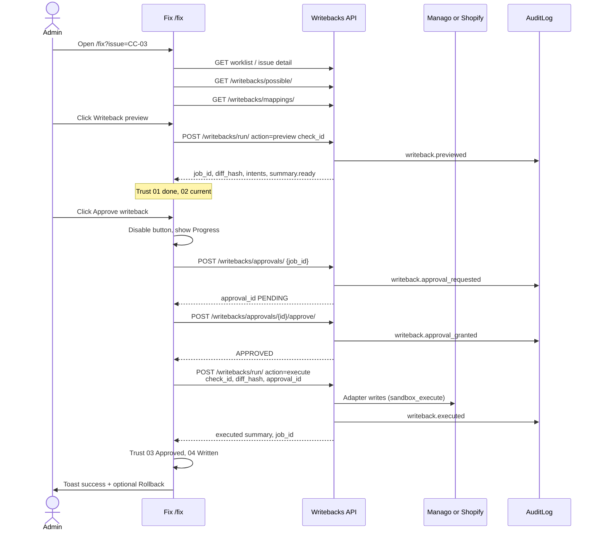

# PRD-WB-02 — Fix Approve writeback → sandbox execute (live)

**Status:** Ready for implementation  
**Owner track:** Engineering  — **PR 1 of 2** (ship before FE-12)  
**Surfaces:** `/fix` (Phase 2) · Activity / notifications (audit) · Postman sandbox collection  
**Depends on (already shipped):**  
- WB-01 / WB-01B / WB-01C — adapters, mappings, `GET …/possible/`, `POST …/run/`  
- Approvals API — `POST …/approvals/` + approve/reject (BL-017 early)  
- FE-08 / FE-09 / FE-11B — live Fix bridge, evidence, Elements  
**Design SoT:** frontend branch **`original-designs`** → `src/routes/fix.tsx` (Approve writeback on Fix, **not** Handoff)  
**Pack SoT:** `Klints_Spec_InitialDataConsistencyCheck_v1.4.1` sheets **02 Check Catalogue** + **09 MVP1 Check Scope** (Build Phase **MVP1-A**)  
**Out of scope:** Prod `WRITEBACKS_ENABLED=True` · new check mappings · LE-04 · contact merge · Order/Transaction writers · MCP · Handoff Send · evidence Excel download (**FE-12**, PR 2) · Workflow Studio live bind · Engineering AI box changes  

---

## 0. Cursor agent brief (paste this)

```text
Implement PRD-WB-02 — Fix “Approve writeback” must really write on sandbox.

Read:
- docs/engineering/PRD_WB_02_FIX_APPROVE_WRITEBACK_EXECUTE.md
- docs/engineering/WRITEBACK_POSSIBLE_NOT_SHEET.csv
- original-designs: src/routes/fix.tsx (trust steps + Approve CTA)

Ship:
1. FE Fix: never setApproved(true) without a successful execute API.
2. Eligible checks only: CI-01, CC-03, WB-SHOP-01 (sandbox_only).
3. Click Approve → preview job → approval request → approve → run execute
   (ADMIN only). Loading + trust steps + toasts match §6–7.
4. Non-eligible / fixture: button disabled or honest copy — no fake Written.
5. Rollback control after success when sheet says rollback yes.
6. Audit events already exist — ensure Activity + bell see them; no new
   notification system.
7. Keep WRITEBACKS_ENABLED=False. Do not invent mappings.

Acceptance: §12.
```

---

## 1. Why

Client Fix chrome (`original-designs`) has **Approve writeback** on Phase 2 so data is repaired **before Build**. Today the button either toasts “not enabled” while flipping local `approved`, or (regressions) shows **Written** without calling Manago/Shopify.

WB-01C already answers **what can write**. This PR wires **Approve → execute** for the three checks that are `sandbox_only` + `registry_enabled=true`, with honest UI for everything else.

---

## 2. Vocabulary (do not confuse)

| Term | Meaning | Screen |
|------|---------|--------|
| **Issue** | One FAIL/WARN worklist row for a DCS check | Data Consistency → Fix |
| **check_id** | Catalogue ID (`CC-03`, `CI-01`, …) — **primary Fix deep-link key** | `/fix?issue=CC-03` |
| **run_issue_id** | DB UUID for that row (optional; not required for writeback) | API detail only |
| **Writeback preview** | Dry-run intents + `job_id` + `diff_hash` | Fix table tab |
| **Approve writeback** | Human sign-off that **executes** the diff | Fix CTA |
| **Send / Handoff** | Workflow package to agent after QA | `/handoff` — **out of scope** |

**URL contract (unchanged from FE-08):**  
`/fix?issue=<check_id>` e.g. `/fix?issue=CC-03`.  
Fixture ids `iss-*` stay demo-only; **never execute** for fixtures.

---

## 3. Which checks / issues — locked allowlist for this PR

### 3.1 Execute allowed (Approve may write)

Grounded in pack MVP1-A + Check Catalogue **and** our sheet/registry **today**:

| check_id | Pack Fix Type | Platform write | Mapping | Sheet `write_possible_today` | Issue appears when |
|----------|---------------|----------------|---------|------------------------------|--------------------|
| **CI-01** | Automated writeback (approved) | Manago contact upsert + `klints_backfill` | `CI-01.identity_backfill.v1.json` | `sandbox_only` | Worklist FAIL/WARN for CI-01 on latest scored run |
| **CC-03** | Automated writeback + Manual | Manago detail `klints_consent_evidence` | `CC-03.consent_provenance.v1.json` | `sandbox_only` | Worklist FAIL/WARN for CC-03 |
| **WB-SHOP-01** | Sandbox proof (not Catalogue) | Shopify customer `note` | `WB-SHOP-01.customer_note.v1.json` | `sandbox_only` | Only if product surfaces this check_id (sandbox ops / Postman); **not** required on worklist for M2 demo |

**Fields written (exact — from sheet):**

| check_id | entity | field_or_key | creates_new | updates_existing | rollback |
|----------|--------|--------------|-------------|------------------|----------|
| CI-01 | contact | `email` (native upsert) | yes | yes | yes |
| CI-01 | contact | `klints_backfill` | yes | yes | yes |
| CC-03 | contact | `klints_consent_evidence` | yes | yes | yes |
| WB-SHOP-01 | customer | `note` | no | yes | yes |

### 3.2 Approve must stay OFF (evidence only — FE-12 later)

Excel MVP1-A “Automated writeback + Manago surface” but **not** built / disabled in registry — **do not execute**:

`CI-03`, `CI-05`, `LE-01`, `LE-02`, `LE-05`, `LE-09`, `PT-01`, `PT-03`, `PT-04`, `SP-03`, `SP-07`, `CC-01`, `CC-02`, `BR-01`

Plus always off:

| check_id / topic | Why |
|------------------|-----|
| **LE-04** | Pack = Integration build + Manual; registry `enabled=false` |
| CI-03 merge / SP-01 / LE-01 stubs | `mapping_stub` / disabled |
| Shopify Order / Transaction / Manago Order CRUD | Not write surfaces |
| Any check with `write_possible_today` ∈ {`no`,`disabled`} | Sheet SoT |

### 3.3 Eligibility helper (FE + tests)

A check is **approve-executable** iff **all** hold:

1. `check_id` ∈ {`CI-01`,`CC-03`,`WB-SHOP-01`} (or derived dynamically: registry enabled **and** any possible-row has `write_possible_today=sandbox_only` **and** not in `WRITEBACK_PREVIEW_BLOCKED_CHECK_IDS`).  
2. Latest `GET /writebacks/possible/` rows for that check include `sandbox_only` or `yes`.  
3. Company is sandbox allowlisted (`WRITEBACK_SANDBOX_COMPANY_IDS`) **or** (future) prod enabled — **this PR only supports sandbox path in UI**.  
4. User role = **ADMIN** for execute (Analyst may preview only).  
5. Preview returned `summary.ready >= 1`, non-null `job_id`, 64-char `diff_hash`, and `execute_eligible.sandbox === true`.

If any fail → button disabled + reason (see §6.4). Prefer deriving from `/possible/` + preview response over hardcoding, but hardcode allowlist as safety net matching sheet.

---

## 4. Screens & navigation

```text
Data Consistency / Overview worklist
  → Open fix for issue (check_id)
       ↓
/fix?issue=CC-03          ← THIS PR (Phase 2)
  Evidence tab | Writeback preview tab
  Trust: 01 Review → 02 Test → 03 Approve → 04 Audit
  [Approve writeback]  [Proceed to Workflow Studio]
       ↓ (after success)
Activity (/activity) + bell notifications (existing AUDIT-02)
       ↓
Workflow Studio (Phase 3) — link only; no new Build work in this PR
```

**Not this PR:** `/qa`, `/handoff` Send buttons.

**Shell:** Keep `original-designs` classes (`fix-trust`, `fix-hero`, `fix-cta-row`, …). No redesign.

---

## 5. End-to-end sequence (happy path)



### 5.1 API calls (exact)

Use existing endpoints (WB-01C). Prefer unified run:

| Step | Method | Path | Body / notes |
|------|--------|------|----------------|
| 1 Preview | `POST` | `/api/v1/writebacks/run/` | `{ "action": "preview", "check_id": "CC-03" }` — roles ADMIN\|ANALYST |
| 2 Request approval | `POST` | `/api/v1/writebacks/approvals/` | `{ "job_id": "<preview job uuid>" }` |
| 3 Approve | `POST` | `/api/v1/writebacks/approvals/<approval_id>/approve/` | empty body |
| 4 Execute | `POST` | `/api/v1/writebacks/run/` | `{ "action": "execute", "check_id": "CC-03", "diff_hash": "<64 hex>", "approval_id": "<uuid>" }` — **ADMIN only** |
| 5 Rollback (optional) | `POST` | `/api/v1/writebacks/run/` | `{ "action": "rollback", "job_id": "<execute job uuid>" }` — ADMIN |

Aliases `…/preview/`, `…/execute/`, `…/rollback/` remain valid.

**Sandbox gate (current BE):** `execute_allowed` returns true for sandbox companies **without** `approval_id`.  
**This PR FE rule:** **always** run steps 2–3 and **always** send `approval_id` on execute so Activity shows the full approval chain (matches contract “with approval gate”). If BE ignores validation on sandbox, still pass the id; consume path already runs when `approval_id` present after execute.

**Prod:** `WRITEBACKS_ENABLED` stays `False` → execute must 403/`writebacks_disabled`. FE must not claim prod write.

### 5.2 Diff binding

- Execute `diff_hash` **must** equal preview `diff_hash`.  
- If user re-previews, invalidate prior approval UI state and require a new Approve click.  
- On `diff_hash mismatch` → toast error; trust steps do **not** advance to Written.

---

## 6. UI behaviour (Fix screen)

### 6.1 Trust steps (must track real state)

| Step | Label | When |
|------|-------|------|
| 01 REVIEW | Reviewed | Issue + evidence loaded (live) |
| 02 TEST | Test complete · ready for approval | Successful preview with `ready >= 1` |
| 02 TEST | Preview empty / blocked | Preview ok but `ready=0` or blocked — **do not** enable Approve |
| 03 APPROVE | Awaiting approval | Idle before success |
| 03 APPROVE | Approving… | In-flight steps 2–4 |
| 03 APPROVE | Approved | Execute HTTP success **and** `summary.executed >= 1` (or documented partial with executed>0) |
| 04 AUDIT | Will write on approval | Before success |
| 04 AUDIT | Written | Same success condition as 03 Approved |

**Hard rule:** Local React `approved` / `showTrustApproved` may flip to true **only after** step-4 response success. Never on click alone. Never for fixtures.

### 6.2 Approve writeback button

| Condition | Button |
|-----------|--------|
| Fixture `iss-*` | Hidden or disabled — “Demo plan · writebacks off” |
| Check not eligible (§3.3) | Disabled — “Writeback not available for this check” |
| Eligible but no preview yet | Disabled — “Run writeback preview first” |
| Preview `ready=0` | Disabled — “Nothing ready to write” |
| User not ADMIN | Disabled — “Admin required to approve writebacks” |
| Eligible + preview ready + ADMIN | **Enabled** |
| In flight | Disabled + spinner label “Writing to sandbox…” |
| Success | Hide Approve; show **Rollback** if `rollback.supported` / sheet yes |
| Execute failed | Re-enable Approve; keep 03/04 pending |

### 6.3 Toasts (honest copy)

| Event | Toast |
|-------|-------|
| Preview ok | Optional soft: “Preview ready · N changes” |
| Execute success | **Success:** “Writeback applied · {check_id} · {executed} updates” — may say Manago.ai / Shopify only if `target` matches |
| Execute denied / disabled | **Error:** API `detail` / blocked_reason — never “queued for Manago” |
| Diff mismatch | **Error:** “Preview changed — run preview again, then approve” |
| Rollback success | **Success:** “Writeback rolled back · {job_id short}” |
| Fixture click (if any) | **Message:** “Demo only — does not update Manago.ai” |

### 6.4 Non-writable live issues (Excel rest)

For live FAIL/WARN checks that are **not** execute-eligible:

- Show Evidence tab (existing FE-09).  
- Hide Writeback preview **or** show preview blocked with sheet blocker text.  
- Approve disabled with: “No automated writeback for this check yet — use evidence and suggested fix.”  
- Still allow “Proceed to Workflow Studio” link (honesty: Build may be limited until data fixed — do not claim data was written).  
- **Download Excel** → **FE-12** (do not build in WB-02).

### 6.5 Progress / loading

- Single in-page progress: disable CTAs; show inline status under trust steps or button (“Requesting approval…”, “Writing…”).  
- No fake multi-second animation after failure.  
- Do not navigate away mid-flight.  
- Optional: `useMutation` with `isPending` covering the whole approve chain as one mutation.

### 6.6 After success

- Show execute `job_id` (mono, truncated) in gov grid or under trust.  
- Refresh possible/preview tabs not required; keep last preview table + show executed statuses if API returns intents.  
- Primary next CTA remains **Proceed to Workflow Studio** (Phase 3) — same chrome as original-designs.  
- Optional secondary: **View in Activity**.

### 6.7 Rollback control

After successful execute when rollback supported:

- Button: **Rollback writeback**  
- Confirm dialog: “Undo sandbox write for {check_id}? This calls Manago/Shopify reverse ops.”  
- On success: trust 04 → “Rolled back”; toast; audit `writeback.rollback`.  
- Re-Approve requires new preview (diff may change).

---

## 7. Notifications & Activity

**Do not build a new notification channel.** Reuse AUDIT-01 / AUDIT-02.

| Audit `action` | When | Bell / Activity |
|----------------|------|-----------------|
| `writeback.previewed` | Preview | Optional noise — OK if appears |
| `writeback.approval_requested` | Step 2 | Unread bell |
| `writeback.approval_granted` | Step 3 | Unread bell |
| `writeback.approval_rejected` | Reject (if UI adds Reject later) | Unread bell |
| `writeback.execute_denied` | Gate fail | Unread bell |
| `writeback.executed` | Step 4 success | Unread bell — **primary** |
| `writeback.rollback` | Rollback | Unread bell |

**FE checklist:**

- After execute success, invalidate audit notifications query (same keys as AUDIT-02) so bell badge updates without full page reload.  
- Activity page already lists company audits — no new columns required.  
- Summary strings already include check_id — keep PII out of summaries (adapters already).

**Out of scope:** email, Slack, websockets, per-intent push.

---

## 8. Roles & tenancy

| Role | Preview | Request/Approve token | Execute / Rollback |
|------|---------|----------------------|--------------------|
| VIEWER | No | No | No |
| ANALYST | Yes | Yes (request/approve token) | **No** |
| ADMIN | Yes | Yes | **Yes** |

Company always from `get_user_company` — never cross-tenant.  
Sandbox membership: company id ∈ `WRITEBACK_SANDBOX_COMPANY_IDS`.  
If not sandbox and prod off → execute fails; FE shows disabled with “Sandbox writebacks only for now.”

---

## 9. Backend changes (minimal)

Prefer **FE-first** if APIs already sufficient. Allowed BE tweaks:

1. Ensure execute with `approval_id` on sandbox still **consumes** token (already in pipeline when id present).  
2. Optional harden: require `approval_id` even for sandbox when `actor` is present (feature flag) — only if FE always sends it; document in PR.  
3. Tests: approve chain for CI-01/CC-03 sandbox company; LE-04 still 404/disabled; non-admin execute 403; diff mismatch 400.  
4. **Do not** enable `WRITEBACKS_ENABLED`.  
5. **Do not** enable LE-04 / new mappings.

---

## 10. Frontend files (expected)

| Area | Likely touch |
|------|----------------|
| `src/routes/fix.tsx` | Approve mutation chain; trust state; rollback; remove fake `setApproved(true)` |
| `src/lib/writebacks.ts` | `executeWriteback`, `requestApproval`, `approveApproval`, `rollbackWriteback`; eligibility helpers |
| Fix plan builders | `govHead` / test badge copy for live success vs blocked |
| Query invalidation | audit notifications + optional worklist |

Keep chrome; no new card layout.

---

## 11. Deploy / verify (sandbox)

1. Staging/dev company id on `WRITEBACK_SANDBOX_COMPANY_IDS`.  
2. `WRITEBACKS_ENABLED=False`.  
3. Connect Manago (+ Shopify for WB-SHOP-01).  
4. Force or wait for DCS so **CC-03** or **CI-01** is FAIL/WARN (or use sandbox evidence fallback already in transform for CC-03).  
5. Open `/fix?issue=CC-03` as **Admin**.  
6. Writeback preview → table with ready rows.  
7. Approve writeback → trust Written → Manago UI shows `klints_consent_evidence` (or CI-01 backfill).  
8. Activity + bell show `writeback.executed`.  
9. Rollback → field cleared / restored.  
10. Open `/fix?issue=LE-04` → Approve disabled.  
11. Analyst login → Approve disabled / execute 403.

Update Postman collection notes: “FE Approve path = preview → approvals → execute.”

---

## 12. Acceptance checklist

- [ ] Approve never sets Written without successful execute response  
- [ ] CI-01 / CC-03 sandbox Admin path works end-to-end  
- [ ] WB-SHOP-01 works if check surfaced; else documented Postman-only OK  
- [ ] LE-04 and non-sheet checks cannot execute from UI  
- [ ] Fixtures cannot claim Manago write  
- [ ] Non-ADMIN cannot execute  
- [ ] Prod kill-switch still off  
- [ ] Trust steps + toasts match §6  
- [ ] Audit events visible in Activity / bell after execute  
- [ ] Rollback works when supported  
- [ ] No FE-12 download button required  
- [ ] No Handoff / MCP changes  

---

## 13. Explicit non-goals (restate)

- Enabling remaining Excel automated-writeback checks without new mappings  
- Evidence CSV/XLSX download (→ **PRD-FE-12**)  
- Handoff “Send to instances”  
- Workflow Studio blueprint generation (Engineering)  
- Changing DCS pass/fail  

---

## 14. Handoff to PR 2

When WB-02 is merged and demoed, start **PRD-FE-12** (evidence Excel download) for checks where Approve stays off — operators export gap/evidence instead of writing.
